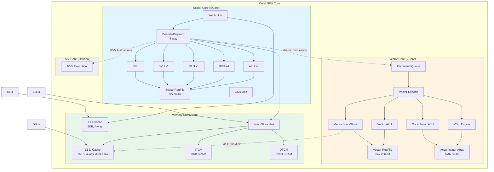

# Top-Level Architecture

## Overview

Coral NPU is a **triple-core fused processor** that combines three distinct processing elements into a single unified design:

1. **Scalar Core (SCore)** - RV32IMF RISC-V processor
2. **Vector Core (VCore)** - Custom SIMD backend with ML acceleration
3. **RVV Core** - Optional RISC-V Vector extension support

This architecture enables efficient execution of both general-purpose code and ML inference workloads by allowing tight coupling between scalar control flow and vector/matrix data processing.

## Architecture Philosophy

The design philosophy of Coral NPU is **domain-first with composable capabilities**:

- **Start with ML domain requirements**: Matrix/convolution operations are the primary design drivers
- **Add vector capabilities**: General-purpose SIMD operations for data preprocessing
- **Include scalar control**: Lightweight RISC-V core for control flow and coordination
- **Fuse, don't federate**: All cores share register files and execution resources where beneficial

This approach differs from traditional CPU+accelerator designs where components are loosely coupled through memory hierarchies.

## High-Level Block Diagram



## Core Components

### 1. Scalar Core (SCore)

The scalar core is a **4-way superscalar, in-order RISC-V processor** implementing the RV32IMF ISA:

| Component | Quantity | Description |
|-----------|----------|-------------|
| **ALU** | 4 | One per dispatch lane, handles arithmetic/logic operations |
| **BRU** | 4 | One per dispatch lane, handles branches and jumps |
| **MLU** | 1 | Shared multiply unit, 3-stage pipeline |
| **DVU** | 1 | Shared division unit, variable latency |
| **FPU** | 1 (optional) | Floating-point unit for F extension |
| **Scalar RegFile** | 32 registers | 32-bit general-purpose registers (x0-x31) |
| **CSR Unit** | 1 | Control and Status Registers |

**Key Characteristics**:
- **4-way dispatch**: Can decode and dispatch up to 4 instructions per cycle
- **In-order**: Maintains program order for dispatch
- **Scoreboard-based hazard detection**: Prevents RAW and WAW hazards
- **Out-of-order retire**: Instructions can complete in different order than dispatch

### 2. Vector Core (VCore)

The vector core is a **custom SIMD backend optimized for ML workloads**:

| Component | Description |
|-----------|-------------|
| **Command Queue** | FIFO buffer decoupling scalar frontend from vector backend |
| **Vector Decode** | Decodes custom vector instructions |
| **Vector RegFile** | 64 registers × 256 bits = 2KB storage |
| **Vector ALU** | SIMD arithmetic/logic operations (8/16/32-bit elements) |
| **VDot Engine** | Dot product operations, 4× 8-bit MACs → 32-bit accumulator |
| **Convolution ALU** | Outer-product MAC engine for convolutions |
| **Accumulator Array** | 8×8 array of 32-bit accumulators |
| **Vector Load/Store** | Unit-stride, strided, and indexed memory access |

**Key Features**:
- **Stripmining**: Single vector instruction expands to 4 sequential operations
- **Outer-product MAC**: 256 MAC operations per cycle (peak)
- **Flexible data types**: Supports INT8, INT16, INT32
- **Decoupled execution**: Command queue allows scalar core to run ahead

### 3. RVV Core (Optional)

When enabled (`p.enableRvv`), provides standard **RISC-V Vector Extension (Zve32x)** support:

- Implements RVV 1.0 specification subset
- Shares execution resources with custom vector core
- Enables compatibility with standard RVV toolchains

**Note**: This is distinct from the custom VCore. The RVV core handles standard RVV instructions, while VCore handles custom SIMD instructions optimized for ML.

### 4. Memory Subsystem

| Component | Size | Type | Latency | Description |
|-----------|------|------|---------|-------------|
| **ITCM** | 8 KB | SRAM | 1 cycle | Tightly-coupled instruction memory |
| **DTCM** | 32 KB | SRAM | 1 cycle | Tightly-coupled data memory |
| **L1 I-Cache** | 8 KB | Cache | 1+ cycle | 4-way set associative, 256-bit blocks |
| **L1 D-Cache** | 16 KB | Cache | 1+ cycle | 4-way, dual-bank, 256-bit blocks |
| **LSU** | - | Unit | - | Handles all memory operations |

**Memory Hierarchy Strategy**:
- **TCMs for deterministic latency**: Critical ML kernels run from TCM
- **Caches for flexibility**: Support larger working sets
- **Dual-bank D-Cache**: Enables prefetching for improved bandwidth

## Bus Interfaces

Coral NPU exposes three distinct bus interfaces:

| Bus | Purpose | Width | Source |
|-----|---------|-------|--------|
| **IBus** | Instruction fetch | 128-bit | Fetch Unit → L1 I-Cache/ITCM |
| **DBus** | Data load/store | 128-bit | LSU → L1 D-Cache/DTCM |
| **EBus** | External memory/peripherals | 128-bit | LSU → Off-chip memory |

**DBusMux**: When vector core is enabled, a bus multiplexer arbitrates between scalar and vector memory accesses on the DBus.

## Core-Level Connections

### Scalar-to-Vector Interface

The scalar core dispatches vector instructions to the vector core through a **command queue** interface:

```
SCore.io.vcore <> VCore.io.score
```

This connection carries:
- **Vector instructions**: Dispatched from scalar decode
- **Scoreboard updates**: Dependency tracking
- **Completion signals**: Vector operations notify scalar when done

### Scalar-to-RVV Interface

When RVV is enabled:

```
SCore.io.rvvcore <> RvvCore.io
```

This connection provides:
- **RVV instruction dispatch**
- **Vector register access**
- **Exception/trap handling**

### Memory Subsystem Integration

**Without VCore** (scalar-only):
```
io.dbus <> score.io.dbus  // Direct connection
```

**With VCore** (with DBusMux):
```
DBusMux arbitrates:
  - score.io.dbus (scalar data bus)
  - vcore.io.dbus (vector data bus)
  → io.dbus (unified output)
```

The DBusMux uses `score.io.vldst` and `vcore.io.last` signals to coordinate access.

## Key Design Decisions

### 1. Decoupled Vector Backend

The vector core uses a **command queue** to decouple from the scalar frontend:

**Benefits**:
- Scalar core can dispatch ahead without stalling on vector operations
- Vector operations can execute at their own pace
- Simplifies scoreboard logic (only track dependencies, not execution)

**Trade-offs**:
- Adds latency for first vector instruction
- Requires careful dependency tracking

### 2. Custom Vector ISA vs Standard RVV

Coral NPU provides **both custom vector instructions and optional RVV support**:

| Aspect | Custom VCore | RVV Core |
|--------|--------------|----------|
| **Design Goal** | Optimize for ML (matrix/conv) | Standard compliance |
| **Instruction Format** | Custom encoding using reclaimed C-extension space | RVV 1.0 standard |
| **Register File** | 64 × 256-bit | Shares with VCore |
| **Key Operations** | VDot, VConv, Stripmining | Standard RVV ops |

This dual approach provides:
- **Performance**: Custom instructions for ML workloads
- **Compatibility**: Standard RVV for ecosystem tools

### 3. Unified Memory Model

All cores share the same physical address space:

```
0x00000 - 0x02000: ITCM (8 KB)
0x10000 - 0x18000: DTCM (32 KB)
0x30000 - 0x32000: CSR/Peripherals (8 KB)
0x?????? - ???????: External memory (via EBus)
```

**Benefits**:
- Simplified software model
- Easy data sharing between scalar and vector code
- No need for explicit data movement

## Configuration Parameters

The `Core` module is highly configurable via the `Parameters` object:

| Parameter | Type | Default | Description |
|-----------|------|---------|-------------|
| `enableVector` | Boolean | true | Enable custom vector core |
| `enableRvv` | Boolean | false | Enable standard RVV support |
| `enableFloat` | Boolean | false | Enable floating-point unit |
| `enableDebug` | Boolean | false | Enable debug module |
| `fetchDataBits` | Int | 128 | Instruction fetch width |
| `lsuDataBits` | Int | 128 | Load/store data width |
| `tcmHighmem` | Boolean | false | Use high memory layout |

### Memory Layout Variants

**Default Layout** (`tcmHighmem = false`):
```
ITCM: 0x00000 - 0x02000 (8 KB)
DTCM: 0x10000 - 0x18000 (32 KB)
CSR:  0x30000 - 0x32000 (8 KB)
```

**High Memory Layout** (`tcmHighmem = true`):
```
ITCM: 0x000000 - 0x100000 (1 MB)
DTCM: 0x100000 - 0x200000 (1 MB)
CSR:  0x200000 - 0x202000 (8 KB)
```

## Code Structure Analysis

### Module Instantiation (from Core.scala)

```scala
// Line 61-66: Core component instantiation
val score = SCore(p)  // Scalar core
val vcore = Option.when(p.enableVector)(VCore(p))  // Vector core (optional)
val rvvCore = Option.when(p.enableRvv)(RvvCore(p))  // RVV core (optional)
```

**Key Observations**:
1. **Scalar core is mandatory**: Always instantiated
2. **Vector cores are optional**: Controlled by parameters
3. **Conditional connections**: Uses Scala `Option` for type-safe optional connections

### Bus Interconnection

```scala
// Lines 95-104: DBus multiplexing logic
if (p.enableVector) {
  val dbusmux = DBusMux(p)
  dbusmux.io.vldst := score.io.vldst.get
  dbusmux.io.vlast := vcore.get.io.last
  dbusmux.io.vcore <> vcore.get.io.dbus
  dbusmux.io.score <> score.io.dbus
  io.dbus <> dbusmux.io.dbus
} else {
  io.dbus <> score.io.dbus  // Direct connection
}
```

**Analysis**:
- `DBusMux` is only instantiated when vector core is enabled
- Multiplexer uses `vldst` (vector load/store active signal) and `vlast` (last vector transaction) for arbitration
- Maintains separate credit/backpressure for scalar and vector paths

## External Interfaces Summary

### Top-Level IO Bundle

```scala
class CoreIO extends Bundle {
  // Control and Status
  val csr: CsrInOutIO        // CSR interface for external access
  val halted: Bool           // Core is halted
  val fault: Bool            // Fault condition detected
  val wfi: Bool              // Wait-for-interrupt state
  val irq: Bool              // Interrupt request input
  val debug_req: Bool        // Debug request input
  val dm: CoreDMIO (optional)// Debug module interface
  
  // Memory Buses
  val ibus: IBusIO           // Instruction bus (128-bit)
  val dbus: DBusIO           // Data bus (128-bit)
  val ebus: EBusIO           // External bus (128-bit)
  
  // Maintenance
  val iflush: IFlushIO       // Instruction cache flush
  val dflush: DFlushIO       // Data cache flush
  val slog: SLogIO           // System log/trace
  val debug: DebugIO         // Debug trace signals
}
```

## Performance Characteristics

### Dispatch Bandwidth

| Condition | Max Instructions/Cycle | Notes |
|-----------|------------------------|-------|
| All scalar ALU/BRU | 4 | Best case, no dependencies |
| With multiply | 1 | MLU is shared across all lanes |
| With division | 1 | DVU is shared, variable latency |
| With load/store | 1 | LSU is single-ported |
| With vector instruction | 1-4 | Scalar continues while vector executes |

### Memory Bandwidth

| Interface | Width | Theoretical BW @ 500MHz | Notes |
|-----------|-------|------------------------|-------|
| IBus | 128-bit | 8 GB/s | Instruction fetch |
| DBus | 128-bit | 8 GB/s | Data access (scalar + vector muxed) |
| EBus | 128-bit | 8 GB/s | External memory |
| **Total** | - | **24 GB/s** | Theoretical max, assumes no contention |

### Vector Performance

| Operation | Throughput | Notes |
|-----------|-----------|-------|
| Vector ALU | 32 ops/cycle | 256-bit / 8-bit elements |
| VDot (8-bit) | 256 MACs/cycle | Outer-product engine |
| Vector Load/Store | 128-bit/cycle | Shares DBus with scalar |

## Related Documentation

For detailed component-level analysis:

- **[Frontend Pipeline](../04_frontend/README.md)** - Fetch, decode, and dispatch
- **[Vector Core](../06_vector_core/README.md)** - Custom SIMD backend with CNN acceleration ⭐

---

**File Reference**: `coral/codes/coralnpu/hdl/chisel/src/coralnpu/Core.scala` (lines 36-105)

