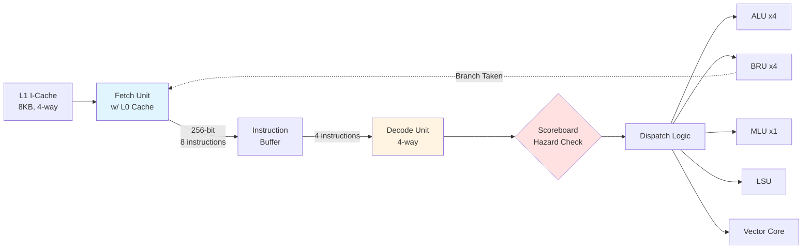

# Frontend: Instruction Fetch and Decode

## Overview

The Coral NPU frontend is responsible for fetching instructions from memory and decoding them into operations that can be dispatched to the execution units. The frontend is designed to support **4-way superscalar dispatch**, meaning it can process up to 4 instructions per cycle.

The frontend consists of three major components:

1. **Fetch Unit** - Fetches instruction blocks from memory with integrated L0 cache
2. **Instruction Buffer** - Buffers fetched instructions to decouple fetch from decode
3. **Decode/Dispatch Unit** - Decodes instructions, resolves dependencies, and dispatches to execution units

## High-Level Block Diagram

## Key Design Features

### 1. **Wide Fetch Path**
- Fetches 256-bit (8 × 32-bit instructions) per cycle from L0 cache
- Provides enough bandwidth to sustain 4-way dispatch

### 2. **Integrated L0 I-Cache**
- 1KB direct-mapped cache within fetch unit
- Reduces pressure on L1 I-Cache
- Provides single-cycle hit latency

### 3. **Predecode for Branches**
- Partial decode in fetch stage to identify branches
- **Static branch prediction policy**:
  - Backward branches: **Taken** (likely loops)
  - Forward branches: **Not taken**

### 4. **Scoreboard-Based Hazard Detection**
- Tracks register dependencies across in-flight instructions
- Prevents **RAW** (Read-After-Write) and **WAW** (Write-After-Write) hazards
- No WAR hazards due to read-then-dispatch pipeline

### 5. **In-Order Dispatch**
- Instructions dispatched in program order
- If instruction N cannot dispatch, N+4 is also blocked
- Simplifies correctness verification

## Performance Characteristics

| Metric | Value | Notes |
|--------|-------|-------|
| **Fetch Width** | 256 bits (8 inst) | From L0 cache |
| **Dispatch Width** | 4 instructions | To execution units |
| **L0 Cache Size** | 1 KB | 32 entries × 256 bits |
| **L0 Cache Latency** | 1 cycle | On hit |
| **Branch Misprediction Penalty** | 1 cycle | Fetch redirect |
| **Instruction Buffer Depth** | Configurable | Default: 16 instructions |

---

## Documentation Structure

### Component Documentation

- **[Fetch Unit](fetch.md)** - L0 cache, predecode, and branch prediction
- **[Instruction Buffer](instruction_buffer.md)** - Circular buffer implementation
- **[Decode Unit](decode.md)** - Instruction decoding
- **[Dispatch Unit](dispatch.md)** - Dependency resolution and dispatch logic

### Step-by-Step Examples

- **[Pipeline Walkthrough](walkthrough.md)** ⭐ **NEW!** - Detailed cycle-by-cycle examples:
  - Perfect 4-way dispatch
  - RAW/WAW hazard detection
  - Branch prediction and misprediction
  - Resource conflicts (MLU)
  - Complex mixed scenarios

---

**Source Files**:
- `coral/codes/coralnpu/hdl/chisel/src/coralnpu/scalar/Fetch.scala` (424 lines)
- `coral/codes/coralnpu/hdl/chisel/src/common/InstructionBuffer.scala` (84 lines)
- `coral/codes/coralnpu/hdl/chisel/src/coralnpu/scalar/Decode.scala` (1552 lines)

