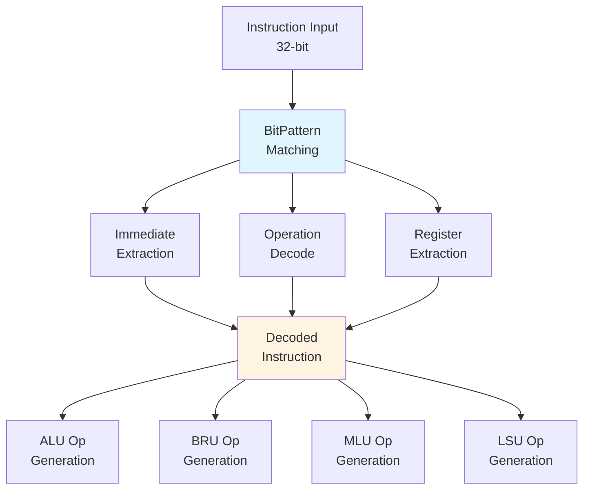
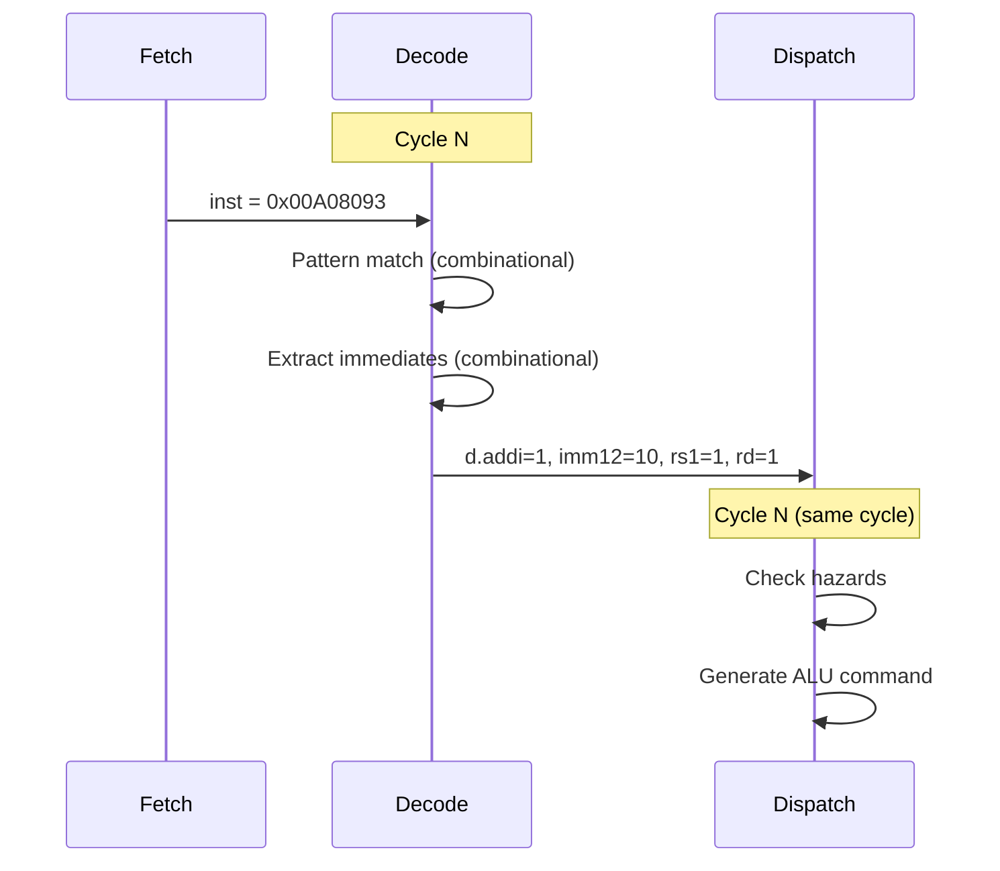

# Decode Unit

## Overview

The Decode Unit is responsible for **interpreting RISC-V instructions** and extracting all information needed for execution. It supports the full RV32IMF_Zbb ISA plus custom vector instructions, RVV extensions, and optional floating-point operations.

**Key Responsibilities**:
- Decode RISC-V instruction encodings into operation types
- Extract immediates (I-type, S-type, B-type, U-type, J-type)
- Identify source/destination registers
- Determine execution unit requirements (ALU, BRU, MLU, LSU, etc.)
- Detect hazards and dependencies

## Supported Instruction Sets

| ISA Extension | Description | Status |
|---------------|-------------|--------|
| **RV32I** | Base integer ISA | ✅ Full support |
| **RV32M** | Multiply/Divide | ✅ Full support |
| **RV32F** | Single-precision FP | ⚠️ Optional (`enableFloat`) |
| **Zbb** | Bit manipulation | ✅ Full support |
| **Zve32x** | Vector extension | ⚠️ Optional (`enableRvv`) |
| **Custom Vector** | Coral NPU SIMD | ⚠️ Optional (`enableVector`) |

## Architecture



## Decoded Instruction Bundle

The output of decoding is a `DecodedInstruction` bundle containing:

**Code** (`Decode.scala` lines 61-248):
```scala
class DecodedInstruction(p: Parameters) extends Bundle {
  val inst = UInt(32.W)  // Original instruction
  
  // Immediates (pre-extracted for all formats)
  val imm12  = UInt(32.W)  // I-type: sign-extended 12-bit
  val imm20  = UInt(32.W)  // U-type: 20-bit << 12
  val immjal = UInt(32.W)  // J-type: JAL offset
  val immbr  = UInt(32.W)  // B-type: Branch offset
  val immcsr = UInt(32.W)  // CSR immediate (zero-extended)
  val immst  = UInt(32.W)  // S-type: Store offset
  
  // RV32I Base Instructions (one-hot)
  val lui, auipc, jal, jalr = Bool()
  val beq, bne, blt, bge, bltu, bgeu = Bool()
  val lb, lh, lw, lbu, lhu = Bool()
  val sb, sh, sw = Bool()
  val addi, slti, sltiu, xori, ori, andi = Bool()
  val slli, srli, srai = Bool()
  val add, sub, slt, sltu, xor, or, and = Bool()
  val sll, srl, sra = Bool()
  
  // RV32M (Multiply/Divide)
  val mul, mulh, mulhsu, mulhu = Bool()
  val div, divu, rem, remu = Bool()
  
  // Zbb (Bit Manipulation)
  val andn, orn, xnor = Bool()
  val clz, ctz, cpop = Bool()
  val max, maxu, min, minu = Bool()
  val sextb, sexth, zexth = Bool()
  val rol, ror, rori, orcb, rev8 = Bool()
  
  // Vector (Custom)
  val getvl, getmaxvl, vld, vst, viop = Bool()
  
  // System/Control
  val csrrw, csrrs, csrrc = Bool()
  val ebreak, ecall, mret, wfi = Bool()
  val fence, fencei = Bool()
  
  // Optional extensions
  val rvv = Option.when(p.enableRvv)(Valid(new RvvCompressedInstruction()))
  val float = Option.when(p.enableFloat)(Valid(new FloatInstruction()))
  
  // ... (helper methods)
}
```

**Total**: ~70 instruction types decoded in parallel using bit-pattern matching.

## Immediate Extraction

All immediate formats are extracted **speculatively** regardless of instruction type:

**Code** (`Decode.scala` lines 1358-1364):
```scala
// I-type: Sign-extend bits [31:20]
d.imm12  := Cat(Fill(20, op(31)), op(31,20))

// U-type: Bits [31:12] << 12
d.imm20  := Cat(op(31,12), 0.U(12.W))

// J-type: JAL immediate (sign-extended, ×2 aligned)
d.immjal := Cat(Fill(12, op(31)), op(19,12), op(20), op(30,21), 0.U(1.W))

// B-type: Branch offset (sign-extended, ×2 aligned)
d.immbr  := Cat(Fill(20, op(31)), op(7), op(30,25), op(11,8), 0.U(1.W))

// CSR immediate: Zero-extend bits [19:15]
d.immcsr := op(19,15)

// S-type: Store offset
d.immst  := Cat(Fill(20, op(31)), op(31,25), op(11,7))
```

### Immediate Formats Visualization

```
I-type (12-bit):
31        20 19   15 14 12 11    7 6     0
+-----------+-------+-----+-------+-------+
|  imm[11:0]|  rs1  |funct| rd    | opcode|
+-----------+-------+-----+-------+-------+

U-type (20-bit):
31                    12 11    7 6     0
+-----------------------+-------+-------+
|     imm[31:12]        |  rd   | opcode|
+-----------------------+-------+-------+

J-type (20-bit):
31 30      21 20 19      12 11    7 6     0
+----+--------+--+----------+-------+-------+
|imm | imm    |im|  imm     |  rd   | opcode|
|[20]| [10:1] |11|  [19:12] |       |       |
+----+--------+--+----------+-------+-------+

B-type (12-bit):
31 30    25 24   20 19   15 14 12 11   8 7 6     0
+--+-------+-------+-------+-----+-----+-+-------+
|im| imm   |  rs2  |  rs1  |funct|imm  |i| opcode|
|12| [10:5]|       |       |     |[4:1]|1|       |
+--+-------+-------+-------+-----+-----+-+-------+
```

## Instruction Decoding

### Bit Pattern Matching

RISC-V instructions are decoded using **Chisel's BitPat** for pattern matching:

**Example** (`Decode.scala` lines 1367-1377):
```scala
// LUI: Load Upper Immediate
d.lui   := op === BitPat("b????????????????????_?????_0110111")
//                         └─ imm[31:12] ─┘  rd   └opcode┘

// AUIPC: Add Upper Immediate to PC
d.auipc := op === BitPat("b????????????????????_?????_0010111")

// JAL: Jump and Link
d.jal   := op === BitPat("b????????????????????_?????_1101111")

// JALR: Jump and Link Register
d.jalr  := op === BitPat("b????????????_?????_000_?????_1100111")
//                         imm[11:0]   rs1  f3   rd   opcode

// BEQ: Branch if Equal
d.beq   := op === BitPat("b???????_?????_?????_000_?????_1100011")
//                         imm  rs2   rs1   f3  imm   opcode
```

**BitPat Syntax**:
- `?`: Don't care (matches 0 or 1)
- `0` / `1`: Must match exactly
- `_`: Visual separator (ignored)

### Decode Parallelism

All instruction patterns are evaluated **in parallel** (combinational logic):

```
Cycle N:
  Input: inst = 0x00A08093  (addi x1, x1, 10)
  
  Parallel Evaluation:
    d.lui   = 0  (opcode ≠ 0110111)
    d.auipc = 0  (opcode ≠ 0010111)
    d.addi  = 1  ✅ (opcode = 0010011, funct3 = 000)
    d.slti  = 0  (funct3 ≠ 010)
    ... (60+ other checks)
  
  Result: d.addi = 1, all others = 0
```

## Helper Methods

The `DecodedInstruction` bundle provides **helper methods** to categorize instructions:

**Code** (`Decode.scala` lines 173-220):
```scala
def isAluImm(): Bool = {
  addi || slti || sltiu || xori || ori || andi || slli || srli || srai || rori
}

def isAluReg(): Bool = {
  add || sub || slt || sltu || xor || or || and || xnor || orn || andn || 
  sll || srl || sra
}

def isAlu(): Bool = { isAluImm() || isAluReg() || isAlu1Bit() || isAlu2Bit() }

def isCondBr(): Bool = { beq || bne || blt || bge || bltu || bgeu }

def isScalarLoad(): Bool = { lb || lh || lw || lbu || lhu }

def isScalarStore(): Bool = { sb || sh || sw }

def isLsu(): Bool = {
  isScalarLoad() || isScalarStore() || vld || vst || flushat || flushall ||
  isFloatLoad() || isFloatStore() || (if (p.enableRvv) { rvv.get.valid && rvv.get.bits.isLoadStore() } else { false.B })
}

def isMul(): Bool = { mul || mulh || mulhsu || mulhu }

def isDvu(): Bool = { div || divu || rem || remu }

def isJump(): Bool = { jal || jalr || ebreak || ecall || mpause || mret }

def forceSlot0Only(): Bool = { isFency() || isCsr() }
```

**Usage**: These methods simplify dispatch logic by grouping instructions into execution units.

## Register Extraction

Source and destination registers are extracted from fixed bit positions:

**Code** (`Decode.scala` lines 1019-1021):
```scala
val rdAddr  = Mux(vldst, io.inst.bits.inst(19,15), io.inst.bits.inst(11,7))
val rs1Addr = io.inst.bits.inst(19,15)
val rs2Addr = io.inst.bits.inst(24,20)
```

**Standard RISC-V Encoding**:
```
31      25 24   20 19   15 14  12 11    7 6      0
+--------+-------+-------+------+-------+--------+
| funct7 |  rs2  |  rs1  |funct3|  rd   | opcode |
+--------+-------+-------+------+-------+--------+
```

**Special Case**: Vector load/store uses `rs1` field for destination register:
```scala
val rdAddr = Mux(vldst, io.inst.bits.inst(19,15), io.inst.bits.inst(11,7))
```

## Undefined Instruction Detection

Any instruction that doesn't match a known pattern is marked as **undefined**:

**Code** (`Decode.scala` lines 1526-1547):
```scala
val decoded = Cat(
  d.lui, d.auipc, d.jal, d.jalr,
  d.beq, d.bne, d.blt, d.bge, d.bltu, d.bgeu,
  d.csrrw, d.csrrs, d.csrrc,
  d.lb, d.lh, d.lw, d.lbu, d.lhu,
  d.sb, d.sh, d.sw, d.fence,
  d.addi, d.slti, d.sltiu, d.xori, d.ori, d.andi,
  d.add, d.sub, d.slt, d.sltu, d.xor, d.or, d.and,
  // ... (all instruction bits)
  d.rvv.map(_.valid).getOrElse(false.B),
  d.float.map(_.valid).getOrElse(false.B)
)

d.undef := decoded === 0.U
```

**Logic**: If no instruction bit is set, the instruction is undefined.

**Handling**:
- Undefined instructions can only dispatch from **slot 0**
- Trigger fault handling in execution stage

## RVV (RISC-V Vector) Support

When `enableRvv` is true, standard RISC-V Vector instructions are decoded:

**Code** (`Decode.scala` lines 1521-1523):
```scala
if (p.enableRvv) {
  d.rvv.get := RvvCompressedInstruction.from_uncompressed(op, addr)
}
```

The `RvvCompressedInstruction` decoder:
- Recognizes RVV instruction patterns (opcodes 0x57, 0x07, 0x27)
- Extracts vector configuration (SEW, LMUL, vl, vstart)
- Identifies vector operations (load/store, arithmetic, configuration)

## Floating-Point Support

When `enableFloat` is true, F-extension instructions are decoded:

**Code** (`Decode.scala` lines 1488-1490, 1516-1518):
```scala
if (p.enableFloat) {
  d.float.get := FloatInstruction.decode(op, addr)
}
```

Supported FP instructions:
- **FLW/FSW**: FP load/store
- **FADD.S, FSUB.S, FMUL.S, FDIV.S**: Arithmetic
- **FSQRT.S**: Square root
- **FMV, FCVT**: Conversions
- **FMADD.S, FMSUB.S**: Fused multiply-add

## Custom Vector Instructions

Coral NPU's custom vector instructions are decoded separately:

**Code** (`Decode.scala` lines 1442-1470):
```scala
if (p.enableVector) {
  // Vector length instructions
  d.getvl    := op === BitPat("b0001?_??_?????_?????_000_?????_11101_11") && ...
  d.getmaxvl := op === BitPat("b0001?_??_00000_00000_000_?????_11101_11") && ...
  
  // Vector load/store
  d.vld := op === BitPat("b000???_0?????_?????0_??_??????_?_111_11")
  d.vst := op === BitPat("b001???_0?????_?????0_??_??????_?_111_11") ||
           op === BitPat("b011???_0?????_?????0_??_??????_?_111_11")
  
  // Vector operations
  d.viop := op(0) === 0.U ||     // .vv .vx
            op(1,0) === 1.U ||   // .vvv .vxv
            vconv || vdupi
}
```

**Custom Opcode Space**: Uses the reclaimed C-extension encoding space (bits [1:0] = `11`).

## Decode Output Example

**Input Instruction**: `0x00A08093` (addi x1, x1, 10)

```
Instruction Breakdown:
  31      20 19   15 14 12 11    7 6     0
  000000001010_00001_000_00001_0010011
  └─ imm=10 ┘ rs1=1 add rd=1  └─ADDI─┘

Decoded Output (d):
  d.inst     = 0x00A08093
  d.imm12    = 0x0000000A  (sign-extended 10)
  d.imm20    = 0x*         (don't care for ADDI)
  d.addi     = 1           ✅
  d.add      = 0
  d.lui      = 0
  ... (all other bits = 0)
  
  d.readsRs1()  = true     (needs x1)
  d.readsRs2()  = false
  d.isAlu()     = true
  d.isAluImm()  = true
```

## Decode Timing

**Latency**: Combinational (0 cycles)



**Critical Path**: BitPat matching → immediate extraction → helper method evaluation

## Decode for Multiple Lanes

Coral NPU decodes **4 instructions in parallel**:

**Code** (`Decode.scala` lines 352-354):
```scala
val decodedInsts = (0 until p.instructionLanes).map(i =>
  DecodeInstruction(p, i, io.inst(i).bits.addr, io.inst(i).bits.inst)
)
```

**Instantiation**:
```
Lane 0: DecodeInstruction(p, 0, addr0, inst0) → d0
Lane 1: DecodeInstruction(p, 1, addr1, inst1) → d1
Lane 2: DecodeInstruction(p, 2, addr2, inst2) → d2
Lane 3: DecodeInstruction(p, 3, addr3, inst3) → d3
```

Each lane has its own **independent decode logic** (no sharing).

## Decode Variants: DispatchV1 vs DispatchV2

Coral NPU has two decode/dispatch implementations:

### DispatchV1 (Legacy)

**Code** (`Decode.scala` lines 846-930):
```scala
class DispatchV1(p: Parameters) extends Dispatch(p) {
  val decode = (0 until p.instructionLanes).map(x => Decode(p, x))
  // ... (connects 4 separate Decode modules)
}
```

- **4 separate Decode modules** (one per lane)
- Each module has its own scoreboard logic
- Serialize signals chained across lanes

### DispatchV2 (Current)

**Code** (`Decode.scala` lines 339-844):
```scala
class DispatchV2(p: Parameters) extends Dispatch(p) {
  // Decode instructions
  val decodedInsts = (0 until p.instructionLanes).map(i =>
    DecodeInstruction(p, i, io.inst(i).bits.addr, io.inst(i).bits.inst)
  )
  // ... (centralized dispatch logic)
}
```

- **Decode function** called 4 times (not 4 modules)
- **Centralized dispatch logic** with unified scoreboard
- Better timing, easier to verify

**Current Default**: DispatchV2 (set via `enableDispatchV2` parameter)

## Performance Considerations

### Decode Bandwidth

| Metric | Value | Notes |
|--------|-------|-------|
| **Decode Width** | 4 instructions/cycle | Parallel decode |
| **Decode Latency** | 0 cycles | Combinational |
| **Throughput** | 4 inst/cycle | When no dispatch stalls |

### Critical Paths

1. **BitPat matching**: 70+ parallel comparisons per lane
2. **Immediate extraction**: Sign-extension logic
3. **Helper methods**: Multi-level OR trees (e.g., `isAlu()`)

**Optimization**: Chisel synthesis tools optimize BitPat matching into efficient multi-level logic.

## Summary

| Feature | Implementation | Complexity |
|---------|----------------|------------|
| **Instruction Count** | ~70 instruction types | High |
| **Decode Parallelism** | 4 lanes × 70 patterns = 280 comparisons | Very High |
| **Immediate Formats** | 6 types (I, S, B, U, J, CSR) | Medium |
| **Extension Support** | RV32IMF + Zbb + RVV + Custom Vector | High |
| **Decode Latency** | 0 cycles (combinational) | ✅ Fast |
| **Area** | ~70 × 32-bit comparators × 4 lanes | Moderate |

---

**Next**: [Dispatch Unit →](dispatch.md)

**Source**: `coral/codes/coralnpu/hdl/chisel/src/coralnpu/scalar/Decode.scala` (lines 932-1551, decode logic)

