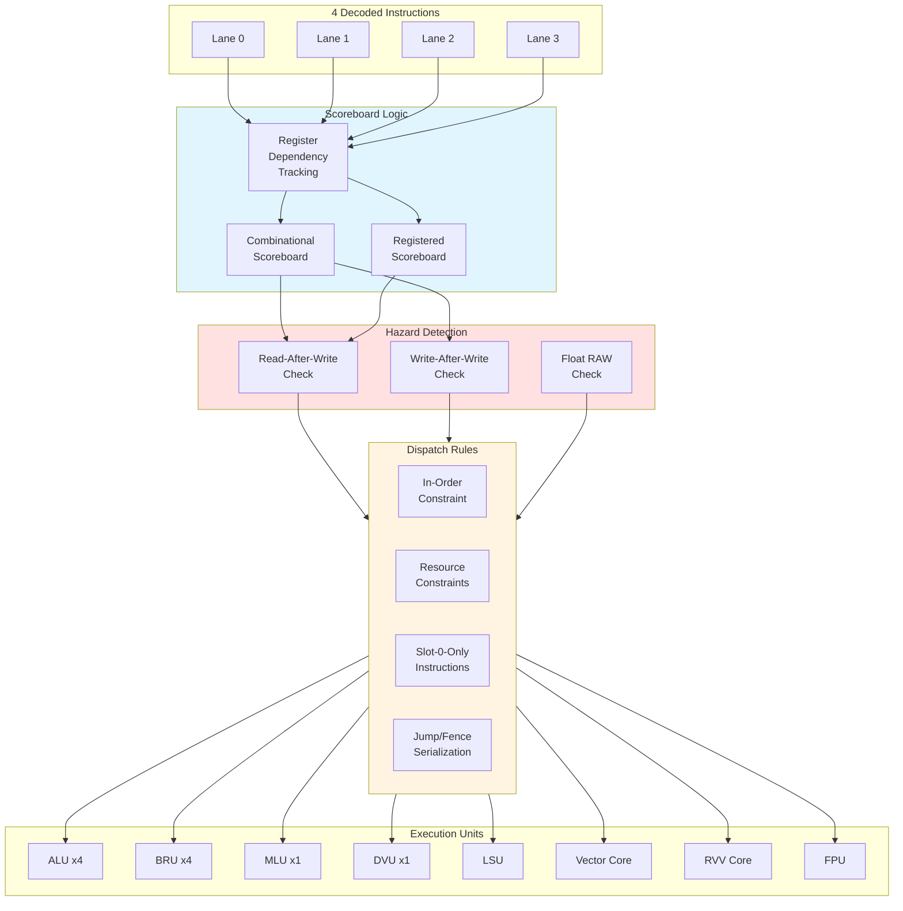

# Dispatch Unit

## Overview

The Dispatch Unit is the **heart of the frontend**, responsible for:
1. **Resolving dependencies** between instructions using scoreboards
2. **Detecting hazards** (RAW, WAW) and preventing out-of-order issues
3. **Enforcing dispatch rules** (in-order, resource constraints, special instructions)
4. **Routing instructions** to appropriate execution units
5. **Managing register file** read/write ports

The dispatch unit implements Coral NPU's **in-order dispatch with out-of-order completion** model using a **scoreboard-based dependency tracking** mechanism.

## Architecture



## Scoreboard Mechanism

### Purpose

The scoreboard tracks which registers have **pending writes** from in-flight instructions. This prevents:
- **RAW (Read-After-Write)**: Reading a register before a previous write completes
- **WAW (Write-After-Write)**: Two writes to the same register completing out-of-order

### Two-Level Scoreboard

Coral NPU maintains **two scoreboard levels**:

**Code** (`Decode.scala` lines 257-261):
```scala
val scoreboard = new Bundle {
  val regd = Input(UInt(32.W))  // Registered scoreboard (from regfile)
  val comb = Input(UInt(32.W))  // Combinational scoreboard (forwarding)
}
```

| Scoreboard | Source | Usage | Update Timing |
|------------|--------|-------|---------------|
| **`regd`** | Register file | Operations requiring value availability (JALR, LSU) | Updated next cycle |
| **`comb`** | Combinational path | Operations allowing forwarding (ALU, arithmetic) | Updated same cycle |

### Scoreboard Update Logic

**Code** (`Decode.scala` lines 374-387):
```scala
// Extract destination registers
val rdAddr = io.inst.map(_.bits.inst(11,7))
val writesRd = decodedInsts.map(d =>
    (!d.isScalarStore() && !d.isCondBr()) ||
    (d.isFloat() && d.floatWritesRd()) ||
    d.rvvWritesRd()
)

// Generate scoreboard updates for this cycle
val rdScoreboard = (0 until p.instructionLanes).map(i =>
    Mux(writesRd(i), UIntToOH(rdAddr(i), 32), 0.U(32.W)))

// Accumulate across lanes (scan)
val scoreboardScan = rdScoreboard.scan(0.U(32.W))(_ | _)

// Combine with existing scoreboard
val regd = scoreboardScan.map(_ | io.scoreboard.regd)
val comb = scoreboardScan.map(_ | io.scoreboard.comb)
```

**Explanation**:
1. **Extract destination registers** from all 4 lanes
2. **Convert to one-hot** encoding (32-bit vector, 1 bit per register)
3. **Accumulate** across lanes using `scan` (lane 0 → lane 1 → lane 2 → lane 3)
4. **OR with existing** scoreboard from register file

**Example**:
```
Cycle N dispatch:
  Lane 0: add x1, x2, x3  → rdScoreboard[0] = 0x00000002 (bit 1 set)
  Lane 1: sub x5, x6, x7  → rdScoreboard[1] = 0x00000020 (bit 5 set)
  Lane 2: xor x1, x8, x9  → rdScoreboard[2] = 0x00000002 (bit 1 set, conflict!)
  Lane 3: or  x10, x11, x12 → rdScoreboard[3] = 0x00000400 (bit 10 set)

scoreboardScan:
  [0] = 0x00000000                           (initial)
  [1] = 0x00000002                           (lane 0 contribution)
  [2] = 0x00000022                           (lanes 0+1)
  [3] = 0x00000022                           (lanes 0+1+2, same as [2])
  [4] = 0x00000422                           (lanes 0+1+2+3)

comb[2] = existing_comb | 0x00000022
        = checks if x1 or x5 already pending
```

### Hazard Detection

**Read-After-Write (RAW)**:

**Code** (`Decode.scala` lines 392-404):
```scala
val rs1Addr = io.inst.map(_.bits.inst(19,15))
val rs2Addr = io.inst.map(_.bits.inst(24,20))

val usesRs1Regd = decodedInsts.map(d => d.jalr || d.isLsu())
val usesRs2Regd = decodedInsts.map(d => d.isScalarStore())

val readScoreboardRegd = (0 until p.instructionLanes).map(i =>
    MuxOR(usesRs1Regd(i), UIntToOH(rs1Addr(i), 32)) |
    MuxOR(usesRs2Regd(i), UIntToOH(rs2Addr(i), 32)))

val usesRs1Comb = decodedInsts.map(d => d.readsRs1())
val usesRs2Comb = decodedInsts.map(d => d.readsRs2())

val readScoreboardComb = (0 until p.instructionLanes).map(i =>
    MuxOR(usesRs1Comb(i), UIntToOH(rs1Addr(i), 32)) |
    MuxOR(usesRs2Comb(i), UIntToOH(rs2Addr(i), 32)))

val readAfterWrite = (0 until p.instructionLanes).map(i =>
    (readScoreboardRegd(i) & regd(i)) =/= 0.U(32.W) ||
    (readScoreboardComb(i) & comb(i)) =/= 0.U(32.W))
```

**Logic**:
- For each lane, create one-hot mask of source registers
- Check if any source register is marked pending in scoreboard
- If conflict detected, RAW hazard exists → **block dispatch**

**Write-After-Write (WAW)**:

**Code** (`Decode.scala` lines 405-406):
```scala
val writeAfterWrite = (0 until p.instructionLanes).map(i =>
    (rdScoreboard(i) & comb(i)) =/= 0.U(32.W))
```

**Logic**:
- Check if current instruction's destination register is already pending
- If so, WAW hazard exists → **block dispatch**

### Floating-Point Scoreboard

Separate scoreboard for FP registers:

**Code** (`Decode.scala` lines 408-423):
```scala
val writesFloatRd = decodedInsts.map(d => d.isFloat() && !d.floatWritesRd())

val floatReadScoreboard = if (p.enableFloat) { (0 until p.instructionLanes).map(i =>
  MuxOR(decodedInsts(i).floatReadsRs1(), UIntToOH(rs1Addr(i), 32)) |
  MuxOR(decodedInsts(i).floatReadsRs2(), UIntToOH(rs2Addr(i), 32)) |
  MuxOR(decodedInsts(i).floatReadsRs3(), UIntToOH(rs3Addr(i), 32))
) } else { ... }

val floatRdScoreboard = if (p.enableFloat) { (0 until p.instructionLanes).map(i =>
  MuxOR(writesFloatRd(i), UIntToOH(rdAddr(i), 32))
) } else { ... }

val floatReadAfterWrite = (0 until p.instructionLanes).map(i =>
    (floatReadScoreboard(i) & io.fscoreboard.getOrElse(0.U)) =/= 0.U(32.W))

val floatWriteAfterWrite = (0 until p.instructionLanes).map(i =>
    (floatRdScoreboard(i) & io.fscoreboard.getOrElse(0.U)) =/= 0.U(32.W))
```

**Note**: FP scoreboard tracks `f0-f31` separately from scalar `x0-x31`.

## Dispatch Rules

### 1. In-Order Dispatch

**Rule**: If instruction N cannot dispatch, instruction N+4 is also blocked.

**Code** (`Decode.scala` lines 361-362):
```scala
val isJump = decodedInsts.map(x => x.isJump() || x.isFency())
val jumped = isJump.scan(false.B)(_ || _)
```

**Logic**:
```
jumped[0] = false                      (initial)
jumped[1] = jumped[0] || isJump[0]     (lane 0 jumped?)
jumped[2] = jumped[1] || isJump[1]     (lanes 0-1 jumped?)
jumped[3] = jumped[2] || isJump[2]     (lanes 0-2 jumped?)
jumped[4] = jumped[3] || isJump[3]     (lanes 0-3 jumped?)
```

**Effect**: Once a jump/fence is encountered, all subsequent lanes are blocked.

### 2. Resource Constraints

#### Single MLU Constraint

Only **one multiply** instruction can dispatch per cycle:

**Code** (`Decode.scala` lines 647-656):
```scala
val mlu = MuxCase(MakeValid(false.B, MluOp.MUL), Seq(
  d.mul     -> MakeValid(true.B, MluOp.MUL),
  d.mulh    -> MakeValid(true.B, MluOp.MULH),
  d.mulhsu  -> MakeValid(true.B, MluOp.MULHSU),
  d.mulhu   -> MakeValid(true.B, MluOp.MULHU),
))
io.mlu(i).valid := tryDispatch && mlu.valid
```

**Constraint enforcement**: First multiply in the dispatch window gets the MLU, others are blocked.

#### Single DVU Constraint

Division unit is **non-pipelined**, only one divide per cycle:

**Code** (`Decode.scala` lines 660-668):
```scala
val dvu = MuxCase(MakeValid(false.B, DvuOp.DIV), Seq(
  d.div  -> MakeValid(true.B, DvuOp.DIV),
  d.divu -> MakeValid(true.B, DvuOp.DIVU),
  d.rem  -> MakeValid(true.B, DvuOp.REM),
  d.remu -> MakeValid(true.B, DvuOp.REMU)
))
io.dvu(i).valid := tryDispatch && dvu.valid
```

#### LSU Queue Constraint

LSU operations limited by **queue capacity**:

**Code** (`Decode.scala` lines 493-502):
```scala
val isLsu = decodedInsts.map(x => x.isLsu())
val isLsuCount = isLsu.scan(0.U(4.W))(_+_)

val lsuInterlock = if (p.useLsuV2) {
    (0 until p.instructionLanes).map(
        i => isLsuCount(i) < io.lsuQueueCapacity)
} else {
  Seq.fill(p.instructionLanes)(true.B)
}
```

**Logic**: If LSU queue has 2 slots, only first 2 LSU instructions dispatch.

### 3. Slot-0-Only Instructions

Some instructions must **execute from lane 0 only**:

**Code** (`Decode.scala` lines 434-442):
```scala
val slot0Interlock = (0 until p.instructionLanes).map(i =>
  if (i == 0) {
    true.B
  } else {
    !decodedInsts(0).forceSlot0Only() && !decodedInsts(i).forceSlot0Only()
  }
)
```

**Slot-0-only instructions** (from `DecodedInstruction` helper):
```scala
def forceSlot0Only(): Bool = { isFency() || isCsr() }
```

**Reason**: These instructions modify global state (CSRs, fences) and require serialization.

### 4. Jump/Branch Serialization

**Jump Instructions** (lines 361-362):
```scala
val isJump = decodedInsts.map(x => x.isJump() || x.isFency())
val jumped = isJump.scan(false.B)(_ || _)
```

**Branch Instructions** (lines 368-370):
```scala
val isBranch = decodedInsts.map(_.isCondBr())
val branched = isBranch.scan(false.B)(_ || _)
val branchInterlock = (0 until p.instructionLanes).map(i => branched(i))
```

**Effect**: After a branch, only **ALU and BRU** operations can dispatch (no multi-cycle ops).

### 5. Fence Interlock

**Code** (`Decode.scala` lines 431):
```scala
val fence = decodedInsts.map(x => x.isFency() && (io.mactive || io.lsuActive))
```

**Rule**: Fence instructions cannot dispatch while memory operations are active.

### 6. RVV Configuration Interlock

**Code** (`Decode.scala` lines 446-463):
```scala
val configInvalid = if (p.enableRvv) {
  val configChange = decodedInsts.map(
      x => x.rvv.get.valid && x.rvv.get.bits.isVset())
  configChange.scan(!io.rvvState.get.valid)(_ || _)
} else {
  Seq.fill(p.instructionLanes)(false.B)
}

val rvvConfigInterlock = if (p.enableRvv) {
  val canDispatchRvv = (0 until p.instructionLanes).map(i =>
      !decodedInsts(i).rvv.get.valid || 
      !decodedInsts(i).rvv.get.bits.isLoadStore() ||
      !configInvalid(i))
  canDispatchRvv
} else {
  Seq.fill(p.instructionLanes)(true.B)
}
```

**Rule**: RVV load/store cannot dispatch until vector configuration is valid (`vtype`, `vl` set).

## Dispatch Decision Logic

All constraints are combined into a **single dispatch decision** per lane:

**Code** (`Decode.scala` lines 537-558):
```scala
val canDispatch = (0 until p.instructionLanes).map(i =>
    !io.halted &&           // Don't dispatch if halted
    !io.interlock &&        // Don't dispatch when interlocked
    io.inst(i).valid &&     // Instruction should be valid
    !jumped(i) &&           // Don't dispatch after a jump
    !readAfterWrite(i) &&   // Avoid RAW hazards
    !writeAfterWrite(i) &&  // Avoid WAW hazards
    !floatReadAfterWrite(i) &&   // Avoid FP RAW hazards
    !floatWriteAfterWrite(i) &&  // Avoid FP WAW hazards
    !branchInterlock(i) &&  // Only branch/alu after branch
    !fence(i) &&            // Don't dispatch if fence interlocked
    slot0Interlock(i) &&    // Special instructions in slot 0 only
    rvvConfigInterlock(i) && // Rvv config interlock
    rvvVstartInterlock(i) && // Don't dispatch illegal vstart
    lsuInterlock(i) &&      // LSU queue capacity
    rvvInterlock(i) &&      // RVV queue capacity
    !undefInterlock(i) &&   // Undef only from slot 0
    io.retirement_buffer_nSpace.map(x => i.U < x).getOrElse(true.B) && // Retirement buffer space
    singleStepInterlock(i) && // Debug single-step
    mpauseInterlock(i)      // MPAUSE serialization
)
```

**Result**: Boolean vector indicating which lanes **can attempt dispatch**.

## Try-Dispatch Loop

Even if `canDispatch[i] = true`, dispatch can still fail due to **execution unit backpressure**:

**Code** (`Decode.scala` lines 563-768):
```scala
val lastReady = Wire(Vec(p.instructionLanes + 1, Bool()))
lastReady(0) := true.B

for (i <- 0 until p.instructionLanes) {
  val tryDispatch = lastReady(i) && canDispatch(i)
  val d = decodedInsts(i)
  
  // ALU dispatch
  io.alu(i).valid := tryDispatch && alu.valid
  
  // BRU dispatch
  io.bru(i).valid := tryDispatch && bru.valid && !(jalFault || jalrFault || bxxFault)
  
  // MLU dispatch
  io.mlu(i).valid := tryDispatch && mlu.valid
  
  // ... (other units)
  
  // Set next lastReady if dispatched
  val dispatched = Seq(io.alu(i).fire, io.bru(i).fire, io.mlu(i).fire, ...).reduce(_||_)
  lastReady(i + 1) := dispatched
}

for (i <- 0 until p.instructionLanes) {
  io.inst(i).ready := lastReady(i + 1)
}
```

**Logic**:
- **`lastReady[0] = true`**: Lane 0 can always try
- **`lastReady[i+1] = dispatched[i]`**: Lane i+1 can try only if lane i dispatched something
- **In-order guarantee**: If lane i stalls, lanes i+1, i+2, i+3 also stall

## Execution Unit Routing

### ALU Routing

**Code** (`Decode.scala` lines 571-606):
```scala
val alu = MuxCase(MakeValid(false.B, AluOp.ADD), Seq(
  // RV32IM
  (d.auipc || d.addi || d.add) -> MakeValid(true.B, AluOp.ADD),
  d.sub                        -> MakeValid(true.B, AluOp.SUB),
  (d.slti || d.slt)            -> MakeValid(true.B, AluOp.SLT),
  (d.sltiu || d.sltu)          -> MakeValid(true.B, AluOp.SLTU),
  (d.xori || d.xor)            -> MakeValid(true.B, AluOp.XOR),
  (d.ori || d.or)              -> MakeValid(true.B, AluOp.OR),
  (d.andi || d.and)            -> MakeValid(true.B, AluOp.AND),
  (d.slli || d.sll)            -> MakeValid(true.B, AluOp.SLL),
  (d.srli || d.srl)            -> MakeValid(true.B, AluOp.SRL),
  (d.srai || d.sra)            -> MakeValid(true.B, AluOp.SRA),
  d.lui                        -> MakeValid(true.B, AluOp.LUI),
  // ZBB
  d.andn                       -> MakeValid(true.B, AluOp.ANDN),
  d.orn                        -> MakeValid(true.B, AluOp.ORN),
  d.xnor                       -> MakeValid(true.B, AluOp.XNOR),
  // ...
))
io.alu(i).valid := tryDispatch && alu.valid
io.alu(i).bits.addr := rdAddr(i)
io.alu(i).bits.op := alu.bits
```

**Effect**: Converts decoded instruction into ALU operation command.

### LSU Routing

**Code** (`Decode.scala` lines 673-713):
```scala
val lsu = MuxCase(MakeValid(false.B, LsuOp.LB), Seq(
  d.lb             -> MakeValid(true.B, LsuOp.LB),
  d.lh             -> MakeValid(true.B, LsuOp.LH),
  d.lw             -> MakeValid(true.B, LsuOp.LW),
  d.lbu            -> MakeValid(true.B, LsuOp.LBU),
  d.lhu            -> MakeValid(true.B, LsuOp.LHU),
  d.sb             -> MakeValid(true.B, LsuOp.SB),
  d.sh             -> MakeValid(true.B, LsuOp.SH),
  d.sw             -> MakeValid(true.B, LsuOp.SW),
  d.fencei         -> MakeValid(true.B, LsuOp.FENCEI),
  (d.isFloatLoad() || d.isFloatStore()) -> MakeValid(true.B, LsuOp.FLOAT)
) ++ Option.when(p.enableRvv) {
  Seq(
    (isRvvLoad && (mop === UNIT_STRIDE))    -> MakeValid(true.B, LsuOp.VLOAD_UNIT),
    (isRvvLoad && (mop === INDEXED_UNORDERED)) -> MakeValid(true.B, LsuOp.VLOAD_UINDEXED),
    (isRvvLoad && (mop === STRIDED))        -> MakeValid(true.B, LsuOp.VLOAD_STRIDED),
    // ...
  )
}.getOrElse(Seq()))

io.lsu(i).valid := tryDispatch && lsu.valid
io.lsu(i).bits.op := lsu.bits
io.lsu(i).bits.store := io.inst(i).bits.inst(5)
io.lsu(i).bits.addr := rdAddr(i)
io.lsu(i).bits.pc := io.inst(i).bits.addr
```

**Effect**: Routes load/store operations to LSU with appropriate addressing mode.

## Register File Interface

### Read Ports

**Code** (`Decode.scala` lines 790-796):
```scala
io.rs1Read(i).valid := io.inst(i).fire && (d.readsRs1() || d.jalr)
io.rs1Read(i).addr := Mux(io.inst(i).bits.inst(0), rs1Addr(i), rs3Addr(i))

io.rs2Read(i).valid := io.inst(i).fire && d.readsRs2()
io.rs2Read(i).addr := io.inst(i).bits.inst(24,20)
```

**Timing**: Register reads triggered **same cycle** as dispatch (fire = valid && ready).

### Immediate Set Ports

For instructions with immediates, values are "set" instead of read:

**Code** (`Decode.scala` lines 799-802):
```scala
io.rs1Set(i).valid := io.inst(i).fire && d.rs1Set()
io.rs1Set(i).value := Mux(d.isCsr(), d.immcsr, io.inst(i).bits.addr)  // PC for AUIPC

io.rs2Set(i).valid := io.inst(i).fire && d.rs2Set()
io.rs2Set(i).value := MuxCase(d.imm12, IndexedSeq((d.auipc || d.lui) -> d.imm20))
```

**Usage**: ALU/BRU can use immediate values directly without reading register file.

### Write Port Marking

**Code** (`Decode.scala` lines 805-814):
```scala
val rdMark_valid =
    io.alu(i).fire || io.mlu(i).fire || io.dvu(i).fire ||
    io.lsu(i).fire && d.isScalarLoad() ||
    (if (i == 0) { io.csr.valid } else { false.B }) ||
    io.rvv.map(x => x(i).fire && x(i).bits.writesRd()).getOrElse(false.B) ||
    (if (i == 0) { io.float.map(x => x.fire && x.bits.scalar_rd).getOrElse(false.B) } else { false.B }) ||
    (io.bru(i).valid && (io.bru(i).bits.op.isOneOf(BruOp.JAL, BruOp.JALR)) && rdAddr(i) =/= 0.U)

io.rdMark(i).valid := rdMark_valid
io.rdMark(i).addr  := rdAddr(i)
```

**Purpose**: Marks destination register as "pending write" in scoreboard.

### Bus Port (Pointer Chasing)

**Code** (`Decode.scala` lines 830-842):
```scala
io.busRead(i).valid := io.lsu(i).valid
io.busRead(i).bypass := d.inst(31,25) === 0.U &&
    Mux(!d.inst(5) || d.inst(6), d.inst(24,20) === 0.U, d.inst(11,7) === 0.U)

io.busRead(i).immen := !d.flushat
io.busRead(i).immed := Mux(d.rvv.map(_.valid).getOrElse(false.B),
    0.U,
    Cat(d.imm12(31,5), Mux(storeSelect, d.immst(4,0), d.imm12(4,0))))
```

**Optimization**: For load/store with zero immediate offset, bypass address calculation (pointer chasing).

## Dispatch Timing Diagram

```
Cycle:        N          N+1         N+2
              |           |           |
Fetch:      [inst0-3]   [inst4-7]   [inst8-11]
              |           |           |
Decode:     [decode]    [decode]    [decode]
              |           |           |
Scoreboard: [check RAW] [check RAW] [check RAW]
            [check WAW] [check WAW] [check WAW]
              |           |           |
canDispatch: [T,T,F,F]  [T,T,T,T]   [T,F,F,F]
              |           |           |
tryDispatch: [T,T,F,F]  [T,T,T,T]   [T,F,F,F]
              |           |           |
Dispatch:    Lane0→ALU   Lane0→ALU   Lane0→BRU
             Lane1→BRU   Lane1→MLU   (Lanes 1-3 blocked)
             (Lane2 hazard)  Lane2→ALU
             (Lane3 blocked) Lane3→LSU
              |           |           |
RegFile:    [mark x1,x2][mark x3,x5,x7,x10] [mark x15]
```

## Performance Metrics

| Metric | Best Case | Typical | Worst Case |
|--------|-----------|---------|------------|
| **Dispatch Width** | 4 inst/cycle | 2-3 inst/cycle | 0 inst/cycle |
| **Utilization** | 100% (4/4) | 50-75% | 0% (stalled) |
| **Hazard Rate** | 0% | 10-20% | 50%+ (dep chain) |

### Bottlenecks

1. **Single MLU**: Multiply-heavy code limited to 1 mult/cycle
2. **Dependency Chains**: Long RAW chains serialize execution
3. **Resource Conflicts**: Multiple LSU ops in window compete for single LSU
4. **Branch Prediction**: Mispredictions flush pipeline

## Summary

| Feature | Implementation | Benefit |
|---------|----------------|---------|
| **Scoreboard** | Two-level (regd/comb) | Fast hazard detection |
| **In-Order** | Sequential dispatch decision | Simplifies verification |
| **Resource Aware** | Track MLU, DVU, LSU capacity | Prevents oversubscription |
| **Slot-0 Special** | CSR/fence serialize | Correctness for global state |
| **Multi-Hazard** | RAW, WAW, float RAW/WAW | Comprehensive safety |
| **4-Way** | Parallel decode + sequential dispatch | High throughput |

---

**Source**: `coral/codes/coralnpu/hdl/chisel/src/coralnpu/scalar/Decode.scala` (lines 250-844, DispatchV2 implementation)

