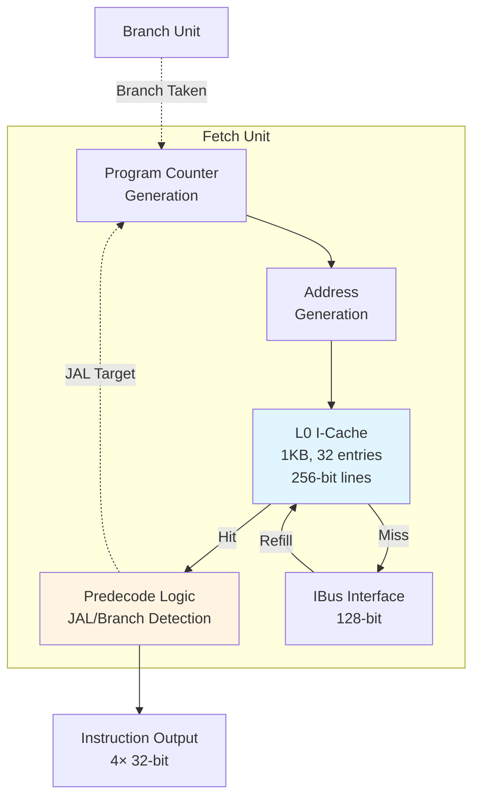
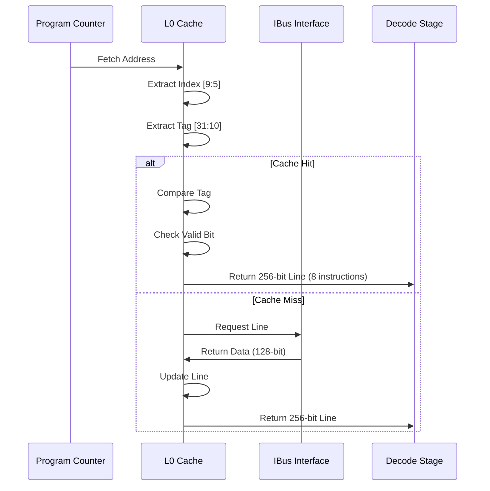
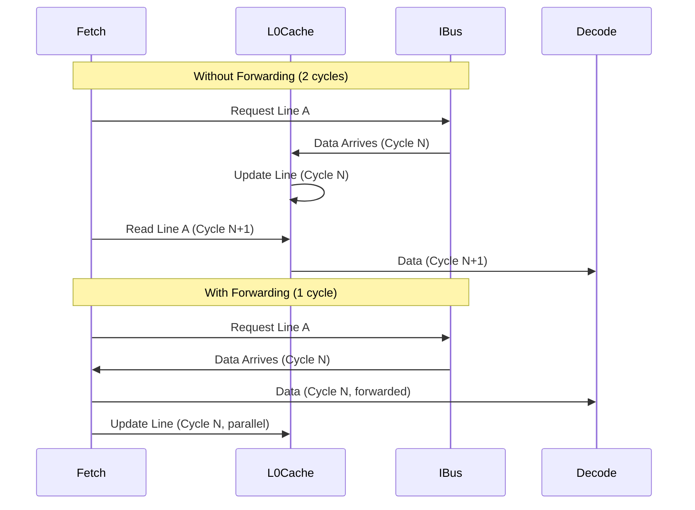

# Fetch Unit

## Overview

The Fetch Unit is responsible for fetching instructions from the instruction memory system and providing them to the decode stage. It includes an integrated **L0 instruction cache** (1KB) and **predecode logic** for branch prediction.

**Key Features**:
- 256-bit wide fetch path (8× 32-bit instructions)
- 1KB L0 direct-mapped cache (32 entries)
- Static branch prediction (backward taken, forward not-taken)
- Single-cycle fetch latency on L0 hit
- JAL predecode for speculative fetch

## Architecture



## L0 I-Cache Design

### Organization

| Parameter | Value | Calculation |
|-----------|-------|-------------|
| **Total Size** | 1024 bytes | 1 KB |
| **Line Size** | 32 bytes | 256 bits |
| **Number of Lines** | 32 | 1024 / 32 |
| **Associativity** | Direct-mapped | 1-way |
| **Tag Bits** | 22 bits | Address bits [31:10] |
| **Index Bits** | 5 bits | Address bits [9:5] |
| **Offset Bits** | 5 bits | Address bits [4:0] |

### Address Breakdown

```
31                            10  9        5  4         0
+--------------------------------+----------+-----------+
|           Tag (22 bits)        |Index (5b)|Offset (5b)|
+--------------------------------+----------+-----------+
```

**From code** (`Fetch.scala` lines 55-70):
```scala
val lanes    = p.fetchDataBits / p.instructionBits  // 256 / 32 = 8 lanes
val indices  = p.fetchCacheBytes * 8 / p.fetchDataBits // 1024*8 / 256 = 32 indices
val indexLsb = log2Ceil(p.fetchDataBits / 8) // log2(32) = 5
val indexMsb = log2Ceil(indices) + indexLsb - 1 // log2(32) + 5 - 1 = 9
val tagLsb   = indexMsb + 1 // 10
val tagMsb   = p.fetchAddrBits - 1 // 31
```

### Cache State

The L0 cache maintains the following state:

```scala
// Lines 73-76
val l0valid = RegInit(0.U(indices.W))  // Valid bit per line (32 bits)
val l0req   = RegInit(0.U(indices.W))  // Request inflight per line
val l0tag   = Reg(Vec(indices, UInt((tagMsb - tagLsb + 1).W)))  // Tags (32 × 22 bits)
val l0data  = Reg(Vec(indices, UInt(p.fetchDataBits.W)))  // Data (32 × 256 bits)
```

- **`l0valid`**: Bitvector indicating which lines contain valid data
- **`l0req`**: Bitvector indicating which lines have outstanding requests
- **`l0tag`**: Tag storage (32 entries × 22 bits = 704 bits)
- **`l0data`**: Data storage (32 entries × 256 bits = 8 KB = **1KB**)

### Cache Lookup Process



**Code Analysis** (lines 92-99):
```scala
val l0valid0 = l0valid(instIndex0)
val l0valid1 = l0valid(instIndex1)
val l0tag0 = VecAt(l0tag, instIndex0)
val l0tag1 = VecAt(l0tag, instIndex1)
val match0 = l0valid0 && instTag0 === l0tag0
val match1 = l0valid1 && instTag1 === l0tag1
```

- Lookup supports **two consecutive lines** to handle unaligned fetches
- `match0` and `match1` indicate hits on line 0 and line 1 respectively

## Branch Prediction

### Static Prediction Policy

Coral NPU uses a **simple static branch prediction** strategy:

| Branch Type | Direction | Prediction | Rationale |
|-------------|-----------|------------|-----------|
| **JAL** (unconditional jump) | Any | Taken | Always taken by definition |
| **Conditional branch (Bxx)** | Backward (negative offset) | Taken | Likely a loop back-edge |
| **Conditional branch (Bxx)** | Forward (positive offset) | Not-Taken | Likely a forward branch |

**From code comments** (lines 16-18):
> "The fetcher itself has a partial decoder to identify branches, where backwards branches are assumed taken and forward branches assumed not taken."

### Predecode Logic

The fetch unit performs a **partial decode** to identify JAL instructions early:

**Code** (lines 104-109):
```scala
def Predecode(addr: UInt, op: UInt): (Bool, UInt) = {
  val jal = op === BitPat("b????????????????????_?????_1101111")
  val immed = Cat(Fill(12, op(31)), op(19,12), op(20), op(30,21), 0.U(1.W))
  val target = addr + immed
  (jal, target)
}
```

**Analysis**:
- Matches RISC-V JAL opcode pattern: `1101111`
- Extracts 20-bit immediate (sign-extended to 32 bits)
- Calculates target address: `PC + imm`
- Returns `(is_jal, target_address)`

**Advanced Predecode** (lines 320-331):
```scala
def PredecodeDe(addr: UInt, op: UInt): (Bool, UInt) = {
  val jal = op === BitPat("b????????????????????_?????_1101111")
  val ret = op === BitPat("b000000000000_00001_000_00000_1100111") && io.linkPort.valid
  val bxx = op === BitPat("b???????_?????_?????_???_?????_1100011") && 
            op(31) && op(14,13) =/= 1.U
  // ...
  (jal || ret || bxx, target)
}
```

This extended predecode handles:
- **JAL**: Unconditional jump
- **RET**: Return instruction (JALR with rs1=x1, imm=0)
- **Bxx**: Conditional branches (backward only: `op(31)` indicates negative immediate)

### Branch Target Prefetch

When a branch is predicted taken, the fetch unit **speculatively requests** the target from L0 cache:

**Code** (lines 141-152):
```scala
val reqP = preBranchTaken && !l0req(preBranchIndex) && 
           (preBranchTag =/= l0tagP || !l0validP)
val req0 = !match0 && !l0req(instIndex0)
val req1 = !match1 && !l0req(instIndex1)

aslice.io.in.valid := (reqs ++ Seq(reqP, req0, req1)).reduce(_ || _) && !io.iflush.valid
```

**Priority**:
1. **Branch targets** from execute stage (`reqs`)
2. **Predecoded branch target** (`reqP`)
3. **Sequential fetch** (`req0`, `req1`)

## Instruction Output

### 4-Way Instruction Dispatch

The fetch unit provides **up to 4 instructions** to the decode stage each cycle:

**Code** (lines 79-81):
```scala
val instValid = RegInit(VecInit(Seq.fill(p.instructionLanes)(false.B)))
val instAddr  = Reg(Vec(p.instructionLanes, UInt(p.instructionBits.W)))
val instBits  = Reg(Vec(p.instructionLanes, UInt(p.instructionBits.W)))
```

Where `p.instructionLanes = 4`.

### Instruction Extraction from Cache Line

A 256-bit cache line contains **8 instructions**. The fetch unit extracts 4 contiguous instructions starting from the PC:

```
Cache Line (256 bits):
+------+------+------+------+------+------+------+------+
| Inst | Inst | Inst | Inst | Inst | Inst | Inst | Inst |
|  0   |  1   |  2   |  3   |  4   |  5   |  6   |  7   |
+------+------+------+------+------+------+------+------+
   ^                                    ^
   |<--- Fetch Window (4 inst) ------->|
```

**Code** (lines 243-251):
```scala
val nxtInstBits0 = Mux(readFwd0, readData, VecAt(l0data, instIndex0))
val nxtInstBits1 = Mux(readFwd1, readData, VecAt(l0data, instIndex1))
val nxtInstBits = Wire(Vec(16, UInt(p.instructionBits.W)))

for (i <- 0 until 8) {
  val offset = 32 * i
  nxtInstBits(i + 0) := nxtInstBits0(31 + offset, offset)
  nxtInstBits(i + 8) := nxtInstBits1(31 + offset, offset)
}
```

- Supports fetching from **two consecutive cache lines** to handle unaligned accesses
- `nxtInstBits` is a 16-entry vector allowing indexing into either line

## IBus Interface

### Connection to L1 I-Cache

The fetch unit communicates with the L1 I-Cache through the **IBus** interface:

**Code** (lines 45-46, 158-160):
```scala
val readAddrEn = io.ibus.valid && io.ibus.ready
val readData = io.ibus.rdata
// ...
io.ibus.valid := aslice.io.out.valid
io.ibus.addr := aslice.io.out.bits
```

**Interface Signals**:
- `io.ibus.valid`: Request valid
- `io.ibus.ready`: L1 I-Cache ready (input)
- `io.ibus.addr`: Fetch address (output)
- `io.ibus.rdata`: Read data, 128-bit (input, available 1 cycle after handshake)

**Note**: IBus is **128-bit wide**, but L0 cache stores **256-bit lines**. This means:
- Each L0 cache line requires **2 IBus transactions** to fill
- Or, L0 cache stores data from multiple IBus reads

## Instruction Cache Flush

### Flush Mechanism

The fetch unit supports flushing the L0 cache on `iflush` signal (e.g., after `fence.i`):

**Code** (lines 183-187):
```scala
when (io.iflush.valid) {
  val clr = ~(0.U(l0validClr.getWidth.W))  // All 1s
  l0validClr := clr
  l0reqClr   := clr
}
```

**Effect**:
- Clears all **valid bits** (`l0valid`) → All lines become invalid
- Clears all **request bits** (`l0req`) → Cancels pending requests

**Flush Ready**:
```scala
io.iflush.ready := !aslice.io.out.valid
```

Flush can only proceed when there are no outstanding IBus requests.

## Performance Optimization: Fetch Forwarding

### Read Forwarding Path

To minimize latency, the fetch unit includes a **forwarding path** that bypasses L0 cache when data just arrived from IBus:

**Code** (lines 228-234):
```scala
val readFwd0 = readDataEn && readAddr(31,indexLsb) === instAligned0(31,indexLsb)
val readFwd1 = readDataEn && readAddr(31,indexLsb) === instAligned1(31,indexLsb)

val nxtMatch0Fwd = match0 || readFwd0
val nxtMatch1Fwd = match1 || readFwd1
```

**Benefit**:
- If IBus returns data for the currently requested address in the **same cycle** as the fetch request, data is forwarded directly
- **Saves 1 cycle** compared to waiting for L0 update and then reading



## Control Flow Handling

### Branch Execution Feedback

The fetch unit receives branch resolution from the execute stage:

**Code** (line 126-127):
```scala
val branchTags = io.branch.map(x => x.value(tagMsb, tagLsb))
val branchIndices = io.branch.map(x => x.value(indexMsb, indexLsb))
```

`io.branch` is a vector of `BranchTakenIO`, providing:
- `valid`: Branch was mispredicted
- `value`: Correct target address

### Misprediction Recovery

On branch misprediction:

1. **Fetch unit receives** correct target address from execute stage
2. **Lookup** target in L0 cache
3. **If hit**: Start fetching from new address immediately (1 cycle penalty)
4. **If miss**: Request from IBus (2+ cycle penalty)

**Code** (lines 285-318, `BranchMatchEx` function):
```scala
def BranchMatchEx(branch: Vec[BranchTakenIO]):
    (Bool, UInt, Vec[UInt], Vec[UInt]) = {
  val valid = branch.map(x => x.valid).reduce(_ || _)
  val addrBase = MuxCase(branch(branch.length - 1).value, ...)
  // Lookup in L0 cache
  val match0 = l0valid(addr(0)(indexMsb,indexLsb)) && 
               addr(0)(tagMsb,tagLsb) === VecAt(l0tag, addr(0)(indexMsb,indexLsb))
  // ...
  (valid, vvalid.asUInt, addr, bits)
}
```

### Branch Forwarding Flag

The fetch unit provides a `brchFwd` flag to decode stage:

**Code** (lines 361-364, 401):
```scala
val brchFwd = Cat((0 until p.instructionLanes).reverse.map(x =>
    brchTakensDe(x) && (if (x == 0) { true.B } else { ... })
))
io.inst.lanes(i).bits.brchFwd := brchFwd(i)
```

This flag indicates that a branch in the fetch window was predicted taken, allowing decode to:
- Skip decoding instructions after the branch
- Avoid unnecessary scoreboard updates

## Reset Behavior

On reset, the fetch unit initializes the PC to the reset vector:

**Code** (lines 391-394):
```scala
when (reset.asBool) {
  val addr = Cat(io.csr.value(0)(31,2), 0.U(2.W))
  instAddr := (0 until p.instructionLanes).map(i => addr + (4 * i).U)
}
```

- Reset vector comes from CSR
- Aligns to 4-byte boundary
- Initializes all instruction addresses consecutively

## Key Assertions

The fetch unit includes several assertions for verification:

**Code** (lines 405-417):
```scala
// Instruction addresses are contiguous
for (i <- 1 until p.instructionLanes) {
  assert(instAddr(0) + (4 * i).U === instAddr(i))
}

// Only one fetch select active at a time
assert(PopCount(fsel) <= 1.U)

// Valid instructions are contiguous from lane 0
for (i <- 0 until p.instructionLanes - 1) {
  assert(!(!instValidUInt(i) && (instValidUInt(p.instructionLanes - 1, i + 1) =/= 0.U)))
}
```

## Summary

| Feature | Implementation | Benefit |
|---------|----------------|---------|
| **L0 I-Cache** | 1KB direct-mapped, 256-bit lines | Single-cycle fetch on hit |
| **Wide Fetch** | 256-bit (8 instructions) | Sustains 4-way dispatch |
| **Predecode** | JAL/RET/Bxx detection | Early branch prediction |
| **Static Prediction** | Backward taken, forward not-taken | Simple, low overhead |
| **Read Forwarding** | Bypass L0 on IBus arrival | -1 cycle miss latency |
| **Dual-Line Lookup** | Support unaligned fetch | No bubble on crossing cache line |

---

**Next**: [Instruction Buffer →](instruction_buffer.md)

**Source**: `coral/codes/coralnpu/hdl/chisel/src/coralnpu/scalar/Fetch.scala` (424 lines)

