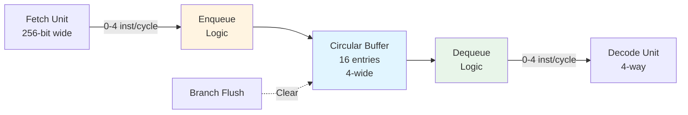
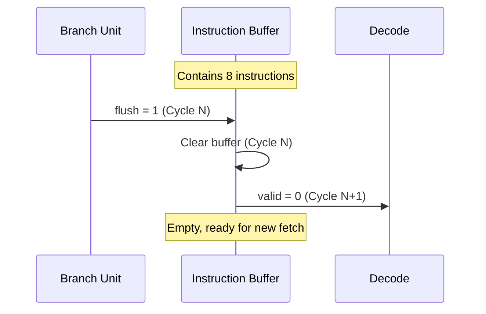

# Instruction Buffer

## Overview

The Instruction Buffer decouples the **fetch unit** from the **decode/dispatch unit**, providing elastic buffering to smooth out variations in fetch bandwidth and decode backpressure. It is implemented as a **circular buffer** that can enqueue and dequeue **up to 4 instructions per cycle**.

**Key Features**:
- Circular buffer organization with configurable depth (default: 16 instructions)
- **Multi-width enqueue**: Accept 1-N instructions per cycle (where N=4)
- **Multi-width dequeue**: Dispatch 0-4 instructions per cycle
- Flush support for branch mispredictions
- Contiguity enforcement: Ensures instructions are dequeued in order

## Purpose

The instruction buffer serves several critical functions:

1. **Decouple Fetch from Decode**: Allows fetch to run ahead when decode is stalled
2. **Absorb Bubbles**: Hide I-cache misses and branch mispredictions
3. **Sustain 4-Way Dispatch**: Provide enough instructions to keep decode busy
4. **Simplify Control**: Provide clean ready/valid interfaces

## Architecture



## Implementation

### Instantiation

The Instruction Buffer is instantiated in the scalar core and parameterized by:

**Code** (`InstructionBuffer.scala` lines 44-56):
```scala
class InstructionBuffer[T <: Data](
  val gen: T,         // Data type (FetchInstruction)
  val n: Int,         // Width (4 for Coral NPU)
  val window: Int     // Capacity (16 for Coral NPU)
) extends Module {
  assert(window % n == 0)  // Window must be multiple of N
  
  val io = IO(new Bundle {
    val feedIn = Flipped(DecoupledVectorIO(gen, n))
    val out = Vec(n, Decoupled(gen))
    val flush = Input(Bool())
    val nEnqueued = Output(UInt(log2Ceil(window + 1).W))
    val nSpace = Output(UInt(log2Ceil(window + 1).W))
  })
}
```

**Parameters for Coral NPU**:
- `gen = FetchInstruction`: Contains instruction bits, address, and branch forward flag
- `n = 4`: 4-way enqueue/dequeue
- `window = 16`: Total capacity of 16 instructions

### Interface

#### Enqueue Interface (`feedIn`)

```scala
class DecoupledVectorIO[T <: Data](gen: T, n: Int) extends Bundle {
  val nReady = Input(UInt(log2Up(n+1).W))   // How many slots available
  val nValid = Output(UInt(log2Up(n+1).W))  // How many inputs valid
  val bits = Output(Vec(n, gen))            // Input data
}
```

**Semantics**:
- Fetch unit can provide 0-4 instructions per cycle via `nValid`
- Instruction buffer reports how many it can accept via `nReady`
- **Transaction occurs** when `min(nValid, nReady)` instructions are transferred

#### Dequeue Interface (`out`)

```scala
val out = Vec(n, Decoupled(gen))
```

- Standard Decoupled interface for each of 4 output lanes
- Each lane has `valid`, `ready`, and `bits` signals
- Decode unit pulls instructions by asserting `ready`

### Underlying Circular Buffer

The instruction buffer uses a **CircularBufferMulti** module to manage storage:

**Code** (line 59):
```scala
val circularBuffer = Module(new CircularBufferMulti(t = gen, n = n, capacity = window))
```

`CircularBufferMulti` provides:
- **Multi-width enqueue/dequeue**: Handle 1-N operations per cycle
- **Head/tail pointers**: Track read and write positions
- **Occupancy tracking**: Report `nEnqueued` and `nSpace`

## Enqueue Logic

**Code** (lines 61-65):
```scala
val feedInReady = Mux(circularBuffer.io.nSpace < n.U, circularBuffer.io.nSpace, n.U)
io.feedIn.nReady := feedInReady
circularBuffer.io.enqValid := io.feedIn.nValid
circularBuffer.io.enqData := io.feedIn.bits
```

**Analysis**:
1. **Calculate available space**: `feedInReady = min(nSpace, 4)`
   - If buffer has 3 slots free, only accept 3 instructions
   - If buffer has 10 slots free, accept up to 4 instructions
2. **Forward to circular buffer**: Pass `nValid` and data directly

### Enqueue Examples

**Scenario 1: Buffer has 10 free slots**
```
Fetch provides: 4 instructions (nValid=4)
Buffer accepts:  4 instructions (nReady=4)
Result: All 4 enqueued, 6 slots remaining
```

**Scenario 2: Buffer has 2 free slots**
```
Fetch provides: 4 instructions (nValid=4)
Buffer accepts:  2 instructions (nReady=2)
Result: Only first 2 enqueued, fetch stalls on remaining 2
```

## Dequeue Logic

**Code** (lines 70-79):
```scala
for (nIndex <- 0 until n) {
  io.out(nIndex).valid := (nIndex.U < circularBuffer.io.nEnqueued) && !io.flush
  io.out(nIndex).bits := circularBuffer.io.dataOut(nIndex)
}

assert(OneHotInOrder(io.out.map(_.fire)), "Instructions not dispatched in order.")
val nReady = PopCount(io.out.map(_.fire))
circularBuffer.io.deqReady := nReady
```

**Analysis**:
1. **Mark valid lanes**: Set `valid` for lanes 0 to `nEnqueued-1`
   - Example: If buffer has 2 instructions, only lanes 0 and 1 are valid
2. **Provide data**: Connect circular buffer's data output to each lane
3. **Handle flush**: Clear all valid signals if flushing
4. **Count accepted**: Count how many lanes fired (`valid && ready`)
5. **Update buffer**: Tell circular buffer how many were dequeued

### Contiguity Assertion

**Critical Requirement**: Instructions must be dequeued **contiguously** from lane 0.

```scala
assert(OneHotInOrder(io.out.map(_.fire)), "Instructions not dispatched in order.")
```

**Valid dequeue patterns**:
- `[fire, fire, fire, fire]` - All 4 lanes dispatch ✅
- `[fire, fire, none, none]` - First 2 lanes dispatch ✅
- `[fire, none, none, none]` - Only lane 0 dispatches ✅
- `[none, none, none, none]` - No lanes dispatch ✅

**Invalid patterns**:
- `[fire, none, fire, none]` - Gap in middle ❌
- `[none, fire, none, none]` - Start from non-zero lane ❌

This enforces the **in-order** dispatch property of Coral NPU.

## Flush Mechanism

On branch misprediction or exception, all instructions in the buffer must be invalidated:

**Code** (line 67):
```scala
circularBuffer.io.flush := io.flush
```

**Effect**:
- Clears all valid bits in circular buffer
- Resets head/tail pointers
- All output lanes become invalid on **next cycle**



## Occupancy Tracking

The instruction buffer provides visibility into its state:

**Code** (lines 81-82):
```scala
io.nEnqueued := circularBuffer.io.nEnqueued
io.nSpace := circularBuffer.io.nSpace
```

- **`nEnqueued`**: Number of valid instructions currently buffered (0-16)
- **`nSpace`**: Number of free slots available (0-16)

**Invariant**: `nEnqueued + nSpace = window (16)`

### Use Cases

1. **Fetch Unit**: Uses `nSpace` to determine how many instructions it can enqueue
2. **Performance Monitoring**: Track buffer utilization
3. **Stall Detection**: If `nEnqueued = 0`, decode is starved; if `nSpace = 0`, fetch is blocked

## Timing Diagram

```
Cycle:      N      N+1      N+2      N+3      N+4
            |       |        |        |        |
Fetch:     [4 inst]-[3 inst]-[0 inst]-[4 inst]-[2 inst]
            |       |        |        |        |
nEnqueued: [5]----[8]------[6]------[10]-----[8]
            |       |        |        |        |
Decode:    [2 inst]-[2 inst]-[2 inst]-[4 inst]-[4 inst]
            |       |        |        |        |
nSpace:   [11]----[8]------[10]------[6]------[8]

Buffer State Timeline:
N  : Had 5, +4 enq, -2 deq → 7 (shown as 8 in N+1)
N+1: Had 7, +3 enq, -2 deq → 8
N+2: Had 8, +0 enq, -2 deq → 6
N+3: Had 6, +4 enq, -4 deq → 6 (shown as 10 enq, but then -4)
```

## Performance Impact

### Throughput

| Scenario | Fetch Rate | Decode Rate | Sustained Throughput |
|----------|-----------|-------------|---------------------|
| **Best case** | 4 inst/cycle | 4 inst/cycle | 4 inst/cycle |
| **Fetch stall (I-cache miss)** | 0 inst/cycle (transient) | 4 inst/cycle | 4 inst/cycle (from buffer) |
| **Decode stall (hazard)** | 4 inst/cycle | 0 inst/cycle (transient) | 0 inst/cycle (buffer fills) |
| **Both stalled** | 0 inst/cycle | 0 inst/cycle | 0 inst/cycle |

**Buffer Benefit**: Can sustain full decode throughput through **4 cycle** fetch stall (16 instructions / 4 per cycle).

### Latency

- **Minimum latency**: 1 cycle from enqueue to visible at decode
- **No combinational path** from `feedIn` to `out` (registered buffer)

**Code comment** (line 42):
> "Note any instruction will be available to dequeue one full cycle following enqueuing."

This means instructions are **not immediately available** on the same cycle they are enqueued, adding 1 cycle of latency.

## Buffer Full/Empty Conditions

### Buffer Full (`nSpace = 0`)

**Cause**: Decode is stalled (dependencies, resource conflicts)

**Effect**:
- Fetch unit cannot enqueue new instructions
- `feedIn.nReady = 0`
- Fetch unit stalls, potentially missing opportunities to prefetch

### Buffer Empty (`nEnqueued = 0`)

**Cause**: Fetch unit is stalled (I-cache miss, branch flush)

**Effect**:
- Decode unit has no instructions to process
- All `out[i].valid = 0`
- Decode unit is idle, wasting cycles

### Optimal Buffer Occupancy

**Sweet spot**: 4-12 instructions

- Enough to absorb transient fetch stalls (> 4)
- Not so full that fetch is frequently blocked (< 12)
- Provides headroom for both fetch and decode variations

## Design Trade-offs

### Window Size (16 instructions)

**Pros**:
- ✅ Absorbs 4-cycle fetch stalls
- ✅ Small area overhead (16 × 32 bits × 4 fields ≈ 2 Kbits)
- ✅ Simple indexing (4-bit pointers)

**Cons**:
- ❌ Cannot hide longer stalls (>4 cycles)
- ❌ Limited benefit for highly bursty fetch patterns

**Alternative**: Larger buffer (32+ entries) would help with longer stalls but increases area and complexity.

### Multi-Width Interface

**Pros**:
- ✅ Efficiently transfers 1-4 instructions per cycle
- ✅ Handles variable fetch/decode rates gracefully
- ✅ No wasted bandwidth

**Cons**:
- ❌ More complex control logic than fixed-width
- ❌ Requires contiguity checking

**Alternative**: Fixed 4-wide interface would be simpler but less efficient when <4 instructions are available.

## Summary

| Feature | Implementation | Benefit |
|---------|----------------|---------|
| **Capacity** | 16 instructions | Absorbs 4-cycle stalls |
| **Width** | 4 instructions/cycle (enq/deq) | Matches fetch and decode bandwidth |
| **Organization** | Circular buffer | Efficient use of storage |
| **Contiguity** | Enforced by assertion | Maintains in-order semantics |
| **Flush** | Immediate clear | Fast recovery from mispredictions |
| **Latency** | 1 cycle (registered) | Predictable timing |

---

**Next**: [Decode Unit →](decode.md)

**Source**: `coral/codes/coralnpu/hdl/chisel/src/common/InstructionBuffer.scala` (84 lines)

