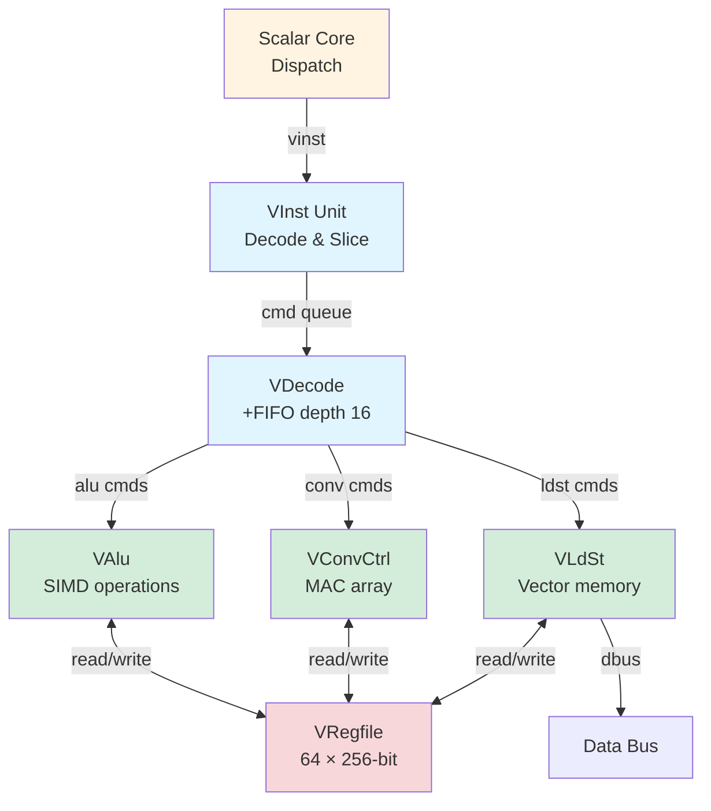

# Vector Core (VCore) Overview

## Overview

The **Vector Core (VCore)** is Coral NPU's custom SIMD acceleration engine, distinct from the RISC-V Vector extension (RVV). It provides a dedicated backend for executing Coral's proprietary vector instructions, enabling efficient ML workloads with a deep, decoupled pipeline.

**Key Features**:
- **Custom instruction set**: Proprietary SIMD operations optimized for ML
- **Decoupled execution**: Runs asynchronously from scalar core via command queue
- **Large vector register file**: 64 registers × 256 bits (configurable: 128/256/512-bit)
- **Stripmining support**: Automatic loop subdivision for large data
- **Multi-functional execution units**: ALU, Load/Store, Convolution accelerator
- **Out-of-order tagging**: Register scoreboarding with 1-bit tags

---

## Architecture

### High-Level Block Diagram



### Pipeline Overview

The Vector Core operates as a **5-stage decoupled pipeline**:

```
Scalar Core Dispatch → VInst (Decode/Slice) → VDecode (FIFO) → Execution Units → VRegfile
```

**Pipeline Stages** (from VCore.scala lines 38-44):
1. **Decode (VInst.in)**: Receive from scalar dispatch
2. **Execute+0 (VInst.slice)**: Slice multi-lane instructions
3. **Execute+1 (VDec::Fifo.in)**: Enqueue into decode FIFO
4. **Execute+2 (VDec::Shuffle.out)**: Shuffle and tag assignment
5. **Execute+3 (VCmdq::Fifo.in)**: Command queue entry
6. **Execute+4 (VCmdq::Reg.in)**: Register staging
7. **Execute+5 (Execution)**: Dispatch to VAlu, VLdSt, or VConv

---

## Core Components

### 1. VInst - Vector Instruction Frontend
**File**: `VInst.scala` (270 lines)

**Purpose**: Receives vector instructions from scalar core, performs address calculation for load/store, and slices instructions for the decode stage.

**Key Functions**:
- **Instruction decode**: Identify VLD, VST, VIOP (vector operation)
- **Address calculation**: `rs1 + offset` for load/store instructions
- **Vector length (VL) handling**: `getvl`, `getmaxvl` instructions
- **Double buffering**: Slice unit provides decoupling from scalar core

**Interface** (VInst.scala lines 51-64):
```scala
val in = Vec(instructionLanes, Flipped(Decoupled(new VInstCmd)))   // From scalar dispatch
val rs = Vec(instructionLanes * 2, Flipped(new RegfileReadDataIO)) // Read scalar regs
val rd = Vec(instructionLanes, Valid(Flipped(new RegfileWriteDataIO)))  // Write scalar regs
val out = new VectorInstructionIO(p)  // To VDecode
```

---

### 2. VDecode - Vector Instruction Decoder
**File**: `VDecode.scala` (326 lines)

**Purpose**: Deep FIFO-buffered decoder that translates vector instructions into execution commands, applies out-of-order tags, and manages register dependencies.

**Key Features**:
- **FIFO depth**: 16 + 8 guard entries (lines 45-46)
- **Out-of-order tagging**: 1-bit tags per 4-register group (64-bit tag register)
- **Dependency tracking**: Scoreboard checks for read-after-write hazards
- **Command routing**: Dispatch to `alu`, `conv`, or `ldst` based on opcode

**Tag Mechanism** (VDecode.scala lines 75-82):
```scala
val tagReg = RegInit(0.U(64.W))  // 64 bits for 64 registers (1 bit per 4-reg group)
val tags = wactive.scan(tagReg)(_ ^ _)  // XOR accumulation
tagReg := MuxCase(tags(0), ...)
```

**Dependency Check** (VDecode.scala lines 143-152):
```scala
val wactive = io.vrfsb.data | io.active | accumulated writes
val ractive = accumulated writes only
val depends = (wactive & wactive_current) | (ractive & ractive_current)
```

---

### 3. VRegfile - Vector Register File
**File**: `VRegfile.scala` (458 lines)

**Purpose**: Large, segmented register file with forwarding, transpose, and convolution write-back support.

**Organization**:
- **Capacity**: 64 registers × `vectorBits` (128/256/512-bit)
- **Segmentation**: Each register split into 32-bit segments (4/8/16 segments)
- **Scoreboard**: 128-bit (64 registers × 2 tags for even/odd)

**Ports**:
| Port Type | Count | Purpose |
|-----------|-------|---------|
| Read | 7 | VAlu (6) + VLdSt (1) |
| Write | 5 | VAlu (2) + VLdSt (1) + VConv (2) |
| Scalar | 2 | Broadcast scalar to vector |
| Transpose | 1 | 8×8 transpose for convolution |

**Forwarding Logic** (VRegfile.scala lines 232-276):
- **f1valid**: Forwarding from current cycle writes
- **f2valid**: Forwarding from registered (previous cycle) writes
- **Priority**: Scalar > F1 > F2 > Memory read

**Scoreboard** (VRegfile.scala lines 414-447):
```scala
val vrfsb = RegInit(0.U(128.W))  // 128 bits for 64 regs × 2 tags
vrfsb := (vrfsb & ~vrfsbClr) | vrfsbSet
```

---

### 4. VAlu - Vector ALU
**File**: `VAlu.scala` (370+ lines)

**Purpose**: Execute SIMD arithmetic, logical, shift, multiply, and shuffle operations.

**Supported Operations** (VAlu.scala lines 73-142):
- **Arithmetic**: `vadd`, `vsub`, `vadds`, `vsubs`, `vhadd`, `vhsub`, `vmax`, `vmin`, `vacc`
- **Compare**: `veq`, `vne`, `vlt`, `vle`, `vgt`, `vge`
- **Logical**: `vand`, `vor`, `vxor`, `vnot`, `vmv`, `vmv2`, `vmvp`
- **Shift**: `vshl`, `vshr`, `vsrans`, `vsraqs`, `vror`, `vshf`
- **Multiply**: `vmul`, `vmul2`, `vmulh`, `vmulh2`, `vdmulh`, `vdmulh2`, `vmadd`, `vmulw`
- **Shuffle**: `vslidevn`, `vslidevp`, `vsel`, `vevn`, `vodd`, `vzip`
- **ML-specific**: `vdwconv`, `adwconv` (depthwise convolution)

**Pipeline**:
- **Command Queue**: 8-deep FIFO (line 55)
- **Stripmining**: Automatic loop subdivision for large vectors

**Stripmining Example** (from code logic):
```
Vector of 32 elements, VLEN=128 bits (4 × 32-bit):
  Strip 0: elements [0:3]   (step=0)
  Strip 1: elements [4:7]   (step=1)
  Strip 2: elements [8:11]  (step=2)
  ...
  Strip 7: elements [28:31] (step=7)
```

---

### 5. VLdSt - Vector Load/Store Unit
**File**: `VLdSt.scala` | **[Comprehensive Documentation](vldst/)** ⭐⭐⭐

**Purpose**: Handle vector memory operations with CNN-optimized addressing modes.

**⚠️ Important**: This is a **simplified, CNN-specific** implementation (~40% RISC-V Vector compliance)
- ✅ Unit-stride and constant-stride access
- ✅ Automatic stripmining (4-register chunks)
- ❌ NO indexed/gather/scatter operations
- ❌ NO segment loads (multi-field structs)
- ❌ NO exception handling (bus errors cause deadlock!)
- ❌ NO fault-only-first (partial completion)

**Documentation Structure**:
- **[Overview & Navigation](vldst/README.md)** - Start here
- **[Operations](vldst/operations.md)** - vld, vst, vstq instructions
- **[Addressing Modes](vldst/addressing.md)** - Stride, stripmining, swizzle
- **[Microarchitecture](vldst/microarchitecture.md)** - Pipeline, FIFOs, control
- **[Limitations](vldst/limitations.md)** ⚠️ - Unsupported RISC-V features
- **[Exception Handling](vldst/exceptions.md)** ⚠️ - Safety risks and mitigations
- **[RISC-V Comparison](vldst/rvv_comparison.md)** - Feature parity analysis

**Interface to Data Bus**:
- 128-bit DBus width (16 bytes/transaction)
- Swizzle logic for misaligned addresses (0-cycle penalty)
- 8-entry command queue + 3-entry control/data FIFOs

---

### 6. VConvCtrl & VConvAlu - Convolution Accelerator
**Files**: `VConvCtrl.scala`, `VConvAlu.scala`

**Purpose**: Hardware accelerator for 2D convolution using outer-product MAC.

**Key Operations**:
- **conv**: Accumulate outer product into accumulator array
- **init**: Initialize accumulator to vector
- **tran**: Transpose vector into accumulator
- **wclr**: Write accumulator to register file and clear

**Accumulator Registers**: v48-v63 (16 registers reserved for accumulation)

---

## Instruction Flow Example

### Example: Vector Add (`vadd.w vd, vs, vt`)

```assembly
# Assembly
vadd.w  v4, v1, v2    # v4 = v1 + v2 (32-bit elements)
```

### Cycle-by-Cycle Execution

#### Cycle N: Scalar Dispatch
```
Scalar Decode identifies vector instruction
  - Opcode: 0x0B (custom-0)
  - Dispatch to VCore via io.score.vinst
```

#### Cycle N+1: VInst Decode
```
VInst.io.in receives instruction
  - inst[31:25] = 0x00 (func7)
  - inst[14:12] = 0x6  (func3)
  - inst[6:0]   = 0x0B (opcode)
  - Identified as VIOP (vector operation)
  
VInst slices and forwards to VDecode
```

#### Cycle N+2: VDecode FIFO
```
VDecode.io.in enqueues instruction
  - FIFO depth: 1/16
  - Decode opcode: vadd (0x01)
  - Extract fields:
    * vd = v4 (addr=4)
    * vs = v1 (addr=1)
    * vt = v2 (addr=2)
    * sz = 2 (32-bit width)
    * m  = 0 (not stripmining)
```

#### Cycle N+3: Tag Assignment
```
tagReg = 0x0000000000000000  (initial)
wactive = 1 << 4 = 0x00000010  (v4 will be written)

Tag assignment:
  - v4 is in group [4:7], use bits [4:7] of tagReg
  - Assign tag = tagReg[1] = 0 (bit 1 = group 1)
  - vs.tag = 0, vt.tag = 0, vd.tag = 0 (all same tag)
  
tagReg XOR= 0x00000010 → tagReg = 0x00000010
```

#### Cycle N+4: Scoreboard Check
```
io.vrfsb.data = 0x00000000...00000000  (128 bits, no pending)

Check dependencies:
  - Read v1: sb[0*64 + 1] = 0 ✅ Ready
  - Read v2: sb[0*64 + 2] = 0 ✅ Ready
  - Write v4: No conflict ✅
  
Command ready to dispatch!
```

#### Cycle N+5: Dispatch to VAlu
```
VDecode routes to VAlu:
  - io.cmdq(i).alu = 1
  - Valid command sent to VAlu.io.in
  
VAlu command queue enqueues:
  - op = vadd
  - sz = 2 (32-bit)
  - vd = 4, vs = 1, vt = 2
  - m = 0, step = 0
```

#### Cycle N+6: VAlu Read Phase
```
VAlu issues read requests:
  - io.read(0).valid = 1, addr = 1, tag = 0  (v1)
  - io.read(1).valid = 1, addr = 2, tag = 0  (v2)
  
VRegfile responds (1-cycle latency):
  - io.read(0).data = 0x0403020100030201... (256 bits)
  - io.read(1).data = 0x0201010105040302...
```

#### Cycle N+7: VAlu Compute
```
VAlu integer unit (VAluInt) performs SIMD add:
  
For 256-bit vector (8 × 32-bit elements):
  v1 = [0x04030201, 0x00030201, ..., (8 elements)]
  v2 = [0x02010101, 0x05040302, ..., (8 elements)]
  
  v4[0] = v1[0] + v2[0] = 0x04030201 + 0x02010101 = 0x06040302
  v4[1] = v1[1] + v2[1] = 0x00030201 + 0x05040302 = 0x05070503
  ...
  (repeat for all 8 elements in parallel)
```

#### Cycle N+8: VAlu Write Phase
```
VAlu issues write:
  - io.write(0).valid = 1
  - io.write(0).addr = 4
  - io.write(0).data = 0x050705030604030... (result)
  
VRegfile writes to v4:
  - Forward data to any pending reads (bypassing)
  - Clear scoreboard: vrfsb[0*64 + 4] = 0
```

#### Cycle N+9: Complete
```
Instruction complete!
  - Total latency: ~9 cycles (decode to writeback)
  - Throughput: 1 instruction/cycle (if no dependencies)
```

---

## Performance Characteristics

| Metric | Value | Notes |
|--------|-------|-------|
| **Vector Register File** | 64 × 256-bit | 2KB total (256-bit config) |
| **SIMD Width** | 256-bit | 8 × 32-bit, 16 × 16-bit, 32 × 8-bit |
| **Peak Throughput** | 8 ops/cycle | One vector instruction (8 elements) |
| **Decode FIFO Depth** | 16 + 8 guard | Decouples from scalar core |
| **ALU Latency** | 3-5 cycles | Depends on operation |
| **Load/Store Latency** | Variable | Depends on cache/memory |
| **Convolution Throughput** | 256 MACs/cycle | Via VConvAlu outer-product engine |

---

## Stripmining Mechanism

**Purpose**: Handle vectors larger than hardware VLEN by automatically subdividing.

### How It Works

**Encoding** (VCommon.scala lines 24-114):
- Register address: 6 bits `[5:0]`
- Upper 4 bits `[5:2]`: Base register (16 groups of 4)
- Lower 2 bits `[1:0]`: Strip offset (0-3)
- Step parameter: 3 bits (0-4 strips)

**Example**: VLEN=128-bit, processing 512-bit vector

```
Vector v8 contains 512 bits = 4 × 128-bit strips

m=1 (stripmining enabled), step=3 (4 strips)

Strip assignment:
  v8 (addr=8, bits[1:0]=0) → strip 0
  v9 (addr=9, bits[1:0]=1) → strip 1
  v10 (addr=10, bits[1:0]=2) → strip 2
  v11 (addr=11, bits[1:0]=3) → strip 3

One instruction processes all 4 strips sequentially!
```

**Active Mask** (VCommon.scala RegActive function):
```
For register v8, step=3:
  Activates registers: v8, v9, v10, v11 (4 consecutive)
  
Scoreboard marks all 4 as active:
  active[8] = 1, active[9] = 1, active[10] = 1, active[11] = 1
```

---

## Register File Organization

### Physical Structure

```
64 registers, each divided into segments:

For 256-bit config (8 × 32-bit segments):
┌─────────────────────────────────────────────────┐
│ v0  [seg7|seg6|seg5|seg4|seg3|seg2|seg1|seg0]  │ 256 bits
│ v1  [seg7|seg6|seg5|seg4|seg3|seg2|seg1|seg0]  │
│ ...                                              │
│ v63 [seg7|seg6|seg5|seg4|seg3|seg2|seg1|seg0]  │
└─────────────────────────────────────────────────┘

Each segment is 32 bits (VRegfileSegment module)
```

### Special Register Ranges

| Range | Purpose |
|-------|---------|
| v0-v47 | General purpose vector registers |
| v48-v63 | **Accumulator registers** (reserved for VConv) |

**Accumulator Usage**:
- `vdwconv` (depthwise convolution) uses v48-v63 for accumulation
- `wclr` operation writes accumulator back to regular registers

---

## Scoreboard Details

### Two-Level Scoreboard

**Structure**: 128 bits = 64 registers × 2 tags

```
Bits [63:0]   : Tag 0 (even tag)
Bits [127:64] : Tag 1 (odd tag)
```

**Tag Index Calculation** (VCommon.scala lines 130-139):
```scala
def ScoreboardReady(addr: UInt, tag: UInt, sb: UInt): Bool = {
  val tagbit = tag(addr(1,0))  // Select bit based on lower 2 bits of addr
  val idx = Cat(tagbit, addr)  // 7-bit index: [tag][addr]
  !sb(idx)  // Ready if scoreboard bit is clear
}
```

**Example**:
```
Register v5, tag=0b1010:
  addr = 5 = 0b000101
  addr[1:0] = 01
  tag[1] = 1 (second bit of tag)
  idx = Cat(1, 5) = 0b1000101 = 69
  
Check: sb[69] == 0? → Ready if true
```

---

## VCore-Scalar Interface

### Command Interface (VCore.scala lines 56-58)

```scala
vinst.io.in <> io.score.vinst  // Instructions from scalar dispatch
vinst.io.rs <> io.score.rs     // Read scalar registers
vinst.io.rd <> io.score.rd     // Write scalar registers (getvl, etc.)
```

### Status Signals (VCore.scala lines 53-54, 78, 169)

```scala
io.score.vrfwriteCount := vrf.io.vrfwriteCount  // VRF write activity
io.score.vstoreCount := vldst.io.vstoreCount    // Vector store count
io.score.undef := vdec.io.undef                 // Undefined instruction
io.score.mactive := vinst.io.nempty || vdec.io.nempty  // Vector core busy
```

**Usage**:
- `mactive`: Scalar core uses to prevent WFI when vector work pending
- `vrfwriteCount`: Performance counter
- `undef`: Triggers undefined instruction exception in scalar core

---

## Execution Unit Routing

### Command Queue Dispatch (VCore.scala lines 94-165)

**ALU Path**:
```scala
val aluvalid = vdec.io.out(x).valid && vdec.io.cmdq(x).alu
valu.io.in.valid := aluvalid.reduce(_ || _)
valu.io.in.bits(i) := vdec.io.out(i).bits
```

**Convolution Path**:
```scala
val convvalid = vdec.io.out(x).valid && vdec.io.cmdq(x).conv
vconv.io.in.valid := convvalid.reduce(_ || _)
vconv.io.in.bits(i) := vdec.io.out(i).bits
```

**Load/Store Path**:
```scala
val ldstvalid = vdec.io.out(x).valid && vdec.io.cmdq(x).ldst
vldst.io.in.valid := ldstvalid.reduce(_ || _)
vldst.io.in.bits(i) := vdec.io.out(i).bits
```

**Ready Feedback** (VCore.scala lines 163-165):
```scala
vdec.io.out(i).ready := aluready(i) || convready(i) || ldstready(i)
```

---

## Example: Convolution Operation

### Instruction: `vdwconv.b v48, v0, v4`

**Operation**: Depthwise convolution, 8-bit elements, accumulate to v48-v63

### Steps:

1. **Transpose Phase**:
   ```
   Read v0 (3×3 kernel) via transpose port
   Transpose 8×8 block into temporary register
   ```

2. **Accumulation Phase** (4 strips):
   ```
   Strip 0: Read v4[0:3],   compute outer-product with kernel, accumulate → v48
   Strip 1: Read v4[4:7],   compute outer-product with kernel, accumulate → v49
   Strip 2: Read v4[8:11],  compute outer-product with kernel, accumulate → v50
   Strip 3: Read v4[12:15], compute outer-product with kernel, accumulate → v51
   ```

3. **Writeback Phase**:
   ```
   wclr: Write v48-v51 back to destination, clear accumulator
   ```

**Performance**:
- 256 MACs per cycle (VConvAlu outer-product engine)
- 4 cycles for 4 strips = 1024 MACs total
- Effective throughput: **256 MACs/cycle sustained**

---

## Comparison: VCore vs. RVV

| Feature | VCore (Coral Custom) | RVV (Standard) |
|---------|----------------------|----------------|
| **Instruction Set** | Proprietary (70+ ops) | RISC-V Vector v1.0 |
| **Decoupling** | Deep FIFO (16-entry) | Tight coupling |
| **Register File** | 64 × 256-bit | 32 × VLEN |
| **Stripmining** | Hardware automatic | Software loop |
| **Convolution** | Dedicated accelerator | Software emulation |
| **Tag System** | 1-bit out-of-order | In-order |
| **Primary Use** | ML inference (CNN) | General vector compute |

**Why Both?**
- **VCore**: Optimized for Coral NPU's ML workloads, higher throughput
- **RVV**: Standard RISC-V compatibility, general-purpose vector compute

---

## Detailed Component Documentation

1. **[VInst Unit](vinst.md)** ⭐ - Instruction frontend and address calculation
2. **[VDecode Unit](vdecode.md)** ⭐ - Deep decoder with out-of-order tagging
3. **[Vector Register File (VRegfile)](vregfile.md)** ⭐ - Segmented register file with forwarding
4. **[VAlu](valu.md)** ⭐ - Dual 128-bit SIMD ALU pipelines
5. **[VLdSt](vldst/)** ⭐⭐⭐ - Vector memory operations (comprehensive documentation)
6. **[Convolution Accelerator (VConv)](vconv.md)** ⭐ - 256 MACs/cycle outer-product engine

**Additional Resources**:
- **[Vector Walkthrough](walkthrough.md)** ⭐ - Step-by-step execution examples

---

**Source Files**:
- `coral/codes/coralnpu/hdl/chisel/src/coralnpu/vector/VCore.scala` (172 lines)
- `coral/codes/coralnpu/hdl/chisel/src/coralnpu/vector/VCommon.scala` (141 lines)
- `coral/codes/coralnpu/hdl/chisel/src/coralnpu/vector/VRegfile.scala` (458 lines)
- `coral/codes/coralnpu/hdl/chisel/src/coralnpu/vector/VInst.scala` (270 lines)
- `coral/codes/coralnpu/hdl/chisel/src/coralnpu/vector/VDecode.scala` (326 lines)
- `coral/codes/coralnpu/hdl/chisel/src/coralnpu/vector/VAlu.scala` (370+ lines)

