# VAlu - Vector SIMD ALU

## Overview

The **VAlu (Vector ALU)** is the primary SIMD execution engine for the Vector Core. It features **dual 128-bit ALU pipelines** (alu0 and alu1) that execute arithmetic, logical, compare, shift, multiply, shuffle, and machine learning operations. The design supports **interleaved execution** to maximize throughput while managing register file port constraints.

**Key Features**:
- **Dual ALU pipelines**: 2 independent 128-bit execution units (alu0, alu1)
- **Instruction support**: 60+ vector operations
- **Stripmining support**: Automatic loop subdivision for large data
- **Command queues**: 8-entry deep FIFO per ALU
- **Scoreboard integration**: Read ports synchronized with register availability
- **Interleaved dispatch**: Round-robin allocation to balance load

---

## Architecture

### Block Diagram

```mermaid
graph TD
    VDecode[VDecode<br/>4 lanes] -->|instructions| SEL[ALU Selection<br/>Round-robin]
    
    SEL -->|even/sync| Q0[Command Queue 0<br/>8 entries]
    SEL -->|odd/sync| Q1[Command Queue 1<br/>8 entries]
    
    Q0 -->|dispatch| ALU0[VAluInt 0<br/>128-bit SIMD]
    Q1 -->|dispatch| ALU1[VAluInt 1<br/>128-bit SIMD]
    
    SB[Scoreboard<br/>128-bit] -->|ready check| Q0
    SB -->|ready check| Q1
    
    VREGS[VRegfile<br/>64×128b] -->|read ports 0-2| ALU0
    VREGS -->|read ports 3-5| ALU1
    
    ALU0 -->|write ports 0-1| VREGS
    ALU1 -->|write ports 2-3| VREGS
    
    style SEL fill:#fff4e1
    style Q0 fill:#e1f5ff
    style Q1 fill:#e1f5ff
    style ALU0 fill:#d4edda
    style ALU1 fill:#d4edda
```



### Dual-Pipeline Rationale

**Why 2 ALUs?**

**Problem**: Single 128-bit ALU + 4-way dispatch = under-utilization
- 4 instructions decoded/cycle
- Only 1 instruction executed/cycle
- 75% idle time ❌

**Solution**: Dual independent ALUs
- Dispatch up to 2 instructions/cycle (even/odd interleaving)
- 50% utilization minimum ✅
- Synchronized commands can use both ALUs for wide operations 🚀

---

## Interface Specification

### Input from VDecode

**Instruction Input** (VAlu.scala line 35):
```scala
val in = Flipped(Decoupled(Vec(instructionLanes, Valid(new VDecodeBits))))
// 4-lane input, dispatches to alu0 or alu1 based on selection
```

**Scoreboard Input** (VAlu.scala line 39):
```scala
val vrfsb = Input(UInt(128.W))
// 128-bit scoreboard: [127:64] = tag 1, [63:0] = tag 0
```

### Output to VRegfile

**Read Ports** (VAlu.scala line 40):
```scala
val read = Vec(vectorReadPorts, new VRegfileReadIO(p))
// 7 read ports total:
//   Ports 0-2: ALU0 (vs, vt, vu)
//   Ports 3-5: ALU1 (vs, vt, vu)
//   Port 6: Shared (for cross-ALU access)
```

**Write Ports** (VAlu.scala line 41):
```scala
val write = Vec(vectorWritePorts - 2, new VRegfileWriteIO(p))
// 4 write ports (total 6 ports, 2 reserved for VConv):
//   Ports 0-1: ALU0 (vd, ve)
//   Ports 2-3: ALU1 (vd, ve)
```

**Write Hints** (VAlu.scala line 42):
```scala
val whint = Vec(vectorWhintPorts, new VRegfileWhintIO(p))
// 4 hint ports for scoreboard early clear
```

**Scalar Operands** (VAlu.scala line 43):
```scala
val scalar = Vec(vectorScalarPorts, new VRegfileScalarIO(p))
// 2 scalar ports (one per ALU) for immediate values
```

---

## Supported Operations

### Operation Categories

**Arithmetic** (VAlu.scala lines 74-91):
```scala
// Addition/Subtraction
vabsd   // Absolute difference
vacc    // Accumulate
vadd    // Add
vadds   // Add with saturation
vaddw   // Add wide (sign-extend)
vadd3   // Three-way add
vdup    // Duplicate
vhadd   // Halving add (a + b) >> 1
vhsub   // Halving subtract (a - b) >> 1
vmax    // Maximum
vmin    // Minimum
vpadd   // Pairwise add
vpsub   // Pairwise subtract
vrsub   // Reverse subtract (b - a)
vsub    // Subtract
vsubs   // Subtract with saturation
vsubw   // Subtract wide
```

**Compare** (VAlu.scala lines 92-98):
```scala
veq     // Equal (a == b)
vne     // Not equal (a != b)
vlt     // Less than (a < b)
vle     // Less or equal (a <= b)
vgt     // Greater than (a > b)
vge     // Greater or equal (a >= b)
// Result: 0xFFFFFFFF (true) or 0x00000000 (false) per element
```

**Logical** (VAlu.scala lines 99-112):
```scala
vand    // Bitwise AND
vclb    // Count leading bits
vclz    // Count leading zeros
vcpop   // Count population (popcount)
vmv     // Move
vmv2    // Move 2 registers
vmvp    // Move with predicate
adwinit // Activation window init
vnot    // Bitwise NOT
vor     // Bitwise OR
vrev    // Bit reverse
vror    // Rotate right
vxor    // Bitwise XOR
```

**Shift** (VAlu.scala lines 113-118):
```scala
vshl    // Shift left logical
vshr    // Shift right logical/arithmetic
vshf    // Shuffle
vsrans  // Shift right and narrow with saturation
vsraqs  // Shift right accumulate and quantize with saturation
```

**Multiply** (VAlu.scala lines 119-129):
```scala
vdmulh  // Dual multiply high
vdmulh2 // Dual multiply high (variant 2)
vmadd   // Multiply-add
vmul    // Multiply
vmul2   // Multiply (variant 2)
vmulh   // Multiply high
vmulh2  // Multiply high (variant 2)
vmuls   // Multiply with saturation
vmuls2  // Multiply with saturation (variant 2)
vmulw   // Multiply wide
```

**Shuffle** (VAlu.scala lines 130-139):
```scala
vslidevn  // Slide vector down (negative direction)
vslidevp  // Slide vector up (positive direction)
vslidehn2 // Slide high-half down (2-register)
vslidehp2 // Slide high-half up (2-register)
vsel      // Select (mux)
vevn      // Extract even elements
vodd      // Extract odd elements
vevnodd   // Even-odd interleave
vzip      // Zip (transpose)
```

**Machine Learning** (VAlu.scala lines 140-142):
```scala
vdwconv  // Depthwise convolution
adwconv  // Accumulator depthwise convolution
```

**Total**: 60+ supported opcodes

---

## Command Queue System

### Dual Command Queues

**Queue 0** (VAlu.scala line 240):
```scala
val q0 = VCmdq(p, cmdqDepth, new VAluCmdq, Fin0, Fout, Factive)
// 8-entry FIFO for ALU0
```

**Queue 1** (VAlu.scala line 241):
```scala
val q1 = VCmdq(p, cmdqDepth, new VAluCmdq, Fin1, Fout, Factive)
// 8-entry FIFO for ALU1
```

**Purpose**: Decouple decode from execution, hide scoreboard stalls

### Command Structure

**VAluCmdq Bundle** (VAlu.scala lines 164-175):
```scala
class VAluCmdq extends Bundle {
  val op = UInt(bits.W)        // Opcode
  val f2 = UInt(3.W)            // Function modifier
  val sz = UInt(3.W)            // Size (one-hot: 8b, 16b, 32b)
  val vd = new VAddr()          // Destination register
  val ve = new VAddr()          // Extended destination
  val vs = new VAddrTag()       // Source 1
  val vt = new VAddrTag()       // Source 2
  val vu = new VAddrTag()       // Source 3
  val sv = new SData()          // Scalar immediate
  val cmdsync = Bool()          // Synchronize both ALUs
}
```

---

## ALU Selection (Interleaving)

### Round-Robin Dispatch

**Selection Logic** (VAlu.scala lines 263-274):
```scala
val alureg = RegInit(false.B)  // Last ALU used
val alusel = Wire(Vec(instructionLanes + 1, Bool()))

// Toggle for each valid, non-synchronized instruction
alusel(0) := alureg
for (i <- 0 until instructionLanes) {
  alusel(i + 1) := Mux(
    io.in.bits(i).valid && !io.in.bits(i).bits.cmdsync, 
    !alusel(i),  // Toggle
    alusel(i)    // Keep same
  )
}

// Update on dispatch
when (io.in.valid && io.in.ready) {
  alureg := alusel(alusel.length - 1)
}
```

**Dispatch Routing** (VAlu.scala lines 276-279):
```scala
for (i <- 0 until instructionLanes) {
  q0.io.in.bits(i).valid := io.in.bits(i).valid && 
    (alusel(i) === 0.U || io.in.bits(i).bits.cmdsync)
  q1.io.in.bits(i).valid := io.in.bits(i).valid && 
    (alusel(i) === 1.U || io.in.bits(i).bits.cmdsync)
}
```

**Rules**:
1. **Non-synchronized instructions**: Alternate between q0 and q1
2. **Synchronized instructions**: Go to **both** q0 and q1

### Example: Interleaving

**Input Sequence**:
```
Lane 0: vadd.w v0, v1, v2   (normal, not sync)
Lane 1: vsub.w v3, v4, v5   (normal, not sync)
Lane 2: vdwconv v6, v7, v8  (cmdsync=true)
Lane 3: vmul.w v9, v10, v11 (normal, not sync)
```

**Selection**:
```
alureg = 0 (initial state: use ALU1 next)

Lane 0: valid=true, cmdsync=false
  alusel(0) = 0 (alureg)
  alusel(1) = !alusel(0) = 1
  → Route to q1 ✅

Lane 1: valid=true, cmdsync=false
  alusel(1) = 1 (from lane 0)
  alusel(2) = !alusel(1) = 0
  → Route to q0 ✅

Lane 2: valid=true, cmdsync=TRUE
  alusel(2) = 0 (from lane 1)
  alusel(3) = alusel(2) = 0 (no toggle)
  → Route to BOTH q0 and q1 ✅✅

Lane 3: valid=true, cmdsync=false
  alusel(3) = 0 (from lane 2)
  alusel(4) = !alusel(3) = 1
  → Route to q1 ✅

Final: alureg = alusel(4) = 1
```

**Result**:
```
q0 receives: Lane 1 (vsub), Lane 2 (vdwconv)
q1 receives: Lane 0 (vadd), Lane 2 (vdwconv), Lane 3 (vmul)
```

---

## Scoreboard Integration

### Ready Check

**Queue 0 Ready** (VAlu.scala lines 250-252):
```scala
val q0ready = ScoreboardReady(q0.io.out.bits.vs, io.vrfsb) &&
              ScoreboardReady(q0.io.out.bits.vt, io.vrfsb) &&
              ScoreboardReady(q0.io.out.bits.vu, io.vrfsb)
// All source registers must be ready
```

**Queue 1 Ready** (VAlu.scala lines 254-256):
```scala
val q1ready = ScoreboardReady(q1.io.out.bits.vs, io.vrfsb) &&
              ScoreboardReady(q1.io.out.bits.vt, io.vrfsb) &&
              ScoreboardReady(q1.io.out.bits.vu, io.vrfsb)
```

### Synchronized Command Dispatch

**Mutual Dependency** (VAlu.scala lines 258-259):
```scala
q0.io.out.ready := q0ready && 
  (!q0.io.out.bits.cmdsync || 
   q1.io.out.valid && q1ready && q1.io.out.bits.cmdsync)

q1.io.out.ready := q1ready && 
  (!q1.io.out.bits.cmdsync || 
   q0.io.out.valid && q0ready && q0.io.out.bits.cmdsync)
```

**Meaning**:
- **Normal commands**: Dispatch when scoreboard ready
- **Synchronized commands**: Dispatch only when **both** queues ready

**Purpose**: Ensure synchronized operations (like `vdwconv`) execute atomically across both ALUs

---

## Register File Port Mapping

### Read Port Assignment

**ALU0 Read Ports** (VAlu.scala lines 289-291):
```scala
MapAddrTag(io.read(0), q0.io.out.bits.vs)  // ALU0 source 1
MapAddrTag(io.read(1), q0.io.out.bits.vt)  // ALU0 source 2
MapAddrTag(io.read(2), q0.io.out.bits.vu)  // ALU0 source 3
```

**ALU1 Read Ports** (VAlu.scala lines 292-294):
```scala
MapAddrTag(io.read(3), q1.io.out.bits.vs)  // ALU1 source 1
MapAddrTag(io.read(4), q1.io.out.bits.vt)  // ALU1 source 2
MapAddrTag(io.read(5), q1.io.out.bits.vu)  // ALU1 source 3
```

**Cross-Connect for Synchronized Operations** (VAlu.scala lines 343-348):
```scala
// ALU1 can also read ALU0's ports for synchronized ops
alu1.io.read(3).data := io.read(0).data  // ALU0's port 0
alu1.io.read(4).data := io.read(1).data  // ALU0's port 1
alu1.io.read(5).data := io.read(2).data  // ALU0's port 2
```

### Write Port Assignment

**ALU0 Write Ports** (VAlu.scala lines 325-326):
```scala
io.write(0) := alu0.io.write(0)  // ALU0 destination 1 (vd)
io.write(1) := alu0.io.write(1)  // ALU0 destination 2 (ve)
```

**ALU1 Write Ports** (VAlu.scala lines 350-351):
```scala
io.write(2) := alu1.io.write(0)  // ALU1 destination 1 (vd)
io.write(3) := alu1.io.write(1)  // ALU1 destination 2 (ve)
```

---

## Stripmining Support

### Automatic Loop Subdivision

**Purpose**: Handle operations on large vectors (> 4 registers) by subdividing into 4-register chunks

**Fout Function** (VAlu.scala lines 200-227):
```scala
def Fout(in: VAluCmdq, m: Bool, step: UInt, valid: Bool): (VAluCmdq, Bool) = {
  val out = Wire(new VAluCmdq)
  val last = !m || step === 3.U  // Last iteration when step=3
  
  // Increment register addresses for next iteration
  out.vd.addr := in.vd.addr + 1.U
  out.ve.addr := in.ve.addr + 1.U
  out.vs.addr := in.vs.addr + 1.U
  out.vt.addr := in.vt.addr + 1.U
  out.vu.addr := in.vu.addr + 1.U
  
  // Special handling for vevnodd and vzip operations...
  (out, last)
}
```

**Active Register Tracking** (VAlu.scala lines 229-238):
```scala
def Factive(in: VAluCmdq, m: Bool, step: UInt): UInt = {
  // Report which registers are actively being read
  val active = MuxOR(in.vs.valid, RegActive(m, step(2,0), in.vs.addr)) |
               MuxOR(in.vt.valid, RegActive(m, step(2,0), in.vt.addr)) |
               MuxOR(in.vu.valid, RegActive(m, step(2,0), in.vu.addr))
  active
}
```

**RegActive Helper** (VCommon.scala):
```scala
def RegActive(m: Bool, step: UInt, addr: UInt): UInt = {
  // If stripmining (m=true), mark 4 consecutive registers
  // Otherwise, mark only 1 register
  val mask = Mux(m, 0xF.U, 0x1.U) << (addr + step)
  mask
}
```

### Example: Stripmining

**Instruction**:
```
vadd.w v8, v0, v4  (m=true, 16 elements = 4 registers)
```

**Execution**:
```
Cycle 0: vadd.w v8, v0, v4   (step=0, addr=8,0,4)
  active = RegActive(true, 0, 8) | RegActive(true, 0, 0) | RegActive(true, 0, 4)
         = 0x0000000000000F00 | 0x000000000000000F | 0x00000000000000F0
         = 0x0000000000000F0F

Cycle 1: vadd.w v9, v1, v5   (step=1, addr=9,1,5)
  active = 0x000000000001E0F0

Cycle 2: vadd.w v10, v2, v6  (step=2, addr=10,2,6)
  active = 0x0000000003C00F00

Cycle 3: vadd.w v11, v3, v7  (step=3, addr=11,3,7)
  active = 0x0000000078000F00
  last = true ✅
```

---

## Performance Characteristics

| Metric | Value | Notes |
|--------|-------|-------|
| **ALU Count** | 2 | Independent 128-bit pipelines |
| **Command Queue Depth** | 8 entries/ALU | 16 total capacity |
| **Throughput** | 2 inst/cycle | If no dependencies |
| **Latency** | 1-3 cycles | Varies by operation |
| **Read Ports** | 6 dedicated + 1 shared | 3 ports per ALU |
| **Write Ports** | 4 | 2 ports per ALU |
| **Supported Operations** | 60+ | See operation list |
| **Stripmining** | 4-register chunks | Automatic subdivision |

---

## Example: Dual-ALU Execution

### Scenario: Independent Operations

**Instructions**:
```
Lane 0: vadd.w v0, v1, v2    → q1 (alusel=1)
Lane 1: vsub.w v3, v4, v5    → q0 (alusel=0)
Lane 2: vmul.w v6, v7, v8    → q1 (alusel=1)
Lane 3: vand.w v9, v10, v11  → q0 (alusel=0)
```

### Cycle N: Dispatch

```
q0 receives: Lane 1 (vsub), Lane 3 (vand)
q1 receives: Lane 0 (vadd), Lane 2 (vmul)

Scoreboard check:
  q0: All registers ready ✅
  q1: All registers ready ✅

Dispatch:
  q0 → ALU0: vsub.w v3, v4, v5
  q1 → ALU1: vadd.w v0, v1, v2
```

### Cycle N+1: Execute

```
ALU0:
  Read ports 0-2: v4, v5, (unused)
  Execute: v3 = v4 - v5
  Write port 0: v3

ALU1:
  Read ports 3-5: v1, v2, (unused)
  Execute: v0 = v1 + v2
  Write port 2: v0
```

### Cycle N+2: Next Dispatch

```
q0 → ALU0: vand.w v9, v10, v11
q1 → ALU1: vmul.w v6, v7, v8

Throughput: 2 instructions/cycle ✅
```

---

## Summary

VAlu is the **dual-pipeline SIMD execution engine**, providing:

✅ **Dual 128-bit ALUs**: 2× throughput for independent operations  
✅ **60+ operations**: Comprehensive SIMD instruction set  
✅ **Deep command queues**: 8 entries per ALU (16 total)  
✅ **Interleaved dispatch**: Round-robin load balancing  
✅ **Scoreboard integration**: Dependency-aware execution  
✅ **Stripmining support**: Automatic loop subdivision  
✅ **Synchronized operations**: Dual-ALU coordination for wide ops  

**Next**: [VLdSt - Vector Load/Store Unit](vldst.md)

---

**Source File**: `coral/codes/coralnpu/hdl/chisel/src/coralnpu/vector/VAlu.scala` (370 lines)

