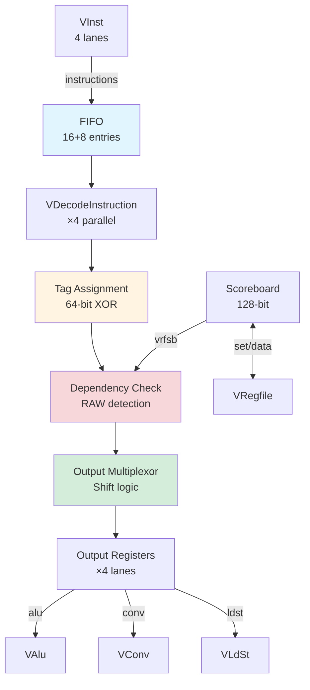

# VDecode - Vector Instruction Decoder

## Overview

The **VDecode (Vector Decoder)** is the deep pipeline buffer and dependency resolution engine for the Vector Core. It provides a **16-entry FIFO** for decoupling VInst from execution units, applies **out-of-order tags** for register tracking, detects **data dependencies**, and routes commands to appropriate execution units (VAlu, VConv, VLdSt).

**Key Features**:
- **Deep FIFO**: 16 + 8 guard entries (24 total capacity)
- **Out-of-order tagging**: 1-bit tags per 4-register group (64-bit tag register)
- **Dependency tracking**: RAW (Read-After-Write) hazard detection
- **Scoreboard integration**: 128-bit dual-tag system
- **Command routing**: Dispatch to alu, conv, or ldst execution paths
- **In-order dispatch**: Ensures sequential instruction execution

---

## Architecture

### Block Diagram



### Pipeline Stages

```
Stage 1: FIFO Enqueue (from VInst)
Stage 2: FIFO Dequeue + Instruction Decode
Stage 3: Tag Assignment (out-of-order tracking)
Stage 4: Dependency Check (RAW/WAW)
Stage 5: Output Multiplexing (shift valid instructions)
Stage 6: Dispatch to Execution Units
```

---

## Interface Specification

### Input from VInst

**FIFO Input** (VDecode.scala line 34):
```scala
val in = Flipped(Decoupled(Vec(instructionLanes, Valid(new VectorInstructionLane))))
// 4-lane input from VInst
```

**Scoreboard Input** (VDecode.scala line 40):
```scala
val vrfsb = new VRegfileScoreboardIO
// vrfsb.data: 128-bit scoreboard state from VRegfile
```

**Active Execution** (VDecode.scala line 39):
```scala
val active = Input(UInt(64.W))
// Bitmap of registers currently being read by execution units
```

### Output to Execution Units

**Decoded Instructions** (VDecode.scala line 35):
```scala
val out = Vec(instructionLanes, Decoupled(new VDecodeBits))
// 4-lane output to VAlu/VConv/VLdSt
```

**Command Queue Routing** (VDecode.scala line 36):
```scala
val cmdq = Vec(instructionLanes, Output(new VDecodeCmdq))

class VDecodeCmdq extends Bundle {
  val alu   = Bool()  // Route to VAlu
  val conv  = Bool()  // Route to VConv
  val ldst  = Bool()  // Route to VLdSt
  val ld    = Bool()  // Uncached load
  val st    = Bool()  // Uncached store
}
```

**Status Signals** (VDecode.scala lines 38, 41-42):
```scala
val stall = Output(Bool())  // Backpressure to VInst when FIFO near full
val undef = Output(Bool())  // Undefined instruction detected
val nempty = Output(Bool()) // VDecode has pending work
```

---

## FIFO Buffer

### Capacity

**Configuration** (VDecode.scala lines 45-46):
```scala
val guard = 8  // Two cycles of 4-way dispatch
val depth = 16 + guard  // 24 total entries
```

**Purpose**:
- **16 entries**: Primary buffer depth
- **8 guard entries**: Safety margin for 2 cycles of 4-way dispatch

**Why 16+8?**
- VInst can dispatch up to 4 instructions/cycle
- Execution units may stall for several cycles
- 16 entries hide typical stalls (4-8 cycles)
- 8 guard prevents overflow during full-speed dispatch

### Implementation

**Instantiation** (VDecode.scala line 50):
```scala
val f = FifoIxO(new VectorInstructionLane, 
                instructionLanes,  // 4 input ports
                instructionLanes,  // 4 output ports
                depth)             // 24 entries
```

**Flow Control** (VDecode.scala lines 115-138):
```scala
// Enqueue from VInst
f.io.in <> io.in

// Count valid input instructions
val icount = MuxOR(io.in.valid,
  PopCount(io.in.bits.map(_.valid))
)

// Dequeue to decode logic
for (i <- 0 until instructionLanes) {
  f.io.out(i).ready := (i.U + ocount) < instructionLanes.U
}

// Stall signal when FIFO near full
io.stall := (f.io.count + icount) > (depth - guard).U
// Stall when count > 16 (keep 8 guard entries free)
```

---

## Instruction Decoding

### VDecodeInstruction Module

**Instantiation** (VDecode.scala line 52):
```scala
val d = Seq.fill(instructionLanes)(Module(new VDecodeInstruction(p)))
// 4 parallel decoders, one per lane
```

**Purpose**: Translates 32-bit instruction word into `VDecodeBits` with operand addresses

**Input** (VDecode.scala lines 67-69):
```scala
for (i <- 0 until instructionLanes) {
  d(i).io.in := f.io.out(i).bits  // Instruction from FIFO
}
```

**Output** (VDecode.scala line 101):
```scala
e(i) := d(i).io.out  // Decoded bits (before tagging)
```

**Decoded Structure** (VDecode.scala lines 257-276):
```scala
class VDecodeBits extends Bundle {
  val op = UInt(bits.W)  // Opcode (vadd, vmul, etc.)
  val f2 = UInt(3.W)     // Function modifier
  val sz = UInt(3.W)     // Size (one-hot: 8b/16b/32b)
  val m  = Bool()        // Stripmining mode
  
  val vd = new VAddr()      // Destination (write)
  val ve = new VAddr()      // Extended destination
  val vf = new VAddr()      // Future destination
  val vg = new VAddr()      // Guard destination
  val vs = new VAddrTag()   // Source 1 (read)
  val vt = new VAddrTag()   // Source 2 (read)
  val vu = new VAddrTag()   // Source 3 (read)
  val vx = new VAddrTag()   // Extended source 1
  val vy = new VAddrTag()   // Extended source 2
  val vz = new VAddrTag()   // Extended source 3
  val sv = new SAddrData()  // Scalar value
  
  val cmdsync = Bool()  // Synchronize with other lanes
}
```

---

## Out-of-Order Tagging

**Purpose**: Track register dependencies with minimal hardware (1-bit tags)

### Tag Register

**Structure** (VDecode.scala line 75):
```scala
val tagReg = RegInit(0.U(64.W))
// 64 bits: 4 bits per group of 4 registers (16 groups total)
// Groups: [v0-v3], [v4-v7], [v8-v11], ..., [v60-v63]
```

**Bit Allocation**:
```
Bits [3:0]   : Tag for registers v0-v3   (group 0)
Bits [7:4]   : Tag for registers v4-v7   (group 1)
Bits [11:8]  : Tag for registers v8-v11  (group 2)
...
Bits [63:60] : Tag for registers v60-v63 (group 15)
```

### Tag Update Logic

**XOR Accumulation** (VDecode.scala lines 77-81):
```scala
val tags = (0 until instructionLanes)
  .map(x => d(x).io.actv.wactive)  // Write bitmap from each lane
  .scan(tagReg)(_ ^ _)              // XOR accumulate

// tags(0) = tagReg (current)
// tags(1) = tagReg ^ lane0_writes
// tags(2) = tagReg ^ lane0_writes ^ lane1_writes
// tags(3) = tagReg ^ lane0_writes ^ lane1_writes ^ lane2_writes
// tags(4) = tagReg ^ ... ^ lane3_writes
```

**Update on Dispatch** (VDecode.scala line 81):
```scala
// Update tagReg when any lane dispatches
tagReg := MuxCase(tags(0), 
  (0 until instructionLanes).reverse.map(x => 
    (f.io.out(x).valid && f.io.out(x).ready) -> tags(x + 1)
  )
)
// Priority: rightmost dispatching lane wins
```

**Example**:
```
Initial: tagReg = 0x0000000000000000

Lane 0 writes v4 (group 1):
  wactive = 0x0000000000000010 (bit 4 set)
  Extract group bits: wactive[group 1] = 0x1
  XOR with tagReg[group 1]: 0x0 ^ 0x1 = 0x1
  tags(1) = 0x0000000000000010

Lane 1 writes v5 (group 1):
  wactive = 0x0000000000000020 (bit 5 set)
  Extract group bits: wactive[group 1] = 0x2
  XOR with tags(1)[group 1]: 0x1 ^ 0x2 = 0x3
  tags(2) = 0x0000000000000030

After dispatch: tagReg = tags(4) = final accumulated value
```

### Tag Application to Operands

**Function** (VDecode.scala lines 83-98):
```scala
def TagAddr(tag: UInt, v: VAddrTag): VAddrTag = {
  val addr = v.addr  // 6-bit register address
  val addrm = addr(5,2)  // Upper 4 bits = group (0-15)
  
  // Extract 4-bit tag for each group
  val tagm = Wire(Vec(16, UInt(4.W)))
  for (i <- 0 until 16) {
    tagm(i) := tag(4 * i + 3, 4 * i)
  }
  
  // Select tag for this register's group
  val r = Wire(new VAddrTag())
  r.valid := v.valid
  r.addr := v.addr
  r.tag := VecAt(tagm, addrm)  // 4-bit tag from group
  r
}
```

**Application** (VDecode.scala lines 100-108):
```scala
for (i <- 0 until instructionLanes) {
  e(i) := d(i).io.out  // Copy decoded bits
  e(i).vs := TagAddr(tags(i), d(i).io.out.vs)  // Tag source 1
  e(i).vt := TagAddr(tags(i), d(i).io.out.vt)  // Tag source 2
  e(i).vu := TagAddr(tags(i), d(i).io.out.vu)  // Tag source 3
  e(i).vx := TagAddr(tags(i), d(i).io.out.vx)  // Extended source 1
  e(i).vy := TagAddr(tags(i), d(i).io.out.vy)  // Extended source 2
  e(i).vz := TagAddr(tags(i), d(i).io.out.vz)  // Extended source 3
}
```

---

## Dependency Tracking

### Active Masks

**Write Active** (VDecode.scala line 143):
```scala
val wactive = VecInit(
  (0 until instructionLanes).map(x => 
    actv(x).ractive | actv(x).wactive  // Reads OR writes
  ).scan(io.vrfsb.data(63,0) | io.vrfsb.data(127,64) | io.active)(_ | _)
)
// Accumulate: scoreboard + active execution + this lane's accesses
```

**Read Active** (VDecode.scala line 146):
```scala
val ractive = VecInit(
  (0 until instructionLanes).map(x => 
    actv(x).wactive  // Only writes block reads
  ).scan(0.U(64.W))(_ | _)
)
// Accumulate: Only writes from earlier lanes
```

### Dependency Detection

**RAW Hazards** (VDecode.scala lines 149-152):
```scala
val depends = VecInit((0 until instructionLanes).map(i =>
  (wactive(i) & actv(i).wactive) =/= 0.U ||  // WAW: Write-After-Write
  (ractive(i) & actv(i).ractive) =/= 0.U     // RAW: Read-After-Write
))

// depends(i) = true if lane i has dependency
```

**Example**:
```
Lane 0: Writes v5
  wactive(0) = 0x0000000000000020 (bit 5)
  
Lane 1: Reads v5
  ractive(1) = 0x0000000000000020 (accumulated from lane 0's write)
  actv(1).ractive = 0x0000000000000020 (reads v5)
  
  depends(1) = (ractive(1) & actv(1).ractive) =/= 0
             = (0x20 & 0x20) =/= 0
             = TRUE ❌ RAW hazard!
```

---

## Output Multiplexing

**Purpose**: Shift valid (non-dependent) instructions to output lanes, compacting the stream

### Multiplexor Logic

**Structure** (VDecode.scala lines 186-214):
```scala
// Input: 8 possible sources (4 current lanes + 4 FIFO outputs)
val dataMux = VecInit(data ++ e)  // Current data + new decode
val cmdqMux = VecInit(cmdq ++ d.map(x => x.io.cmdq))
val actvMux = VecInit(actv2 ++ dactv)

// For each output lane:
for (i <- 0 until instructionLanes) {
  // Find first valid instruction not yet output
  val idx = MuxCase((i + instructionLanes).U, 
    (i until instructionLanes + i).map(x =>
      (!prevMarked(i).getOrElse(false.B)(x) && validNotOutput(x)) -> (x).U
    )
  )
  
  dataNxt(i) := dataMux(idx)  // Select from 8 sources
  cmdqNxt(i) := cmdqMux(idx)
  actvNxt(i) := actvMux(idx)
}
```

**Effect**: Compact valid instructions into contiguous output lanes

**Example**:
```
Input (current + FIFO):
  Lane 0: Valid, no dependency ✅
  Lane 1: Valid, has dependency ❌
  Lane 2: Valid, no dependency ✅
  Lane 3: Valid, no dependency ✅

After multiplexing (next cycle):
  Lane 0: Instruction from lane 0 ✅
  Lane 1: Instruction from lane 2 ✅ (skipped lane 1)
  Lane 2: Instruction from lane 3 ✅
  Lane 3: New instruction from FIFO ✅
```

---

## Scoreboard Integration

### Scoreboard Set

**Update on Dispatch** (VDecode.scala lines 218-221):
```scala
// Set scoreboard bits when any lane dispatches
io.vrfsb.set.valid := output =/= 0.U  // Any lane dispatched

io.vrfsb.set.bits := (0 until instructionLanes)
  .map(x => MuxOR(output(x), actv2(x).wactive))  // Write active bits
  .reduce(_ | _)  // OR all lanes
```

**Dual-Tag Structure**:
```
actv2(x).wactive = 128 bits
  [63:0]   : Tag 0 (even tag)
  [127:64] : Tag 1 (odd tag)
  
For each write:
  Set bit in tag 0 or tag 1 based on current tag state
```

**Assertions** (VDecode.scala lines 223-224):
```scala
// Tag 0 and tag 1 don't overlap for same instruction
assert((io.vrfsb.set.bits(63, 0) & io.vrfsb.set.bits(127, 64)) === 0.U)

// New writes don't conflict with existing scoreboard
assert(((io.vrfsb.data(63, 0) | io.vrfsb.data(127, 64)) & 
        (io.vrfsb.set.bits(63, 0) | io.vrfsb.set.bits(127, 64))) === 0.U)
```

---

## Output Dispatch

### Valid Signal

**In-Order Dispatch** (VDecode.scala lines 227-245):
```scala
val outvalid = VecInit(
  (0 until instructionLanes).map(i => 
    valid(i) && !depends(i)  // Valid and no dependency
  )
)

for (i <- 0 until instructionLanes) {
  val synchronize = cmdsync.asUInt(i,0) =/= 0.U  // Any lane needs sync
  val ordered = (~outvalid.asUInt(i,0)) === 0.U  // All lanes up to i valid
  val unorder = outvalid(i)  // This lane valid
  
  // Always use ordered (in-order dispatch)
  io.out(i).valid := ordered
  io.out(i).bits := data(i)
  io.cmdq(i) := cmdq(i)
}
```

**In-Order Constraint**:
```
Lane 0 dispatches if: valid(0) && !depends(0) ✅
Lane 1 dispatches if: Lane 0 dispatched && valid(1) && !depends(1) ✅
Lane 2 dispatches if: Lanes 0-1 dispatched && valid(2) && !depends(2) ✅
Lane 3 dispatches if: Lanes 0-2 dispatched && valid(3) && !depends(3) ✅

If any lane stalls, all following lanes also stall ❌
```

---

## Performance Characteristics

| Metric | Value | Notes |
|--------|-------|-------|
| **FIFO Depth** | 16 + 8 guard | 24 total entries |
| **Latency** | 2-3 cycles | FIFO → decode → tag → output |
| **Throughput** | 4 inst/cycle | If no dependencies |
| **Stall Threshold** | >16 entries | Guard prevents overflow |
| **Tag Width** | 64 bits | 4 bits × 16 groups |
| **Scoreboard** | 128 bits | Dual-tag system |

---

## Example: Dependency Resolution

### Scenario: RAW Hazard

**Instructions**:
```
Lane 0: vadd.w v4, v1, v2  (writes v4)
Lane 1: vsub.w v5, v4, v3  (reads v4) ← RAW!
Lane 2: vmul.w v6, v7, v8  (independent)
Lane 3: vor.w  v9, v10, v11 (independent)
```

### Cycle N: Decode & Tag

```
Decode:
  Lane 0: vs=v1, vt=v2, vd=v4
  Lane 1: vs=v4, vt=v3, vd=v5
  Lane 2: vs=v7, vt=v8, vd=v6
  Lane 3: vs=v10, vt=v11, vd=v9

Tag Assignment:
  tagReg = 0x0000000000000000 (initial)
  
  Lane 0 writes v4 (group 1):
    tags(1) = tagReg ^ 0x0010 = 0x0010
    Extract group 1: tag = 0x1
    Apply to lane 0: vd.tag = 0x1
  
  Lane 1 writes v5 (group 1):
    tags(2) = tags(1) ^ 0x0020 = 0x0030
    Extract group 1: tag = 0x3
    Apply to lane 1: vs.tag = 0x1 (reads v4 with tag from lane 0)
                      vd.tag = 0x3
```

### Cycle N+1: Dependency Check

```
Active masks:
  wactive(0) = 0x0000000000000000 (no prior writes)
  wactive(1) = 0x0000000000000010 (lane 0 writes v4)
  
  ractive(0) = 0x0000000000000000 (no prior writes)
  ractive(1) = 0x0000000000000010 (lane 0 writes v4)

Lane 0:
  actv(0).wactive = 0x0000000000000010 (writes v4)
  actv(0).ractive = 0x0000000000000006 (reads v1, v2)
  
  depends(0) = (wactive(0) & 0x10) =/= 0 || (ractive(0) & 0x06) =/= 0
             = (0 & 0x10) || (0 & 0x06)
             = FALSE ✅

Lane 1:
  actv(1).wactive = 0x0000000000000020 (writes v5)
  actv(1).ractive = 0x0000000000000018 (reads v4, v3)
  
  depends(1) = (wactive(1) & 0x20) =/= 0 || (ractive(1) & 0x18) =/= 0
             = (0x10 & 0x20) || (0x10 & 0x18)
             = 0 || 0x10
             = TRUE ❌ RAW hazard on v4!

Lanes 2-3:
  depends(2) = FALSE ✅
  depends(3) = FALSE ✅
```

### Cycle N+2: Output Dispatch

```
outvalid = [TRUE, FALSE, TRUE, TRUE]

In-order dispatch:
  Lane 0: ordered = (~[1,0,0,0]) === [0,1,1,1] = FALSE ❌
  
Wait, let me recalculate:
  outvalid.asUInt = 0b1101 (bits [3,2,0] set, bit 1 clear)
  
  Lane 0: outvalid.asUInt(0,0) = 0b1
          ~outvalid.asUInt(0,0) = 0b0
          ordered = (0b0 === 0b0) = TRUE ✅ Dispatch!
  
  Lane 1: outvalid.asUInt(1,0) = 0b01
          ~outvalid.asUInt(1,0) = 0b10
          ordered = (0b10 === 0b00) = FALSE ❌ Stall!
  
  Lane 2: Blocked by lane 1 ❌
  Lane 3: Blocked by lane 1 ❌

Result: Only lane 0 dispatches, lanes 1-3 stall
```

### Cycle N+3: Retry

```
Lane 0's write completes, scoreboard clears v4
  ractive(1) = 0x0000000000000000 (v4 now available)
  
  depends(1) = FALSE ✅

All lanes now valid:
  outvalid = [TRUE, TRUE, TRUE, TRUE]
  
All dispatch successfully ✅
```

---

## Design Insights

### Why 64-bit Tag Register?

**Alternative**: Track each register independently (64 bits for 64 registers)

**Chosen**: 4 bits per group of 4 registers (64 bits for 16 groups)

**Benefits**:
- **Compact**: Only 64 bits for full tracking
- **Out-of-order**: XOR toggle supports non-sequential updates
- **Efficient**: Group-level granularity sufficient for most cases

### Why In-Order Dispatch?

**Alternative**: Out-of-order dispatch (independent lanes proceed)

**Chosen**: In-order (all lanes up to current must be valid)

**Rationale**:
- **Simplicity**: Easier scoreboard management
- **Determinism**: Predictable execution order
- **Debugging**: Easier to trace and verify

**Trade-off**: May under-utilize execution units when dependencies exist

### Why Deep FIFO (16+8)?

**Purpose**: Hide variable latencies from upstream (VInst) and downstream (execution)

**Benefit**: Sustain 4-inst/cycle throughput despite transient stalls

**Cost**: Area (24-entry FIFO), but worth it for throughput

---

## Summary

VDecode is the **dependency resolution and command routing** engine, providing:

✅ **Deep buffering**: 16+8 entry FIFO for decoupling  
✅ **Out-of-order tagging**: 64-bit XOR-based tracking  
✅ **Dependency detection**: RAW/WAW hazard identification  
✅ **Scoreboard integration**: 128-bit dual-tag system  
✅ **Command routing**: Dispatch to alu/conv/ldst  
✅ **In-order dispatch**: Sequential execution guarantee  

**Next**: [VAlu - Vector ALU](valu.md)

---

**Source File**: `coral/codes/coralnpu/hdl/chisel/src/coralnpu/vector/VDecode.scala` (326 lines)

