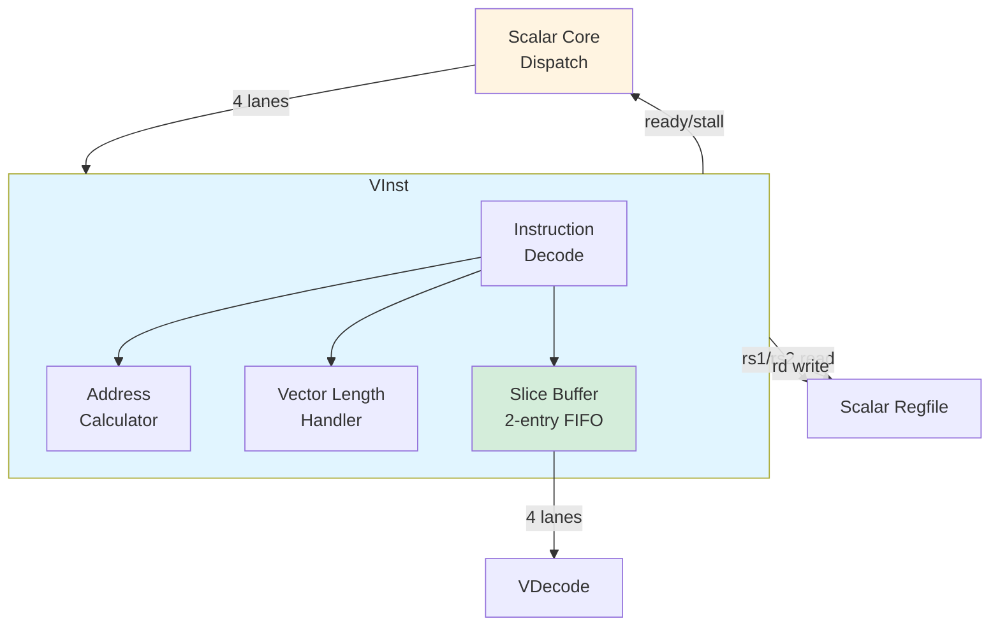

# VInst - Vector Instruction Frontend

## Overview

The **VInst (Vector Instruction)** unit is the frontend interface between the scalar core and the Vector Core. It receives vector instructions from scalar dispatch, performs address calculations for load/store operations, handles vector length (VL) queries, and provides double-buffered slicing for decoupling from the scalar core.

**Key Features**:
- **Instruction reception**: 4-way parallel from scalar dispatch
- **Address calculation**: `rs1 + offset` for load/store instructions
- **Vector length handling**: `getvl`, `getmaxvl` instructions
- **Double buffering**: Slice unit provides 2-entry FIFO
- **Scalar register access**: Read rs1/rs2, write rd for address updates
- **Backpressure management**: Stall signal to scalar decode

---

## Architecture

### Block Diagram



### Pipeline Position

```
Scalar Core Dispatch (Cycle N)
    ↓
VInst Decode (Cycle N+1)
    ↓
VInst Execute (Cycle N+2) - Address calc, VL query
    ↓
Slice Buffer (Cycle N+3)
    ↓
VDecode FIFO (Cycle N+4)
```

---

## Interface Specification

### Input from Scalar Core

**Command Interface** (VInst.scala lines 52-53):
```scala
val in = Vec(instructionLanes, Flipped(Decoupled(new VInstCmd)))
// instructionLanes = 4 (4-way dispatch)

class VInstCmd extends Bundle {
  val addr = UInt(5.W)  // Scalar rd address for writeback
  val inst = UInt(32.W) // Vector instruction word
  val op   = VInstOp    // Operation type (VLD, VST, VIOP, GETVL, etc.)
}
```

**Scalar Register Read** (VInst.scala lines 56):
```scala
val rs = Vec(instructionLanes * 2, Flipped(new RegfileReadDataIO))
// 4 lanes × 2 operands = 8 read ports
// Lane i: rs(2*i) = rs1, rs(2*i+1) = rs2
```

**Scalar Register Write** (VInst.scala lines 57):
```scala
val rd = Vec(instructionLanes, Valid(Flipped(new RegfileWriteDataIO)))
// Write updated addresses or VL values back to scalar registers
```

### Output to VDecode

**Vector Instruction Interface** (VInst.scala lines 29-40):
```scala
class VectorInstructionIO(p: Parameters) extends Bundle {
  val valid = Output(Bool())  // Valid instruction available
  val ready = Input(Bool())   // VDecode ready to accept
  val stall = Input(Bool())   // VDecode backpressure
  val lane = Vec(instructionLanes, Valid(new VectorInstructionLane))
}

class VectorInstructionLane extends Bundle {
  val inst = UInt(32.W)  // Vector instruction
  val addr = UInt(32.W)  // Address for load/store (from rs1)
  val data = UInt(32.W)  // Data/count for load/store (from rs2)
}
```

---

## Instruction Categories

### 1. Vector Load (VLD)

**Encoding** (VInst.scala lines 127-128):
```scala
vld_o(i) := reqvalid(i) && (op === VInstOp.VLD) && !p
vld_u(i) := reqvalid(i) && (op === VInstOp.VLD) &&  p
```

**Types**:
- **vld.o** (`p=0`): Ordered load, no address update
- **vld.u** (`p=1`): Unordered load, update address

**Address Calculation** (VInst.scala lines 142-194):
```scala
val rs1 = io.rs(2 * i + 0).data  // Base address
val rs2 = io.rs(2 * i + 1).data  // Count/offset
val m  = inst(5)  // Stripmining mode
val sz = inst(13,12)  // Element size (0=8b, 1=16b, 2=32b)
val sl = inst(27,26)  // Stride/loop type

// Determine max vector length
val max = Mux(sz === 0 && !m, maxvlb,  // 32 bytes (256-bit / 8)
          Mux(sz === 1 && !m, maxvlh,  // 16 halfwords
          Mux(sz === 2 && !m, maxvlw,  // 8 words
          Mux(sz === 0 && m,  maxvlbm, // 128 bytes (4 strips)
          ...))))

// Calculate offset based on stride type
val offset = 
  if (sl === 0 && xs2zero) {  // Unit stride, post-increment
    Mux(m, maxvlbm, maxvlb)
  } else if (sl === 0) {  // Strided
    rs2 * element_size
  } else if (sl === 1) {  // Loop back
    bytes_loaded
  } else if (sl === 2) {  // Scaled pointer
    Mux(m, rs2 * 4, rs2)
  }

// Final address for load
lsuAdder(i) := rs1 + offset
```

**Address Update Writeback** (VInst.scala lines 224-231):
```scala
io.rd(i).valid := vld_u(i)  // Only for vld.u (update mode)
io.rd(i).bits.addr := rdAddr(i)  // Target scalar register
io.rd(i).bits.data := lsuAdder(i)  // Updated address
```

### 2. Vector Store (VST)

**Encoding** (VInst.scala lines 129-131):
```scala
vst_o(i) := reqvalid(i) && (op === VInstOp.VST) && !p && !q
vst_u(i) := reqvalid(i) && (op === VInstOp.VST) &&  p && !q
vst_q(i) := reqvalid(i) && (op === VInstOp.VST) &&  p &&  q
```

**Types**:
- **vst.o** (`p=0, q=0`): Ordered store, no address update
- **vst.u** (`p=1, q=0`): Unordered store, update address
- **vstq.sp** (`p=1, q=1`): Quad-word store with scaled pointer

**Address Calculation**: Same as VLD (uses same `lsuAdder` logic)

### 3. Vector Operation (VIOP)

**Encoding** (VInst.scala lines 117-118):
```scala
nxtVinstValid(i) := reqvalid(i) && io.in(i).bits.op.isOneOf(
        VInstOp.VLD, VInstOp.VST, VInstOp.VIOP)
```

**Handling**: Pass-through to VDecode without address calculation

**Examples**:
- `vadd.w vd, vs, vt` - Vector add
- `vmul.h vd, vs, vt` - Vector multiply
- `vdwconv.b vd, vs, vu` - Depthwise convolution

### 4. Vector Length Query (GETVL)

**Encoding** (VInst.scala lines 132-133):
```scala
getvl(i) := reqvalid(i) && (op === VInstOp.GETVL)
getmaxvl(i) := reqvalid(i) && (op === VInstOp.GETMAXVL)
```

**Purpose**: Query effective vector length for software loop control

**Calculation** (VInst.scala lines 196-221):
```scala
// Extract parameters from instruction
val getvlsz = inst(26,25)  // Element size
val getvlm  = inst(27)     // Stripmining mode

// Calculate maximum VL for this configuration
val maxvl = Mux(getvlsz === 0 && !getvlm, maxvlb,  // 32 bytes
            Mux(getvlsz === 1 && !getvlm, maxvlh,  // 16 halfwords
            Mux(getvlsz === 2 && !getvlm, maxvlw,  // 8 words
            ...)))

// Determine actual VL based on rs1 (requested) and rs2 (constraint)
val len = 
  if (rs2 < maxvl && rs2 < rs1 && rs2nonzero) {
    rs2  // Use rs2 as constraint
  } else if (rs1 < maxvl) {
    rs1  // Use rs1 as requested
  } else {
    maxvl  // Use hardware maximum
  }

// Write result to scalar register
io.rd(i).valid := getvl(i)
io.rd(i).bits.data := len  // VL in bytes or elements
```

**Example**:
```c
// Software query before loop
int vl = getvl(requested_length, 0, sizeof(int));

for (int i = 0; i < total; i += vl) {
  vl = getvl(total - i, 0, sizeof(int));
  // Process vl elements
}
```

---

## Max Vector Length Constants

**Definitions** (VInst.scala lines 66-71):
```scala
val maxvlb  = (vectorBits / 8).U   // Bytes (no stripmining)
val maxvlh  = (vectorBits / 16).U  // Halfwords
val maxvlw  = (vectorBits / 32).U  // Words
val maxvlbm = (vectorBits * 4 / 8).U   // Bytes (with stripmining, 4 strips)
val maxvlhm = (vectorBits * 4 / 16).U  // Halfwords (4 strips)
val maxvlwm = (vectorBits * 4 / 32).U  // Words (4 strips)
```

**For 256-bit configuration**:
```
maxvlb  = 256 / 8 = 32 bytes
maxvlh  = 256 / 16 = 16 halfwords
maxvlw  = 256 / 32 = 8 words
maxvlbm = 256 * 4 / 8 = 128 bytes (4 strips × 32 bytes)
maxvlhm = 256 * 4 / 16 = 64 halfwords
maxvlwm = 256 * 4 / 32 = 32 words
```

---

## Slice Buffer - Double Buffering

**Purpose**: Decouple VInst from VDecode, allowing VInst to continue receiving instructions even when VDecode is busy.

**Implementation** (VInst.scala lines 74-78):
```scala
val slice = Slice(Vec(instructionLanes, new Bundle {
  val vld = Output(Bool())
  val vst = Output(Bool())
  val lane = Valid(new VectorInstructionLane)
}), true)
```

**Structure**:
```
┌─────────────────────────────────────┐
│ Slice Buffer (2-entry FIFO)        │
│                                     │
│ Entry 0: [valid, inst, addr, data] │
│ Entry 1: [valid, inst, addr, data] │
└─────────────────────────────────────┘
       ↓ (4 lanes)
    VDecode
```

**Flow Control** (VInst.scala lines 235-241):
```scala
slice.io.in.valid := vvalid  // Input: VInst has instruction
slice.io.out.ready := io.out.ready  // Output: VDecode ready
io.out.valid := slice.io.out.valid  // Output: Slice has valid data

// Assertion: Slice should never overflow (2 entries sufficient)
assert(!(slice.io.in.valid && !slice.io.in.ready))
```

**Backpressure** (VInst.scala lines 85-87):
```scala
for (i <- 0 until instructionLanes) {
  io.in(i).ready := !io.out.stall
}
// When VDecode stalls, propagate to scalar dispatch
```

---

## Example: Vector Load with Address Update

### Instruction: `vld.u.w v4, (x10), x11`

**Meaning**: Load 8 × 32-bit elements to v4, base address x10, stride x11, update x10

### Encoding

```
op     = VInstOp.VLD
inst(28) = 1 (p=1, update mode)
inst(13:12) = 2 (sz=2, 32-bit elements)
inst(27:26) = 0 (sl=0, strided)
inst(24:20) = 11 (rs2 = x11, stride)
inst(19:15) = 10 (rs1 = x10, base address)
```

### Cycle-by-Cycle Execution

#### Cycle N: Scalar Dispatch

```
Scalar Decode identifies vector load
  io.in(0).valid = 1
  io.in(0).bits.op = VInstOp.VLD
  io.in(0).bits.inst = encoded instruction
  io.in(0).bits.addr = 10 (rd = x10, for writeback)
```

#### Cycle N+1: VInst Decode

```
Decode instruction type:
  vld_u(0) = 1  (update mode) ✅
  
Request scalar register reads:
  io.rs(0).addr = 10  (rs1 = x10)
  io.rs(1).addr = 11  (rs2 = x11)
```

#### Cycle N+2: VInst Execute (Address Calculation)

```
Read scalar registers:
  rs1 = io.rs(0).data = 0x20000000  (base address)
  rs2 = io.rs(1).data = 0x00000004  (stride = 4 bytes)
  
Extract instruction fields:
  m  = inst(5) = 0  (no stripmining)
  sz = inst(13:12) = 2  (32-bit)
  sl = inst(27:26) = 0  (strided)
  xs2zero = (inst(24:20) === 0) = 0  (rs2 != x0)
  
Determine max VL:
  max = maxvlw = 8 words (for sz=2, no stripmining)
  
Calculate offset:
  p_xx = (sl === 0 && !xs2zero) = 1 ✅
  offset = rs2 * element_size
         = 0x00000004 (stride already in bytes)
         
Calculate updated address:
  lsuAdder(0) = rs1 + offset
              = 0x20000000 + 0x00000004
              = 0x20000004 ✅
```

#### Cycle N+2: Prepare Slice Input

```
slice.io.in.bits(0).vld = 1  (load operation)
slice.io.in.bits(0).lane.valid = 1
slice.io.in.bits(0).lane.bits.inst = instruction
slice.io.in.bits(0).lane.bits.addr = 0x20000000  (original base)
slice.io.in.bits(0).lane.bits.data = 0x00000004  (stride)

slice.io.in.valid = 1
```

#### Cycle N+2: Scalar Register Writeback

```
// Update x10 with new address for next iteration
io.rd(0).valid = 1  (vld_u writeback)
io.rd(0).bits.addr = 10  (x10)
io.rd(0).bits.data = 0x20000004  (updated address)

Scalar regfile writes x10 = 0x20000004 ✅
```

#### Cycle N+3: Slice Buffer

```
Slice buffer enqueues instruction
  slice.io.out.valid = 1
  slice.io.out.bits(0) = buffered instruction
```

#### Cycle N+4: Output to VDecode

```
io.out.valid = 1
io.out.lane(0).valid = 1
io.out.lane(0).inst = instruction
io.out.lane(0).addr = 0x20000000
io.out.lane(0).data = 0x00000004

VDecode receives and processes ✅
```

### Result

- **Base address**: Used by VLdSt to load from 0x20000000
- **Updated address**: x10 = 0x20000004 for next iteration
- **Total latency**: 4 cycles (dispatch to VDecode)
- **Software benefit**: No manual pointer update needed!

---

## Addressing Modes

### Unit Stride (sl=0, xs2zero=1)

**Pattern**: Contiguous memory access

```
Addresses:
  Load 0: base
  Load 1: base + element_size
  Load 2: base + 2 * element_size
  ...
  
Offset for next iteration:
  offset = max_vl_bytes
  
Example (8 × 32-bit):
  offset = 8 * 4 = 32 bytes
```

### Strided (sl=0, xs2zero=0)

**Pattern**: Fixed stride between elements

```
Offset = rs2 (stride in bytes or elements)

Example:
  rs2 = 8 (stride 8 bytes)
  Loads from: base, base+8, base+16, base+24, ...
```

### Loop Back (sl=1)

**Pattern**: Circular buffer

```
Offset = bytes_loaded (amount just loaded)

Example:
  Loaded 32 bytes
  Next load: base + 32
```

### Scaled Pointer (sl=2)

**Pattern**: Pointer arithmetic with scaling

```
Offset = rs2 * scale
  scale = 1 (no stripmining)
  scale = 4 (with stripmining)

Example:
  rs2 = 10, m = 1 (stripmining)
  offset = 10 * 4 = 40 bytes
```

---

## Status Signal

**nempty** (VInst.scala lines 263-268):
```scala
val nempty = RegInit(false.B)

nempty := io.in.map(x => x.valid).reduce(_ || _) ||  // Input pending
          vvalid ||  // Internal processing
          io.out.valid  // Output pending

io.nempty := nempty
```

**Purpose**: Indicates VInst has work pending, used by scalar core to prevent WFI (Wait-For-Interrupt) when vector operations are active.

---

## Performance Characteristics

| Metric | Value | Notes |
|--------|-------|-------|
| **Latency** | 4 cycles | Dispatch to VDecode output |
| **Throughput** | 4 inst/cycle | If no stalls |
| **Buffer Depth** | 2 entries | Slice double-buffer |
| **Address Calc** | 1 cycle | Pipelined |
| **Scalar R/W** | 8 read, 4 write | Per cycle |

---

## Example: GETVL Query

### Instruction: `getvl rd, rs1, 0b010000`

**Purpose**: Query effective vector length for 32-bit elements

### Encoding

```
op = VInstOp.GETVL
inst(27) = 0  (getvlm = 0, no stripmining)
inst(26:25) = 2  (getvlsz = 2, 32-bit elements)
inst(19:15) = rs1  (requested length)
inst(24:20) = 0  (no rs2 constraint)
```

### Execution

```
Cycle N: Dispatch to VInst

Cycle N+1: Calculate VL
  rs1 = 100  (requested 100 elements)
  rs2 = 0  (no constraint, rs2zero = 1)
  
  maxvl = maxvlw = 8 words (hardware max for 256-bit, 32-bit elements)
  
  Since rs1 (100) >= maxvl (8):
    len = maxvl = 8 ✅
    
Cycle N+2: Writeback to Scalar
  io.rd(0).valid = 1
  io.rd(0).bits.addr = rd
  io.rd(0).bits.data = 8  (VL = 8 elements)
  
Scalar register: rd = 8
```

**Software usage**:
```c
int remaining = 100;
while (remaining > 0) {
  int vl = getvl(remaining, 0, 2);  // Get VL for 32-bit
  // Process vl elements (vl = 8 for first 12 iterations, 4 for last)
  remaining -= vl;
}
```

---

## Design Insights

### Why Double Buffer?

**Problem**: VDecode can stall (full FIFO, dependencies)

**Solution**: 2-entry slice buffer absorbs transient stalls

**Benefit**: VInst continues accepting from scalar core, hiding bubbles

### Why Address Update in VInst?

**Alternative**: Software updates pointers explicitly

**Chosen Design**:
- Hardware updates address automatically
- Writes back to scalar register
- Saves 1 scalar instruction per vector load/store

**Benefit**: Higher code density, fewer cycles

### Why GETVL Instruction?

**Purpose**: Software needs to know effective VL for loop control

**Alternative**: Hardcode VL in software (inflexible)

**Chosen Design**:
- Query hardware maximum
- Clamp to remaining elements
- Supports variable vector length

**Benefit**: Portable across different VLEN configurations

---

## Summary

VInst is the **critical interface** between scalar and vector cores, providing:

✅ **Instruction reception**: 4-way parallel from scalar dispatch  
✅ **Address calculation**: Automatic pointer updates for load/store  
✅ **Vector length query**: Dynamic VL determination  
✅ **Double buffering**: 2-entry slice for decoupling  
✅ **Backpressure management**: Stall propagation to scalar core  
✅ **Scalar register access**: Seamless R/W integration  

**Next**: [VDecode - Vector Decoder](vdecode.md)

---

**Source File**: `coral/codes/coralnpu/hdl/chisel/src/coralnpu/vector/VInst.scala` (270 lines)

