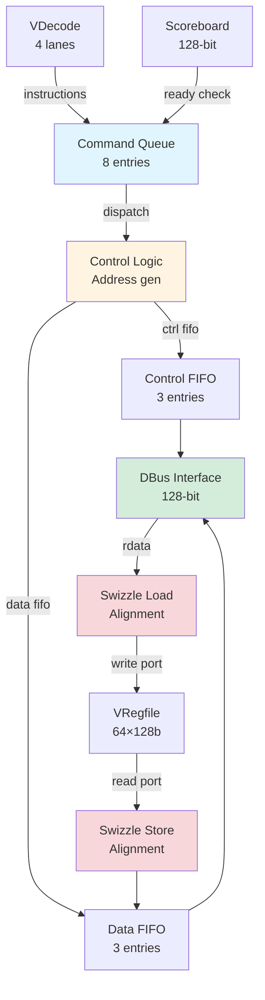

# VLdSt - Vector Load/Store Unit

## Overview

The **VLdSt (Vector Load/Store Unit)** manages all vector memory transactions between the Vector Register File and the memory system (L1 Dcache or AXI bus). It handles **strided**, **unit-stride**, and **quadrant-strided** accesses with automatic stripmining for large transfers.

**Key Features**:
- **Load/Store operations**: `vld`, `vst`, `vstq` (quadrant store)
- **Strided access**: Configurable stride for non-contiguous memory
- **Stripmining**: Automatic subdivision of large transfers (>16 bytes)
- **Command queue**: 8-entry deep FIFO for decoupling
- **DBus interface**: 128-bit data bus for memory access
- **Swizzle logic**: Address alignment handling
- **Single-port regfile access**: 1 read + 1 write port

---

## Architecture

### Block Diagram



### Pipeline Stages

```
Stage 1: Command Queue (8 entries)
Stage 2: Address Generation + Register Read (stores only)
Stage 3: Control/Data FIFO (3 entries each)
Stage 4: DBus Transaction (128-bit bus)
Stage 5: Swizzle + Register Write (loads only)
```

---

## Interface Specification

### Input from VDecode

**Instruction Input** (VLdSt.scala line 35):
```scala
val in = Flipped(Decoupled(Vec(instructionLanes, Valid(new VDecodeBits))))
// 4-lane input, but only 1 ldst instruction/cycle
```

**Scoreboard Input** (VLdSt.scala line 39):
```scala
val vrfsb = Input(UInt(128.W))
// 128-bit scoreboard for dependency tracking
```

### Register File Interface

**Read Port** (VLdSt.scala line 40):
```scala
val read = new VRegfileReadHsIO(p)
// Single read port for store data
```

**Write Port** (VLdSt.scala line 41):
```scala
val write = new VRegfileWriteIO(p)
// Single write port for load data
```

### Memory Bus Interface

**DBus** (VLdSt.scala line 44):
```scala
val dbus = new DBusIO(p)
// 128-bit data bus to L1 Dcache or AXI

class DBusIO extends Bundle {
  val valid = Output(Bool())
  val ready = Input(Bool())
  val write = Output(Bool())           // 0=load, 1=store
  val addr  = Output(UInt(32.W))       // Primary address
  val adrx  = Output(UInt(32.W))       // Extended address (addr+16)
  val size  = Output(UInt(5.W))        // Transfer size in bytes
  val wdata = Output(UInt(128.W))      // Write data
  val wmask = Output(UInt(16.W))       // Byte write mask
  val rdata = Input(UInt(128.W))       // Read data
  val pc    = Output(UInt(32.W))       // Program counter (for debug)
}
```

---

## Supported Operations

### Load Operation

**vld (Vector Load)** (VLdSt.scala line 100):
```scala
op === e.vld.U
// Load from memory to vector register
// Syntax: vld vd, (addr), stride, length
```

**Fields**:
- `vd`: Destination vector register
- `addr`: Base memory address (from scalar register)
- `f2[1]`: Stride enable (0=unit-stride, 1=strided)
- `f2[0]`: Length enable (0=maxvl, 1=custom length)
- `sz`: Element size (one-hot: 8b, 16b, 32b)
- `m`: Stripmining enable (0=single, 1=4-register block)

### Store Operations

**vst (Vector Store)** (VLdSt.scala line 104):
```scala
op === e.vst.U
// Store from vector register to memory
// Syntax: vst vs, (addr), stride, length
```

**vstq (Vector Store Quadrant)** (VLdSt.scala line 104):
```scala
op === e.vstq.U
// Store 4 consecutive registers (quadrant) with stride/4
// Syntax: vstq vs, (addr)
// Special: Used for convolution output (4 registers × 4 bytes = 16 bytes/reg)
```

---

## Command Queue

### VLdStCmdq Structure

**Bundle Definition** (VLdSt.scala lines 87-106):
```scala
class VLdStCmdq extends Bundle {
  val op = UInt(bits.W)              // Opcode (vld, vst, vstq)
  val f2 = UInt(3.W)                 // Function modifier
  val sz = UInt(3.W)                 // Size (one-hot)
  val addr = UInt(32.W)              // Memory address
  val offset = UInt(32.W)            // Address increment per iteration
  val remain = UInt(vectorCountBits.W) // Remaining bytes
  val vd = new VAddr()               // Destination register (load)
  val vs = new VAddrTag()            // Source register (store)
  val quad = UInt(2.W)               // Quadrant position (vstq only)
  val last = Bool()                  // Last iteration flag
}
```

### Command Queue Instantiation

**Configuration** (VLdSt.scala lines 52, 184):
```scala
val cmdqDepth = 8  // 8-entry deep FIFO
val q = VCmdq(p, cmdqDepth, new VLdStCmdq, Fin, Fout, Factive)
```

**Purpose**: Decouple decode from memory transactions, hide latency

---

## Instruction Slicing and Iteration

### How Vector Ld/St Instructions are Split

**Key Concept**: A single vector load/store instruction is **sliced** by VInst, then **iterated** by VLdSt to generate multiple memory transactions.

#### Step 1: Scalar Core Dispatch

**Original Instruction** (from assembly):
```assembly
vld.w v0, (x10)      # Load 16 bytes (1 register) from address in x10
# Encoded as 32-bit RISC-V custom instruction
```

**Scalar Core Action**:
- Decode identifies vector memory operation
- Dispatch to VCore via `io.score.vinst`
- Pass instruction bits + operands to VInst

#### Step 2: VInst Slicing

**VInst Processing** (VInst.scala lines 150-200):
```scala
// Identify load/store based on func3 field
val isVLD  = func3 === 0.U  // Vector Load
val isVST  = func3 === 1.U  // Vector Store
val isVSTQ = func3 === 2.U  // Vector Store Quadrant

// Extract operands
out.vd.addr := inst(11,7)   // Destination register (vd)
out.vs.addr := inst(24,20)  // Source register (vs, for stores)
out.sv.addr := rs1_data     // Base address from scalar register
out.sv.data := rs2_data     // Stride/length from scalar register (if applicable)

// f2 encoding:
//   f2[1] = stride enable (0=unit-stride, 1=strided)
//   f2[0] = length enable (0=maxvl, 1=custom length from rs2)
```

**Slicing Output**:
```scala
// Single instruction → 1 entry in VDecode FIFO
VDecodeBits {
  op = vld/vst/vstq
  vd = destination register
  vs = source register (store only)
  sv = {addr: x10_value, data: x11_value}  // Base address + stride/length
  f2 = stride/length flags
  sz = element size (8b/16b/32b)
  m  = stripmining flag (multi-register)
}
```

#### Step 3: VLdSt Command Queue Processing

**Fin Function Creates Initial Command** (VLdSt.scala lines 108-141):
```scala
def Fin(in: VDecodeBits): VLdStCmdq = {
  // Calculate how many memory transactions needed
  val maxvlb  = 16.U  // 128 bits = 16 bytes (1 register)
  val maxvlbm = 64.U  // 4 registers = 64 bytes
  
  // Initial state
  out.addr   = in.sv.addr           // Start address
  out.offset = stride ? stride : 16 // Address increment per transaction
  out.remain = total_bytes          // How much data left to transfer
  out.vd     = in.vd                // Current destination register
  
  // Will loop until remain = 0
}
```

#### Step 4: Iteration via Fout Function

**Fout Generates Next Transaction** (VLdSt.scala lines 143-172):
```scala
def Fout(in: VLdStCmdq, m: Bool, step: UInt, valid: Bool): (VLdStCmdq, Bool) = {
  // Each iteration generates ONE memory transaction (up to 16 bytes)
  
  out.addr   = in.addr + in.offset     // Next address
  out.vd     = in.vd.addr + 1          // Next register
  out.remain = in.remain - maxvlb      // Decrement remaining bytes
  
  val last = (out.remain == 0)         // Done when no bytes left
  (out, last)
}
```

### Complete Example: Instruction to Memory Transactions

**Assembly Instruction**:
```assembly
vld.w v8, (x10), x11, x12
# x10 = 0x10000000 (base address)
# x11 = 32 (stride in bytes)
# x12 = 48 (total length in bytes)
# m = true (stripmining, 4 registers)
```

**VInst Slicing**:
```
Input:  1 instruction (32 bits)
Output: 1 VDecodeBits entry
  op = vld
  vd = v8
  sv.addr = 0x10000000
  sv.data = 32 (stride)
  f2[1] = 1 (strided)
  f2[0] = 1 (custom length)
  sz = 0b100 (32-bit)
  m = true
```

**VLdSt Iteration**:
```
Fin: Create initial command
  addr = 0x10000000, offset = 32, remain = 48, vd = v8

Transaction 0 (step=0):
  DBus: Load 16 bytes from 0x10000000 → v8
  addr = 0x10000000, remain = 48

Fout: Generate next command
  addr = 0x10000020 (+32), remain = 32 (48-16), vd = v9

Transaction 1 (step=1):
  DBus: Load 16 bytes from 0x10000020 → v9
  addr = 0x10000020, remain = 32

Fout: Generate next command
  addr = 0x10000040 (+32), remain = 16 (32-16), vd = v10

Transaction 2 (step=2):
  DBus: Load 16 bytes from 0x10000040 → v10
  addr = 0x10000040, remain = 16

Fout: Generate next command
  addr = 0x10000060 (+32), remain = 0 (16-16), vd = v11
  last = true

Transaction 3 (step=3):
  DBus: Load 16 bytes from 0x10000060 → v11
  Done ✅
```

**Result**:
```
1 instruction → 1 VDecode entry → 4 memory transactions (64 bytes total)
Memory addresses: 0x10000000, 0x10000020, 0x10000040, 0x10000060
Registers filled: v8, v9, v10, v11
```

---

## Strided Load: Detailed Explanation

### Unit-Stride vs Strided Access

#### Unit-Stride (Contiguous Memory)

**Syntax**:
```assembly
vld.w v0, (x10)      # f2[1]=0, stride implicit = 16 bytes
```

**Address Pattern**:
```
Transaction 0: addr = 0x10000000 (base)
Transaction 1: addr = 0x10000010 (base + 16)
Transaction 2: addr = 0x10000020 (base + 32)
Transaction 3: addr = 0x10000030 (base + 48)

Memory layout:
[v0_data ] [v1_data ] [v2_data ] [v3_data ]
^          ^          ^          ^
0x00       0x10       0x20       0x30
```

**Use Case**: Contiguous arrays, sequential data structures

**Performance**: 
- ✅ Best case for cache locality
- ✅ Can potentially be burst transfers on AXI bus
- ✅ Minimal address overhead

#### Strided Access (Non-Contiguous Memory)

**Syntax**:
```assembly
vld.w v0, (x10), x11     # f2[1]=1, stride = x11 value
# x11 = 32 (stride in bytes)
```

**Address Pattern**:
```
Transaction 0: addr = 0x10000000 (base)
Transaction 1: addr = 0x10000020 (base + 32)
Transaction 2: addr = 0x10000040 (base + 64)
Transaction 3: addr = 0x10000060 (base + 96)

Memory layout (conceptual):
[v0_data ] [skip 16B] [v1_data ] [skip 16B] [v2_data ] [skip 16B] [v3_data ]
^                     ^                     ^                     ^
0x00                  0x20                  0x40                  0x60
```

**Use Case**: 
- Matrix row/column access
- Structure-of-arrays (SoA) with selective fields
- Downsampling (every N-th element)

**Performance**:
- ⚠️ Potentially poor cache locality (if stride > cache line)
- ⚠️ Cannot coalesce transactions (each is independent)
- ⚠️ Higher address computation overhead

### Stride Calculation in Hardware

**Fin Function** (VLdSt.scala lines 119-133):
```scala
val stride = in.f2(1)  // Stride enable flag
val length = in.f2(0)  // Length enable flag

// Calculate stride value from scalar operand and element size
val data = MuxOR(in.sz(0), in.sv.data) |          // 8-bit: × 1
           MuxOR(in.sz(1), Cat(in.sv.data, 0.U(1.W))) |  // 16-bit: × 2
           MuxOR(in.sz(2), Cat(in.sv.data, 0.U(2.W)))    // 32-bit: × 4

// Offset = stride value (if strided) OR default register size (if unit-stride)
out.offset := Mux(stride, data(31,0),  // Strided: use calculated value
                  Mux(in.op === e.vstq.U, maxvlb >> 2, maxvlb))
              // Unit-stride: 16 bytes (or 4 bytes for vstq)
```

**Example**:
```
Instruction: vld.h v0, (x10), x11  (16-bit elements, strided)
  x11 = 10 (stride in 16-bit elements)
  
Calculation:
  sz = 0b010 (16-bit)
  in.sv.data = 10
  data = Cat(10, 0.U(1.W)) = 10 << 1 = 20 bytes
  
  offset = 20 bytes
  
Address sequence:
  Transaction 0: 0x10000000
  Transaction 1: 0x10000014 (+20)
  Transaction 2: 0x10000028 (+20)
  Transaction 3: 0x1000003C (+20)
```

### Strided Access Examples

#### Example 1: Matrix Column Access

**Scenario**: Load column of 4×4 matrix (32-bit integers)
```
Memory layout (row-major):
[ 0  1  2  3]   ← Row 0: 0x10000000-0x1000000F
[ 4  5  6  7]   ← Row 1: 0x10000010-0x1000001F
[ 8  9 10 11]   ← Row 2: 0x10000020-0x1000002F
[12 13 14 15]   ← Row 3: 0x10000030-0x1000003F

Want: Load column 1 → [1, 5, 9, 13]
```

**Assembly**:
```assembly
# Load column 1 (skip 12 bytes to next element)
li x10, 0x10000004   # Base = address of element [0][1]
li x11, 4            # Stride = 4 elements = 16 bytes
vld.w v0, (x10), x11 # Strided load
```

**Execution**:
```
Transaction 0: addr = 0x10000004 → Load element 1  → v0[0]
Transaction 1: addr = 0x10000014 → Load element 5  → v0[1]
Transaction 2: addr = 0x10000024 → Load element 9  → v0[2]
Transaction 3: addr = 0x10000034 → Load element 13 → v0[3]

Result: v0 = [1, 5, 9, 13]
```

#### Example 2: RGB to R Channel

**Scenario**: Extract R channel from RGB image (3 bytes per pixel)
```
Memory (RGB pixels):
Pixel 0: R0 G0 B0 | Pixel 1: R1 G1 B1 | Pixel 2: R2 G2 B2 | ...
         ^                   ^                   ^
         0x00                0x03                0x06
```

**Assembly**:
```assembly
li x10, 0x10000000   # Base = first R value
li x11, 3            # Stride = 3 bytes per R channel
vld.b v0, (x10), x11 # Load R values only
```

**Execution**:
```
Each transaction loads 16 R values (16-byte register / 1 byte per element):
Transaction 0: addr = 0x10000000
  Load: R0, skip 2, R1, skip 2, R2, ..., R15
  Result: 16 R values packed in v0

Note: Within each 16-byte transaction, swizzle logic handles 
      the stride, but can only fit elements that fit in 16 bytes
```

---

## Memory Transaction Coalescing

### Can VLdSt Coalesce Memory Accesses?

**Short Answer**: **NO, the current implementation does NOT coalesce**.

### Why No Coalescing?

#### Hardware Constraints

1. **Single Transaction per Iteration** (VLdSt.scala lines 251-285):
```scala
// Each command queue dispatch → ONE DBus transaction
ctrl.io.in.valid := qoutEn  // One command = one transaction
io.dbus.valid := ctrl.io.out.valid  // One-to-one mapping
```

**Reason**: Command queue entry directly maps to one DBus request. No logic to merge multiple entries.

2. **Fixed 128-bit DBus Width** (VLdSt.scala line 44):
```scala
val dbus = new DBusIO(p)  // Fixed 128-bit = 16 bytes
```

**Reason**: Cannot issue wider than 16-byte transactions. Even if coalescing logic existed, hardware width limits parallelism.

3. **No Address Comparison Logic**:
```scala
// Missing: Logic to detect consecutive addresses
// Missing: Logic to merge adjacent transactions
// Missing: Buffering for out-of-order completion
```

**Reason**: Would require complex address CAM (Content Addressable Memory) and merge logic.

### Performance Impact of No Coalescing

#### Unit-Stride Access

**Best Case** (contiguous memory):
```
vld.w v0, (x10)  # 64 bytes = 4 transactions

Transaction 0: addr = 0x10000000 (16 bytes)
Transaction 1: addr = 0x10000010 (16 bytes)
Transaction 2: addr = 0x10000020 (16 bytes)
Transaction 3: addr = 0x10000030 (16 bytes)

Cache Impact:
- If cache line = 64 bytes → 1 cache miss, 3 hits ✅
- If cache line = 32 bytes → 2 cache misses, 2 hits ⚠️

AXI Bus:
- 4 separate AXI transactions (could be burst, but not coalesced)
- Each transaction has address + handshake overhead
```

**Potential Improvement with Coalescing**:
```
Ideal: 1 transaction of 64 bytes
Reality: 4 transactions of 16 bytes each
Overhead: 4× address/handshake cycles
```

#### Strided Access

**Worst Case** (large stride):
```
vld.w v0, (x10), 128  # Stride = 128 bytes = 2 cache lines

Transaction 0: addr = 0x10000000
Transaction 1: addr = 0x10000080 (different cache line)
Transaction 2: addr = 0x10000100 (different cache line)
Transaction 3: addr = 0x10000180 (different cache line)

Cache Impact:
- 4 cache misses (100% miss rate) ❌
- No spatial locality
- Cache pollution if stride > cache size

Coalescing:
- N/A: Transactions not adjacent, cannot coalesce anyway
```

### Design Trade-offs

| Feature | With Coalescing | Without Coalescing (Current) |
|---------|----------------|------------------------------|
| **Hardware Complexity** | High (CAM, merge logic) | Low (simple FIFO) |
| **Unit-Stride Performance** | Excellent (1 transaction) | Good (4 transactions, but sequential) |
| **Strided Performance** | Same as non-coalesced | Same (no benefit anyway) |
| **Area Cost** | High | Low |
| **Power** | Higher (complex logic) | Lower |
| **Design Focus** | General-purpose | Convolution-optimized ✅ |

### Why This Design Choice Makes Sense

**Coral NPU Target Workload**: **Convolution-heavy CNNs**

1. **Convolution Pattern**:
   - Uses `VConv` accelerator for dense matrix ops
   - Memory access is via **unit-stride** loads/stores
   - `vstq` handles output efficiently (4 bytes/register)

2. **SIMD Pattern**:
   - Simple element-wise operations (vadd, vmul)
   - Data pre-loaded into register file
   - Memory bandwidth NOT the bottleneck

3. **Edge Device**:
   - Area and power budget limited
   - Coalescing hardware too expensive
   - Better to keep design simple and efficient

**Conclusion**: For the target workload (CNNs on edge devices), the lack of coalescing is an **acceptable trade-off** for lower area/power.

---

## Address Generation

### Fin Function (Initial Setup)

**Implementation** (VLdSt.scala lines 108-141):
```scala
def Fin(in: VDecodeBits): VLdStCmdq = {
  val stride = in.f2(1)  // 1=strided, 0=unit-stride
  val length = in.f2(0)  // 1=custom length, 0=maxvl
  
  val limit = Mux(in.m, maxvlbm, maxvlb)
  // maxvlb  = 128 bits / 8 = 16 bytes (single register)
  // maxvlbm = 128 bits * 4 / 8 = 64 bytes (4 registers)
  
  // Calculate data length from scalar value and size
  val data = MuxOR(in.sz(0), in.sv.data) |         // 8-bit: data × 1
             MuxOR(in.sz(1), Cat(in.sv.data, 0.U(1.W))) |  // 16-bit: data × 2
             MuxOR(in.sz(2), Cat(in.sv.data, 0.U(2.W)))    // 32-bit: data × 4
  
  // Compute offset (stride or default)
  out.offset := Mux(stride, data(31,0),  // Strided: use scalar value
                Mux(in.op === e.vstq.U, maxvlb >> 2, maxvlb))
                // vstq: 16/4=4 bytes, others: 16 bytes
  
  // Compute remaining bytes
  out.remain := Mux(length, 
                Mux(data > limit, limit, data),  // Custom: min(data, limit)
                maxvlbm)                         // Default: 64 bytes
  
  out
}
```

**Example**:
```
Instruction: vld.w v8, (x10), x11, x12
  - v8: destination
  - x10 = 0x10000000 (base address)
  - x11 = 32 (stride in bytes)
  - x12 = 48 (length in bytes)
  - m = true (stripmining)
  - sz = 0b100 (32-bit)

Fin output:
  addr = 0x10000000
  offset = 32 (stride)
  remain = 48 (length < maxvlbm=64)
  vd.addr = 8
  last = false (will stripmine)
```

### Fout Function (Iteration Update)

**Implementation** (VLdSt.scala lines 143-172):
```scala
def Fout(in: VLdStCmdq, m: Bool, step: UInt, valid: Bool): (VLdStCmdq, Bool) = {
  val vstq = in.op === e.vstq.U
  val fmaxvlb = Mux(vstq, maxvlb >> 2, maxvlb)  // 4 or 16 bytes
  
  // Update destination/source register
  out.vd.addr := Mux(vstq && step(1,0) =/= 3.U, 
                     in.vd.addr,           // vstq: keep same for 4 iterations
                     in.vd.addr + 1.U)     // others: increment
  
  // Update address
  out.addr := in.addr + in.offset  // Add stride/offset
  
  // Update remaining bytes
  out.remain := Mux(in.remain <= fmaxvlb, 
                    0.U,                        // Done
                    in.remain - fmaxvlb)        // Subtract chunk
  
  // Determine last iteration
  val last = Mux(vstq, step === 15.U, step === 3.U)
  
  (out, last)
}
```

**Example Continuation**:
```
Iteration 0: addr=0x10000000, remain=48, vd=v8
  Transfer 16 bytes
  
Iteration 1: addr=0x10000020 (+=32), remain=32, vd=v9
  Transfer 16 bytes
  
Iteration 2: addr=0x10000040 (+=32), remain=16, vd=v10
  Transfer 16 bytes
  
Iteration 3: addr=0x10000060 (+=32), remain=0, vd=v11
  last=true ✅
```

---

## Swizzle Logic

**Purpose**: Handle misaligned addresses by rotating data within the 128-bit bus width

### Swizzle Function

**Implementation** (VLdSt.scala lines 66-83):
```scala
def Swizzle(positive: Boolean, size: Int, addr: UInt, data: UInt): UInt = {
  val bytes = 16  // 128-bit bus = 16 bytes
  val index = addr(3, 0)  // Lower 4 bits = byte offset within 128-bit line
  
  // Split data into bytes
  val datain = Wire(Vec(bytes, UInt(size.W)))
  for (i <- 0 until bytes) {
    datain(i) := data(size * i + (size - 1), size * i)
  }
  
  // Rotate bytes
  val dataout = Wire(Vec(bytes, UInt(size.W)))
  for (i <- 0 until bytes) {
    val idx = if (positive) i.U + index else i.U - index
    dataout(i) := VecAt(datain, idx)  // Circular indexing
  }
  
  dataout.asUInt
}
```

**Store Swizzle** (VLdSt.scala line 263):
```scala
data.io.in.bits.wdata := Swizzle(false, 8, rdataAshf, io.read.data)
// Rotate data right to align with bus address
```

**Load Swizzle** (VLdSt.scala line 315):
```scala
io.write.data := Swizzle(true, 8, wrega.io.out.bits.addr, wregd.io.out.bits)
// Rotate data left to restore register alignment
```

### Example: Misaligned Store

**Scenario**:
```
Store v5 to address 0x10000004 (4-byte offset)
Register v5: [D15 D14 D13 ... D1 D0] (16 bytes)
Memory expects: [X X X X D0 D1 D2 D3 D4 D5 D6 D7 D8 D9 D10 D11]
```

**Swizzle Operation**:
```
Input data:  [D15 D14 D13 D12 D11 D10 D9 D8 D7 D6 D5 D4 D3 D2 D1 D0]
index = 4
Rotate right by 4: [D11 D10 D9 D8 D7 D6 D5 D4 D3 D2 D1 D0 X X X X]
wmask:             [1  1  1  1  1  1  1  1  1  1  1  1  0 0 0 0]

Bus output: [D11 D10 D9 D8 D7 D6 D5 D4 D3 D2 D1 D0 X X X X]
            Bytes 4-15 valid, bytes 0-3 masked ✅
```

---

## Control and Data FIFOs

### Purpose

**Problem**: Register file read and DBus transaction have different latencies
- Register read: 1 cycle
- DBus transaction: Variable (1-10+ cycles)

**Solution**: Separate control and data FIFOs to decouple

### FIFO Instantiation

**Control FIFO** (VLdSt.scala line 223):
```scala
val dbusDepth = 3  // Minimum to cover pipeline delays
val ctrl = Fifo(new DBusCtrl, dbusDepth)

class DBusCtrl extends Bundle {
  val last = Bool()                 // Last iteration
  val write = Bool()                // 0=load, 1=store
  val addr = UInt(lsuAddrBits.W)    // Primary address
  val adrx = UInt(lsuAddrBits.W)    // Extended address
  val size = UInt(5.W)              // Transfer size
  val widx = UInt(6.W)              // Write register index (load)
}
```

**Data FIFO** (VLdSt.scala line 224):
```scala
val data = Fifo(new DBusWData, dbusDepth)

class DBusWData extends Bundle {
  val wdata = UInt(lsuDataBits.W)   // 128-bit write data
  val wmask = UInt(16.W)            // Byte write mask
}
```

### FIFO Flow

**Enqueue** (VLdSt.scala lines 251-265):
```scala
// Control FIFO: Always enqueue on command dispatch
ctrl.io.in.valid := qoutEn
ctrl.io.in.bits.addr := q.io.out.bits.addr
ctrl.io.in.bits.size := qsize
ctrl.io.in.bits.write := q.io.out.bits.IsStore()

// Data FIFO: Only enqueue for stores (after register read)
when (rdataEnNxt) {
  rdataSize := qsize
  rdataAddr := q.io.out.bits.addr
}
rdataEn := rdataEnNxt  // Delayed by 1 cycle
data.io.in.valid := rdataEn
data.io.in.bits.wdata := Swizzle(false, 8, rdataAshf, io.read.data)
```

**Dequeue** (VLdSt.scala lines 267-285):
```scala
// Control and data FIFOs must dequeue together for stores
ctrl.io.out.ready := io.dbus.ready && 
                     (data.io.out.valid || !ctrl.io.out.bits.write)
data.io.out.ready := io.dbus.ready && 
                     (ctrl.io.out.valid && ctrl.io.out.bits.write)

// Drive DBus
io.dbus.valid := ctrl.io.out.valid && 
                 (data.io.out.valid || !ctrl.io.out.bits.write)
io.dbus.write := ctrl.io.out.bits.write
io.dbus.addr := ctrl.io.out.bits.addr
io.dbus.wdata := data.io.out.bits.wdata  // Stores only
io.dbus.wmask := data.io.out.bits.wmask
```

---

## Load Data Path

### Pipeline

```
Cycle N:   Command dispatch → Control FIFO enqueue
Cycle N+1: DBus read request
Cycle N+2: DBus read response → Write register FIFO enqueue
Cycle N+3: Register write
```

### Register Write Logic

**Write Register FIFO** (VLdSt.scala lines 288-289):
```scala
val wrega = Slice(new RegWrite, true, true)   // Address + size
val wregd = Slice(UInt(vectorBits.W), false, true)  // Data
```

**Enqueue** (VLdSt.scala lines 292-304):
```scala
wdataEn := io.dbus.valid && io.dbus.ready && !io.dbus.write

wrega.io.in.valid := ctrl.io.out.valid && io.dbus.ready && 
                     !ctrl.io.out.bits.write
wrega.io.in.bits.widx := ctrl.io.out.bits.widx  // Register index
wrega.io.in.bits.addr := ctrl.io.out.bits.addr  // Memory address
wrega.io.in.bits.size := ctrl.io.out.bits.size  // Transfer size

wregd.io.in.valid := wdataEn
wregd.io.in.bits := io.dbus.rdata  // 128-bit read data
```

**Register Write** (VLdSt.scala lines 306-316):
```scala
// Generate byte mask
for (i <- 0 until vectorBits / 8) {
  maskb(i) := MuxOR(i.U < wrega.io.out.bits.size, 0xff.U)
}

// Write to register file
io.write.valid := wrega.io.out.valid && wregd.io.out.valid
io.write.addr := wrega.io.out.bits.widx
io.write.data := Swizzle(true, 8, wrega.io.out.bits.addr, wregd.io.out.bits) & mask
```

---

## Stripmining

### Automatic Subdivision

**Problem**: Vector registers are 128 bits, but operations may span multiple registers

**Solution**: Subdivide into 16-byte (128-bit) or 64-byte (4-register) chunks

### Example: Large Load

**Instruction**:
```
vld.w v0, (x10), 0, 64  (load 64 bytes = 4 registers)
  - Base address: x10 = 0x10000000
  - Stride: 0 (unit-stride)
  - Length: 64 bytes
  - m = true (stripmining)
```

**Execution**:
```
Iteration 0: vld.w v0, addr=0x10000000, remain=64
  Load 16 bytes → v0
  
Iteration 1: vld.w v1, addr=0x10000010, remain=48
  Load 16 bytes → v1
  
Iteration 2: vld.w v2, addr=0x10000020, remain=32
  Load 16 bytes → v2
  
Iteration 3: vld.w v3, addr=0x10000030, remain=16
  Load 16 bytes → v3
  last = true ✅

Total: 4 iterations, 64 bytes, 4 registers (v0-v3)
```

---

## vstq (Quadrant Store)

### Purpose

**Use Case**: Convolution output (VConvAlu) generates 4 adjacent registers per operation

**Problem**: Normal `vst` increments address by 16 bytes/register, but convolution expects 4 bytes/register

**Solution**: `vstq` stores 4 registers with stride/4

### Example

**Instruction**:
```
vstq v8, (x10)  (store v8-v11 to memory)
  - Base address: x10 = 0x10000000
  - 4 registers: v8, v9, v10, v11
  - Each register writes 4 bytes (not 16!)
```

**Execution**:
```
Iteration 0: vst v8, addr=0x10000000, quad=0
  Write bytes 0-3 of v8 to 0x10000000
  
Iteration 1: vst v8, addr=0x10000004, quad=1
  Write bytes 4-7 of v8 to 0x10000004
  
Iteration 2: vst v8, addr=0x10000008, quad=2
  Write bytes 8-11 of v8 to 0x10000008
  
Iteration 3: vst v8, addr=0x1000000C, quad=3
  Write bytes 12-15 of v8 to 0x1000000C
  vd.addr increments to v9 ✅
  
Iterations 4-7: Repeat for v9
Iterations 8-11: Repeat for v10
Iterations 12-15: Repeat for v11
  last = true (step=15) ✅

Total: 16 iterations, 64 bytes, 4 registers
Result: Memory layout matches convolution output format
```

---

## Performance Characteristics

| Metric | Value | Notes |
|--------|-------|-------|
| **Command Queue** | 8 entries | Decouple decode from bus |
| **DBus Width** | 128 bits | 16 bytes/cycle |
| **Control FIFO** | 3 entries | Cover pipeline delays |
| **Data FIFO** | 3 entries | Store data buffering |
| **Load Latency** | 3-5 cycles | Command → register write |
| **Store Latency** | 2-4 cycles | Command → bus write |
| **Throughput** | 1 ldst/cycle | Single port limitation |
| **Max Stripe** | 4 registers | 64 bytes (stripmining) |

---

## Summary

VLdSt is the **vector memory interface**, providing:

✅ **Load/Store operations**: `vld`, `vst`, `vstq`  
✅ **Strided access**: Configurable stride for non-contiguous data  
✅ **Stripmining**: Automatic loop subdivision (64-byte chunks)  
✅ **Swizzle logic**: Misaligned address handling  
✅ **Deep queuing**: 8-entry command queue + 3-entry FIFOs  
✅ **DBus interface**: 128-bit memory bus  
✅ **Quadrant store**: Special `vstq` for convolution output  

**Next**: [Vector Core Walkthroughs](walkthrough.md)

---

**Source File**: `coral/codes/coralnpu/hdl/chisel/src/coralnpu/vector/VLdSt.scala` (330 lines)

