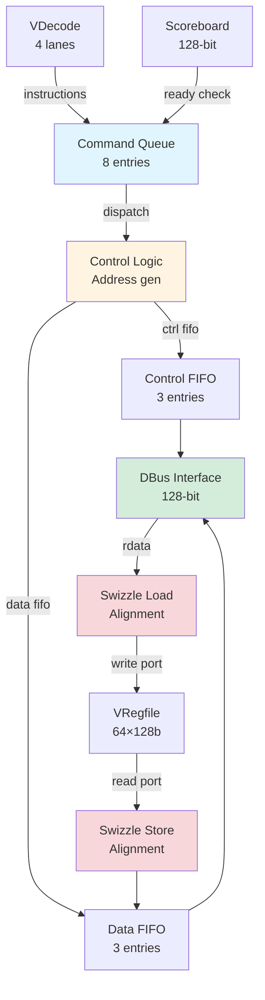

# Vector Load/Store Unit (VLdSt)

## Overview

The **VLdSt (Vector Load/Store Unit)** is the memory interface for the Vector Core, handling all data transfers between the 64-register vector register file and the memory system (L1 Dcache/AXI bus).

**Design Philosophy**: **Simplified, CNN-optimized** implementation focused on common convolution memory patterns, sacrificing generality for area/power efficiency.

---

## ⚠️ Important Limitations

> **This is NOT a full RISC-V Vector implementation!**
> 
> Coral NPU VLdSt supports only **basic load/store operations** optimized for CNN inference:
> - ✅ Unit-stride and constant-stride access
> - ✅ Automatic stripmining (4-register chunks)
> - ❌ NO fault-only-first (partial completion)
> - ❌ NO indexed/gather/scatter operations
> - ❌ NO segment loads (multi-field structs)
> - ❌ NO exception handling (bus errors cause deadlock!)
> - ❌ NO masked operations
> - ❌ NO memory ordering/atomics
>
> **~40% RISC-V Vector compliance** (basic features only)

---

## Quick Links

### Core Documentation

1. **[Operations](operations.md)** - Supported instructions (vld, vst, vstq)
2. **[Addressing Modes](addressing.md)** - Unit-stride, strided, and stripmining
3. **[Microarchitecture](microarchitecture.md)** - Pipeline, FIFOs, and swizzle logic
4. **[Limitations](limitations.md)** ⚠️ - Unsupported features and design constraints
5. **[Exception Handling](exceptions.md)** ⚠️ - Safety considerations and error behavior
6. **[RISC-V Comparison](rvv_comparison.md)** - Feature parity analysis

---

## Key Features

| Feature | Value | Notes |
|---------|-------|-------|
| **Supported Operations** | vld, vst, vstq | Basic load/store only |
| **Addressing Modes** | Unit-stride, Strided | No indexed access |
| **DBus Width** | 128 bits | 16 bytes/transaction |
| **Command Queue** | 8 entries | Decouple decode from bus |
| **Control/Data FIFOs** | 3 entries each | Pipeline buffering |
| **Stripmining** | 4 registers (64 bytes) | Automatic subdivision |
| **Data Widths** | 8b, 16b, 32b | Byte, halfword, word |
| **Swizzle Logic** | Yes | Misaligned address handling |
| **Exception Handling** | ❌ NO | All accesses must succeed |
| **Coalescing** | ❌ NO | Separate transactions |

---

## Architecture Block Diagram



---

## Pipeline Overview

```
Stage 1: VDecode → Command Queue (8 entries deep)
          ↓
Stage 2: Address Generation + Scoreboard Check
          ↓ (stores only)
Stage 3: Register Read (stores) + Swizzle
          ↓
Stage 4: Control/Data FIFOs (3 entries each)
          ↓
Stage 5: DBus Transaction (128-bit bus)
          ↓ (loads only)
Stage 6: Swizzle + Register Write (loads)
```

**Latency**:
- Load: 3-5 cycles (command → register write)
- Store: 2-4 cycles (command → bus write)

**Throughput**: 1 load/store per cycle (single port limitation)

---

## Typical Use Cases

### ✅ Well-Suited (CNN Inference)

1. **Activation loading**: Contiguous input tensors
   ```assembly
   vld.w v0, (x10)    # Unit-stride, cache-friendly
   ```

2. **Weight loading**: Sequential filter weights
   ```assembly
   vld.w v8, (x11)    # Unit-stride, bulk transfer
   ```

3. **Output writing**: Convolution results
   ```assembly
   vstq v48, (x12)    # Special quadrant store for 4-reg output
   ```

4. **Strided convolution**: Dilated convolution patterns
   ```assembly
   vld.w v0, (x10), x13    # Configurable stride
   ```

### ❌ Poorly-Suited (General-Purpose)

1. **Sparse matrices**: Irregular access patterns
   ```assembly
   # Need indexed load, not supported ❌
   # Fallback: Scalar loop (slow)
   ```

2. **Structure-of-arrays**: Multi-field structs
   ```assembly
   # Need segment loads, not supported ❌
   # Fallback: Multiple separate loads
   ```

3. **Histogram updates**: Indirect writes
   ```assembly
   # Need scatter stores, not supported ❌
   # Fallback: Scalar atomics
   ```

4. **Safe partial loads**: Unknown data boundaries
   ```assembly
   # Need fault-only-first, not supported ❌
   # Risk: Page fault → system deadlock!
   ```

---

## Design Rationale

### Why So Simplified?

**Target Workload**: Edge CNN inference (MobileNet, EfficientNet, YOLO)

**CNN Memory Characteristics**:
- 95%+ accesses are **unit-stride** (contiguous)
- Dense matrix operations (no sparsity)
- Known data sizes (no dynamic bounds)
- Single-threaded (no atomics needed)

**Hardware Budget**: Edge device constraints
- Area: <1mm² for entire vector core
- Power: <100mW active power
- Design complexity: Minimize verification effort

**Trade-off**: Feature richness vs efficiency
- Full RISC-V Vector: +50% area, +30% power
- Coral NPU VLdSt: Minimal area/power for 90% of CNN needs

**Result**: **Acceptable compromise for target market**

---

## Performance Characteristics

| Metric | Value | Notes |
|--------|-------|-------|
| **Best-case throughput** | 1 ldst/cycle | No dependencies |
| **Worst-case latency** | ~10 cycles | Cache miss + pipeline fill |
| **Stripmining overhead** | ~1 cycle/stripe | Address calculation |
| **Swizzle penalty** | 0 cycles | Combinational logic |
| **Command queue depth** | 8 entries | Hide scoreboard stalls |
| **Outstanding transactions** | Up to 11 | 8 cmd + 3 ctrl/data FIFOs |
| **Memory bandwidth** | 16 bytes/cycle | 128-bit DBus |
| **Effective bandwidth** | ~12 bytes/cycle | Accounting for overhead |

---

## Getting Started

**New to Vector Core?** Start here:
1. Read [Operations](operations.md) to understand vld/vst/vstq
2. Understand [Addressing Modes](addressing.md) for stride and stripmining
3. Review [Microarchitecture](microarchitecture.md) for pipeline details

**Compiler Developer?** Critical reads:
1. [Limitations](limitations.md) - Know what's NOT supported
2. [Exception Handling](exceptions.md) - Understand safety constraints
3. [RISC-V Comparison](rvv_comparison.md) - Feature parity gaps

**Verification Engineer?** Focus on:
1. [Microarchitecture](microarchitecture.md) - Pipeline and control logic
2. [Exception Handling](exceptions.md) - Error scenarios (deadlock risks!)
3. [Addressing Modes](addressing.md) - Stripmining corner cases

---

## Documentation Roadmap

```
vldst/
├── README.md (this file)         # Overview and navigation
├── operations.md                 # vld, vst, vstq instructions
├── addressing.md                 # Stride, stripmining, swizzle
├── microarchitecture.md          # Pipeline, FIFOs, control flow
├── limitations.md                # Unsupported RISC-V features
├── exceptions.md                 # Error handling analysis
└── rvv_comparison.md             # RISC-V Vector compliance
```

---

## Quick Reference

### Instruction Summary

| Instruction | Format | Description |
|-------------|--------|-------------|
| `vld.w vd, (rs1)` | Unit-stride load | Load 16 bytes contiguously |
| `vld.w vd, (rs1), rs2` | Strided load | Load with stride rs2 |
| `vst.w vs, (rs1)` | Unit-stride store | Store 16 bytes contiguously |
| `vst.w vs, (rs1), rs2` | Strided store | Store with stride rs2 |
| `vstq vs, (rs1)` | Quadrant store | Store 4 regs (64 bytes) for convolution |

### Common Patterns

**Bulk load** (64 bytes = 4 registers):
```assembly
vld.w v0, (x10)    # m=true for stripmining
# Result: v0-v3 loaded from 0x10000000-0x1000003F
```

**Strided access** (skip every 32 bytes):
```assembly
li x11, 32
vld.w v0, (x10), x11
# Loads from: 0x00, 0x20, 0x40, 0x60 (4 transactions)
```

**Convolution output**:
```assembly
vstq v48, (x12)
# Stores 64 bytes from v48-v51 with special layout
```

---

## Related Documentation

- [Vector Core Overview](../README.md) - High-level architecture
- [VInst Unit](../vinst.md) - Instruction frontend
- [VDecode Unit](../vdecode.md) - Decoder and dependency tracking
- [VRegfile](../vregfile.md) - Vector register file
- [VAlu](../valu.md) - SIMD ALU operations

---

**Source File**: `coral/codes/coralnpu/hdl/chisel/src/coralnpu/vector/VLdSt.scala` (330 lines)

