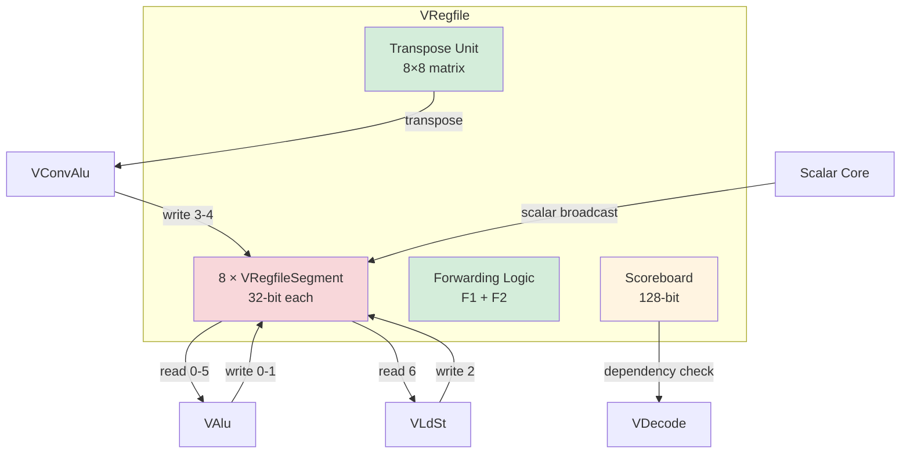

# Vector Register File (VRegfile)

## Overview

The **Vector Register File (VRegfile)** is the central storage for vector data in Coral NPU's Vector Core. It provides high-bandwidth access for multiple execution units with sophisticated forwarding, transposition, and accumulation capabilities.

**Key Features**:
- **Capacity**: 64 registers × 256 bits = 2KB (configurable: 128/256/512-bit per register)
- **Segmented architecture**: Each register split into 8 × 32-bit segments for parallel access
- **Multi-ported**: 7 read ports, 5 write ports, 2 scalar broadcast ports
- **Read-write forwarding**: Bypasses writes to reads in the same cycle
- **Transpose support**: 8×8 matrix transpose for convolution operations
- **Scoreboard tracking**: 128-bit scoreboard for dependency management
- **Accumulator integration**: Direct writeback from convolution accelerator

---

## Architecture

### Block Diagram



### Segmented Organization

**Concept**: Each 256-bit register is divided into 8 × 32-bit segments, stored in separate `VRegfileSegment` modules.

```
Register v5 (256-bit):
┌─────┬─────┬─────┬─────┬─────┬─────┬─────┬─────┐
│ s7  │ s6  │ s5  │ s4  │ s3  │ s2  │ s1  │ s0  │
└─────┴─────┴─────┴─────┴─────┴─────┴─────┴─────┘
  32b   32b   32b   32b   32b   32b   32b   32b

Each segment stored in VRegfileSegment(j) module:
  - VRegfileSegment(0) stores s0 of all 64 registers
  - VRegfileSegment(1) stores s1 of all 64 registers
  - ...
  - VRegfileSegment(7) stores s7 of all 64 registers
```

**Code Reference** (VRegfile.scala lines 134-141):
```scala
val segcnt = p.vectorBits / 32  // 8 for 256-bit config
val vreg = for (i <- 0 until segcnt) yield {
  Module(new VRegfileSegment(p))  // 8 separate 64×32-bit SRAMs
}
```

**Benefits**:
- Parallel read/write to all segments
- Efficient SRAM implementation (64×32-bit × 8 vs. 64×256-bit monolithic)
- Supports transpose and partial updates

---

## Interface Specification

### Port Summary

| Port Type | Count | Width | Users | Purpose |
|-----------|-------|-------|-------|---------|
| **Read** | 7 | 6-bit addr + 256-bit data | VAlu (6), VLdSt (1) | Read vector registers |
| **Write** | 5 | 6-bit addr + 256-bit data | VAlu (2), VLdSt (1), VConv (2) | Write vector registers |
| **Scalar** | 2 | 32-bit data | VAlu | Broadcast scalar to all lanes |
| **Transpose** | 1 | 6-bit addr + 256-bit data | VConv | 8×8 matrix transpose |
| **Convolution** | 1 | Control + 256×8-bit data | VConv | Write accumulator array |
| **Whint** | 2 | 6-bit addr | VAlu | Write hint for scoreboard |
| **Scoreboard** | 1 | 128-bit | VDecode | Dependency tracking |

**Total Bandwidth**:
- **Read**: 7 × 256 bits = 1792 bits/cycle = 224 bytes/cycle
- **Write**: 5 × 256 bits = 1280 bits/cycle = 160 bytes/cycle

---

## Read Port Details

### Port Interface (VRegfile.scala lines 32-36)

```scala
class VRegfileReadIO(p: Parameters) extends Bundle {
  val valid = Output(Bool())
  val addr = Output(UInt(6.W))    // Register address (0-63)
  val tag  = Output(UInt(1.W))    // Even/odd tag for scoreboard
  val data = Input(UInt(p.vectorBits.W))  // 256-bit data
}
```

### Read Allocation

**Port Assignment** (from VCore.scala):
```
Port 0-5: VAlu (6 reads)
  - Typical ALU ops use 2 reads (vs, vt)
  - Some ops use 3 reads (vmadd: vd, vs, vt)
  
Port 6: VLdSt (1 read)
  - Vector store data read
```

### Read Pipeline

**1-cycle read latency** (VRegfile.scala lines 224-293):

```
Cycle N:   Request (valid, addr, tag)
Cycle N+1: Data available (io.read(i).data)
```

**Example**:
```scala
// Cycle N
io.read(0).valid := true.B
io.read(0).addr := 5.U  // Read v5

// Cycle N+1
val data = io.read(0).data  // 256-bit result
```

---

## Write Port Details

### Port Interface (VRegfile.scala lines 66-70)

```scala
class VRegfileWriteIO(p: Parameters) extends Bundle {
  val valid = Output(Bool())
  val addr = Output(UInt(6.W))    // Register address (0-63)
  val data = Output(UInt(p.vectorBits.W))  // 256-bit data
}
```

### Write Allocation

**Port Assignment** (VRegfile.scala lines 82-86, VCore.scala lines 105-107, 153):
```
Port 0-1: VAlu writes
Port 2:   VLdSt write (loads)
Port 3-4: VConvAlu writes (accumulator writeback)
```

### Write Pipeline

**Registered writes** (VRegfile.scala lines 162-181):

```
Cycle N:   Write request (valid, addr, data)
Cycle N+1: Data registered internally
Cycle N+2: Write to SRAM

This 2-cycle pipeline enables forwarding!
```

**Code** (VRegfile.scala lines 168-181):
```scala
writevalidReg := writevalid  // Register valid signals

for (i <- 0 until writePorts) {
  when (io.write(i).valid) {
    writebitsReg(i).addr := io.write(i).addr
    writebitsReg(i).data := io.write(i).data
  }
}

// Cycle N+1: Write to SRAM
for (i <- 0 until writePorts) {
  vreg(j).io.write(i).valid := writevalidReg(i)
  vreg(j).io.write(i).addr := writebitsReg(i).addr
  vreg(j).io.write(i).data := writebitsReg(i).data(32*j+31, 32*j)
}
```

---

## Forwarding Logic

**Purpose**: Bypass write data to reads in the same or previous cycle, avoiding RAW hazards.

### Two-Level Forwarding (VRegfile.scala lines 232-276)

#### Level 1: F1 Forwarding (Same Cycle)

**Detects writes in current cycle and forwards immediately**:

```scala
val f1validBits = Wire(Vec(writePorts, Bool()))
for (j <- 0 until writePorts) {
  f1validBits(j) := writevalid(j) && 
                    writebits(j).addr === io.read(i).addr
}
val f1valid = f1validBits.asUInt
assert(PopCount(f1valid) <= 1.U)  // At most one match

val f1data = VecOR(f1dataBits, writePorts)  // Mux selected write data
```

**Example**:
```
Cycle N:
  write(0): valid=1, addr=5, data=0xABCD...
  read(2):  valid=1, addr=5
  
  f1valid(0) = 1  (address match!)
  f1data = 0xABCD...  (forward write data)
```

#### Level 2: F2 Forwarding (Previous Cycle)

**Detects registered writes from previous cycle**:

```scala
val f2validBits = Wire(Vec(writePorts, Bool()))
for (j <- 0 until writePorts) {
  f2validBits(j) := writevalidReg(j) && 
                    writebitsReg(j).addr === io.read(i).addr
}
val f2valid = f2validBits.asUInt

val f2data = VecOR(f2dataBits, writePorts)
```

#### Priority Selection (VRegfile.scala lines 267-276)

```scala
val (scalarValid, scalarData) = ReadScalar(i)

val sel = Cat(
  scalarValid,                                      // Highest priority
  !scalarValid && f1valid =/= 0.U,                  // F1
  !scalarValid && f1valid === 0.U && f2valid =/= 0.U, // F2
  !scalarValid && f1valid === 0.U && f2valid === 0.U  // Memory (lowest)
)

val data = MuxOR(sel(3), scalarData) |
           MuxOR(sel(2), f1data) |
           MuxOR(sel(1), f2data) |
           MuxOR(sel(0), rdata(i).asUInt)  // From SRAM

when (rvalid) {
  readData(i) := data  // Register final result
}
```

**Priority Order**:
1. **Scalar broadcast** (highest priority)
2. **F1 forwarding** (current cycle write)
3. **F2 forwarding** (previous cycle write)
4. **SRAM read** (no forwarding needed)

---

## Scalar Broadcast

**Purpose**: Replicate a 32-bit scalar value across all vector lanes.

### Implementation (VRegfile.scala lines 199-220)

```scala
def ReadScalar(i: Int): (Bool, UInt) = {
  val valid  = Wire(Bool())
  val scalar = Wire(UInt(32.W))

  if (i == 1 || i == 4) {  // Only ports 1 and 4 support scalar
    valid  := io.scalar(i / 3).valid
    scalar := io.scalar(i / 3).data
  } else {
    valid  := false.B
    scalar := 0.U
  }

  val lanes = p.vectorBits / 32  // 8 for 256-bit
  val values = Wire(Vec(lanes, UInt(32.W)))
  for (i <- 0 until lanes) {
    values(i) := scalar  // Replicate to all lanes
  }

  val result = values.asUInt  // Concatenate into 256-bit
  (valid, result)
}
```

**Example**:
```
Scalar value: 0x12345678

Broadcast to 256-bit vector (8 × 32-bit):
┌──────────┬──────────┬──────────┬──────────┬──────────┬──────────┬──────────┬──────────┐
│12345678  │12345678  │12345678  │12345678  │12345678  │12345678  │12345678  │12345678  │
└──────────┴──────────┴──────────┴──────────┴──────────┴──────────┴──────────┴──────────┘
```

**Usage**: Operations like `vadd.w vd, vs, scalar` add scalar to each vector element.

---

## Transpose Port

**Purpose**: Read 8×8 sub-matrix and transpose for convolution operations.

### Interface (VRegfile.scala lines 53-59)

```scala
class VRegfileTransposeIO(p: Parameters) extends Bundle {
  val valid = Output(Bool())
  val tcnt = 16.min(p.vectorBits / 32)  // 8 for 256-bit config
  val addr = Output(UInt(6.W))          // Base address
  val index = Output(UInt(log2Ceil(tcnt).W))  // Sub-block index (0-7)
  val data = Input(UInt((tcnt * 32).W)) // 256-bit transposed data
}
```

### Operation (VRegfile.scala lines 388-402)

```scala
val transposeDataMux = Wire(Vec(segcnt, UInt(io.transpose.data.getWidth.W)))

for (i <- 0 until segcnt) {
  vreg(i).io.transpose.addr := Mux(io.conv.valid, io.conv.addr1, io.transpose.addr)
  transposeDataMux(i) := vreg(i).io.transpose.data
}

when (io.conv.valid || io.transpose.valid) {
  val index = Mux(io.conv.valid, io.conv.index, io.transpose.index)
  transposeData := VecAt(transposeDataMux, index)
}

io.transpose.data := transposeData
```

### Example: 8×8 Transpose

**Input**: 8 consecutive registers (v0-v7), each with 8 × 32-bit elements

```
Before transpose (row-major):
v0: [a00, a01, a02, a03, a04, a05, a06, a07]
v1: [a10, a11, a12, a13, a14, a15, a16, a17]
v2: [a20, a21, a22, a23, a24, a25, a26, a27]
...
v7: [a70, a71, a72, a73, a74, a75, a76, a77]

After transpose (column-major):
result: [a00, a10, a20, a30, a40, a50, a60, a70]  (first column)
```

**Hardware**: Each `VRegfileSegment` independently transposes its 8×8 sub-block.

---

## Convolution Write Port

**Purpose**: Write accumulator array (8×8 matrix) from convolution accelerator back to register file.

### Interface (VRegfile.scala lines 92-109)

```scala
class VRegfileConvIO(p: Parameters) extends Bundle {
  val valid = Output(Bool())
  val ready = Output(Bool())
  val op = new Bundle {
    val conv = Output(Bool())  // Accumulate convolution
    val init = Output(Bool())  // Initialize accumulator
    val tran = Output(Bool())  // Transpose to accumulator
    val wclr = Output(Bool())  // Write and clear accumulator
  }
  val addr1 = Output(UInt(6.W))  // Transpose source address
  val addr2 = Output(UInt(6.W))  // Internal data address
  val mode  = Output(UInt(2.W))  // Convolution mode
  val index = Output(UInt(log2Ceil(p.vectorBits / 32).W))
  val abias = Output(UInt(9.W))  // Bias for A operand
  val bbias = Output(UInt(9.W))  // Bias for B operand
  val asign = Output(Bool())     // Sign of A operand
  val bsign = Output(Bool())     // Sign of B operand
}
```

### Writeback Logic (VRegfile.scala lines 339-344)

```scala
for (i <- 0 until segcnt) {
  vreg(i).io.conv.valid := convClear  // Write enable
  for (j <- 0 until segcnt) {
    // Note: indices reversed for correct layout
    vreg(i).io.conv.data(j) := vconv.io.out(j)(32*i+31, 32*i)
  }
}
```

**Accumulator Registers**: v48-v63 (16 registers reserved)

**Example**:
```
Convolution accumulator (8×8 matrix):
┌─────────────────────────────────────┐
│ acc[0,0] acc[0,1] ... acc[0,7]     │
│ acc[1,0] acc[1,1] ... acc[1,7]     │
│ ...                                 │
│ acc[7,0] acc[7,1] ... acc[7,7]     │
└─────────────────────────────────────┘

wclr operation writes:
  v48[0:7] = [acc[0,0], acc[1,0], ..., acc[7,0]]  (first column)
  v49[0:7] = [acc[0,1], acc[1,1], ..., acc[7,1]]  (second column)
  ...
  v55[0:7] = [acc[0,7], acc[1,7], ..., acc[7,7]]  (eighth column)
```

---

## Scoreboard

**Purpose**: Track pending writes to prevent Read-After-Write (RAW) hazards.

### Structure (VRegfile.scala lines 111-115)

```scala
class VRegfileScoreboardIO extends Bundle {
  // 64 registers sequenced from even/odd tags.
  val set  = Valid(UInt(128.W))  // Set bits (mark busy)
  val data = Input(UInt(128.W))  // Current state
}
```

**Bit Allocation**:
```
Bits [63:0]   : Tag 0 (even tag)
Bits [127:64] : Tag 1 (odd tag)

Each register has 2 bits:
  - Bit in [63:0] for tag=0 operations
  - Bit in [127:64] for tag=1 operations
```

### Set/Clear Logic (VRegfile.scala lines 414-447)

#### Clear Function (VRegfile.scala lines 415-436)

```scala
def SbClr(valid: Bool, data: UInt, i: Int): (Bool, UInt) = {
  if (i < writePorts) {
    // Clear on write or write-hint
    val wvalid = io.write(i).valid
    val hvalid = if (i < whintPorts) io.whint(i).valid else false.B
    val woh = MuxOR(io.write(i).valid, UIntToOH(io.write(i).addr, 64))
    val hoh = if (i < whintPorts) MuxOR(io.whint(i).valid, UIntToOH(io.whint(i).addr, 64)) else 0.U
    val whoh = woh | hoh
    val whdata = Cat(whoh, whoh)  // Set same bit in both tag halves
    SbClr(valid || wvalid || hvalid, data | whdata, i + 1)
  } else {
    // Clear on convolution writeback
    val cvalid = convClear
    val cdataH = Wire(UInt(16.W))
    if (p.vectorBits == 128) cdataH := 0x000f.U  // Registers 48-51
    if (p.vectorBits == 256) cdataH := 0x00ff.U  // Registers 48-55
    if (p.vectorBits == 512) cdataH := 0xffff.U  // Registers 48-63
    val cdata = MuxOR(cvalid, Cat(cdataH, 0.U(48.W), cdataH, 0.U(48.W)))
    (valid || cvalid, data | cdata)
  }
}
```

#### Update Logic (VRegfile.scala lines 438-445)

```scala
val vrfsb = RegInit(0.U(128.W))
val vrfsbSetEn = io.vrfsb.set.valid
val vrfsbSet = MuxOR(io.vrfsb.set.valid, io.vrfsb.set.bits)
val (vrfsbClrEn, vrfsbClr) = SbClr()

when (vrfsbSetEn || vrfsbClrEn) {
  vrfsb := (vrfsb & ~vrfsbClr) | vrfsbSet  // Clear then set
}

io.vrfsb.data := vrfsb
```

### Example: Scoreboard Update

**Scenario**: Write to v5 with tag=0, then read

```
Initial: vrfsb = 0x00000000_00000000

Write to v5 (addr=5):
  Set: vrfsbSet = 0x00000000_00000020 (bit 5 in tag-0 half)
  vrfsb = 0x00000000_00000020

Read check for v5, tag=0:
  idx = Cat(tag, addr) = Cat(0, 5) = 5
  busy = vrfsb[5] = 1  ❌ Not ready (RAW hazard)

Write completes:
  Clear: vrfsbClr = 0x00000020_00000020 (both halves)
  vrfsb = (0x00000000_00000020 & ~0x00000020_00000020) | 0
        = 0x00000000_00000000

Read check for v5, tag=0:
  busy = vrfsb[5] = 0  ✅ Ready!
```

---

## Register Address Mapping

### Standard Addressing

**6-bit address** (VRegfile.scala line 34):
```
addr[5:0] = register number (0-63)

Examples:
  v0  = 0b000000 = 0
  v5  = 0b000101 = 5
  v63 = 0b111111 = 63
```

### Stripmining Addressing (VCommon.scala lines 24-114)

**For stripmining operations** (`m=1`):

```
addr[5:2]: Base register group (0-15)
addr[1:0]: Strip index (0-3)

Example: addr=21 (0b010101)
  Base group = addr[5:2] = 0b0101 = 5
  Strip = addr[1:0] = 0b01 = 1
  
  Accesses registers:
    Group 5 = v20, v21, v22, v23
    Strip 1 = v21
```

**Active Mask** (RegActive function):
```
m=1, step=3, regnum=20:
  Activate v20, v21, v22, v23 (4 consecutive)
  active = 0x0000000000F00000 (bits 20-23 set)
```

---

## Accumulator Registers

**Range**: v48-v63 (16 registers)

**Purpose**: Reserved for convolution accumulator array.

**Constraints** (VRegfile.scala lines 363-371):
```scala
// Convolution reads must not conflict with pipelined writes
assert(!(convRead0 && writeCurr(io.conv.addr2)))
assert(!(convRead0 && writePrev(io.conv.addr2)))

// Convolution writeback (wclr) must not conflict
val convmaska = 0xffff.U << 48.U  // Registers 48-63
assert(!(convClear0 && (writeCurr & convmaska) =/= 0.U))
assert(!(convClear0 && (writePrev & convmaska) =/= 0.U))

// No direct writes to accumulator during convolution
for (i <- 0 until writePorts) {
  assert(!((convClear0 || convClear) && io.write(i).valid && io.write(i).addr >= 48.U))
}
```

**Lifetime**:
1. **init**: Clear accumulator or load initial values
2. **conv/tran**: Accumulate outer-products over multiple cycles
3. **wclr**: Write accumulator to v48-v63 and clear for next operation

---

## Performance Metrics

| Metric | Value | Notes |
|--------|-------|-------|
| **Total Capacity** | 2KB | 64 × 256-bit |
| **Read Bandwidth** | 224 bytes/cycle | 7 ports × 32 bytes |
| **Write Bandwidth** | 160 bytes/cycle | 5 ports × 32 bytes |
| **Read Latency** | 1 cycle | From SRAM |
| **Forwarding Latency** | 0 cycles | Bypass write-to-read |
| **Scoreboard Width** | 128-bit | 2 tags × 64 registers |
| **Segment Count** | 8 | For 256-bit config |

---

## Example: Full Read-Write Cycle

### Scenario: VAlu writes v8, then reads v8

```
Cycle N: VAlu Write Request
  io.write(0).valid = 1
  io.write(0).addr = 8
  io.write(0).data = 0x1234567890ABCDEF...
  
  Scoreboard set: vrfsb[8] = 1 (tag-0 half)

Cycle N+1: Write Registered
  writevalidReg(0) = 1
  writebitsReg(0).addr = 8
  writebitsReg(0).data = 0x1234567890ABCDEF...
  
  VAlu Read Request (same v8):
    io.read(0).valid = 1
    io.read(0).addr = 8
    
  Forwarding F2 activates:
    f2valid(0) = 1 (address match with registered write)
    f2data = 0x1234567890ABCDEF... (bypass from writebitsReg)
    
  Result: Read bypasses write, no stall! ✅

Cycle N+2: Write to SRAM
  vreg(j).io.write(0).valid = 1
  vreg(j).io.write(0).addr = 8
  vreg(j).io.write(0).data = segment data
  
  Scoreboard clear: vrfsb[8] = 0

Cycle N+3: Data committed to SRAM
  Future reads access memory directly
```

**Key Insight**: Forwarding eliminates 1-2 cycle stalls for back-to-back write-read!

---

## Summary

The Vector Register File is the **heart of the Vector Core**, providing:

✅ **High bandwidth**: 384 bytes/cycle total (224 read + 160 write)  
✅ **Zero-latency forwarding**: Eliminates RAW hazards  
✅ **Scoreboard tracking**: Prevents data races  
✅ **Transpose support**: Accelerates convolution  
✅ **Segmented design**: Efficient SRAM utilization  

**Next**: [VAlu - Vector ALU](valu.md)

---

**Source File**: `coral/codes/coralnpu/hdl/chisel/src/coralnpu/vector/VRegfile.scala` (458 lines)

